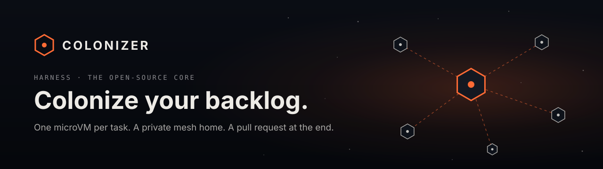
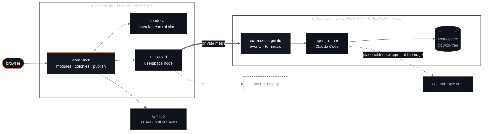

<p align="center">
  
</p>

<p align="center">
  
  
  
  
  
  
</p>

<p align="center">
  <b>colonizer.dev</b> · HARNESS · the open-source core
</p>

---

# The harness

Coding agents are good enough to work on their own for a long time. Most setups still make you pick
between **safe** (a sandbox, one task at a time, an approval every few seconds) and **fast** (an agent
with your credentials loose on your laptop). This is the setup that doesn't make you pick.

Every task gets a **colony**: its own KVM microVM with a fresh git worktree and an agent inside. The
agent can do anything in there. Every colony joins a **private mesh** with the machine that launched it,
so its chat and a real terminal are one hop away. When the agent needs you, it asks with **choices**.
When the work is done, your machine, the **mothership**, commits it and opens the pull request.

This repository is the open-source core, MIT, and it runs on one machine today: Linux with KVM, or an
Apple Silicon Mac. [colonizer.dev](https://colonizer.dev) is the name for everything around it. Nothing
is live there yet, and nothing in this README pretends otherwise.

> **Colonies only ever hold placeholders.**
> The GitHub token never enters a colony. The agent's API credential is swapped in by the sandbox's
> host-side TLS proxy, for one host, on the way out. A colony that goes rogue can wreck its own
> worktree, and that's all.

The design is in [docs/architecture.md](docs/architecture.md). The wire format between agent, microVM,
mothership and browser is in [docs/protocol.md](docs/protocol.md). Why any of this exists, and where
it's going, is in [docs/vision.md](docs/vision.md).

---

## Run it

On Linux x86_64 with KVM, or an Apple Silicon Mac, with `git` and `gh`:

```sh
curl -fsSL https://colonizer.dev/install.sh | sh
colonizer               # then open http://127.0.0.1:7878
```

That installs the latest [release](https://github.com/Colonizer-dev/harness/releases). To build from
source instead, you also need Node.js 20+ and Rust 1.88+:

```sh
git clone https://github.com/Colonizer-dev/harness
cd harness
scripts/install.sh      # builds everything into ./dist
dist/bin/colonizer
```

[docs/install.md](docs/install.md) has the rest: what a Linux machine needs for Claude Code, what the
installer does on a Mac, the install options, the first run, where things live and how to update. It is
also on [colonizer.dev/docs/install](https://colonizer.dev/docs/install). The binary takes a few
arguments, too: `colonizer --help` lists them — `telemetry show`, `telemetry on` and `telemetry off`
for the [usage data](docs/usage-data.md) switch, and `--version`.

---

## Two things, and which is which

| | What it is | Status |
| :--- | :--- | :--- |
| **Harness** | This repository: the mothership, the in-VM daemon, the agent module, the web UI, the bundled mesh. Runnable today on your own machine. | `SHIPPING` |
| **Colonizer** | Anything beyond one machine: remote outposts, a fleet view, a hosted offering. | `PLANNED` |

Two labels are used everywhere below, and they set the tense of the sentence around them:

- `SHIPPING`: merged, in this repository, and exercised on a real machine.
- `PLANNED`: named, not specified, not started.

---

## A question, from inside a colony

Real, from a colony working on this repository. Unedited apart from line breaks.

```json
{"type": "question", "seq": 14,
 "question_id": "toolu_01Kz2S34mniQ6KJ476Twd2X3",
 "questions": [{
   "header": "README tweak", "multi_select": false,
   "question": "Which small README improvement do you prefer?",
   "options": [
     {"label": "Add a table of contents",
      "description": "Insert a short linked ToC near the top (Requirements, Install, Trust model, Configuration, Development, Run as a service) so readers can jump to a section in this fairly long README."},
     {"label": "Add a Quick Start block",
      "description": "Add a 3-line 'Quick Start' snippet right under the intro paragraph (clone, install.sh --install, open the URL) so skimmers get running before reading Requirements/Trust model/Configuration."}
   ]}]}
```

The web UI renders that as a card with both options and an **Other…** answer. One click sends
`question_answered` back through the mothership, over the mesh, to the agent that is waiting for it.

Agents never ask in plain text. The Claude Code module routes `AskUserQuestion` into this event, and if a
turn still ends on a plain-text question, the runner holds the turn open and has the agent ask again as
a card. Autopilot can't publish in the middle of a question.

---

## Shape



---

## The argument, in five points

**1. A colony is a machine, not a container.** Each task runs in a KVM microVM
([microsandbox](https://microsandbox.dev), libkrun) with its own kernel. The agent runs without
permission prompts because there is nothing on the other side of the wall worth protecting.

**2. Secrets stay home.** Git objects are mounted read-only, so the agent can read history but not
rewrite it. The mothership commits, pushes and opens the pull request after the microVM is gone, and it
treats everything the colony left behind as untrusted: `.git` is rewritten, nested repositories are
removed, and git runs with hooks and fsmonitor disabled.

**3. Every colony is one hop away.** The mothership runs its own Headscale and a userspace `tailscaled`,
both bundled. Every colony joins with a single-use key. The network is separate from any tailnet the
machine is already on. The mothership can reach colonies, and colonies can't reach each other. One narrow
UDP rule per colony keeps WireGuard direct (about 1 ms) instead of relayed.

**4. Decisions, not prose.** Agents bring you choices. Your job is to pick one, not to parse a paragraph
that ends in a question mark.

**5. Everything is a module.** Source, sandbox, mesh, agent, interfaces and publish are providers behind
small contracts, selected in the UI and saved in `modules.json`. The agent contract is a JSON Lines
protocol on stdio, so an agent module can be written in anything.

---

## What's in the repository

| Path | What it is | Status |
| :--- | :--- | :--- |
| [`crates/colonizer`](crates/colonizer) | The mothership: HTTP and WebSocket API, module registry, colony lifecycle, mesh supervision, publish | `SHIPPING` |
| [`crates/colonizer-agentd`](crates/colonizer-agentd) | The daemon inside every colony: runner supervision, event log with replay, PTY terminals. Static musl binary | `SHIPPING` |
| [`modules/agents/claude-code`](modules/agents/claude-code) | Claude Code through the Claude Agent SDK, speaking the runner protocol | `SHIPPING` |
| [`web`](web) | The UI: colonies, chat on [assistant-ui](https://www.assistant-ui.com), choice cards, [xterm.js](https://xtermjs.org) terminal, settings | `SHIPPING` |
| [`vendor`](vendor) | Pinned, sha256-verified microsandbox, Headscale and Tailscale, plus a DERP map snapshot | `SHIPPING` |
| [`scripts`](scripts) | `install.sh`, vendoring, the in-microVM agentd build | `SHIPPING` |

## Modules

| Kind | Providers today | Next |
| :--- | :--- | :--- |
| `source` | GitHub issues and repositories | GitLab, Linear, Jira `PLANNED` |
| `sandbox` | microsandbox (KVM microVMs), with presets for Node, Python, Rust and Go | other VMMs `PLANNED` |
| `mesh` | Private mesh (bundled Headscale), or a loopback port | remote outposts `PLANNED` |
| `agent` | Claude Code, with subagents on any Anthropic-compatible provider (DeepSeek, a local model) | more agents behind the same protocol `PLANNED` |
| `interfaces` | Chat with choice cards, terminal | dev-server previews `PLANNED` |
| `publish` | GitHub pull request from the colony's own branch, opened automatically when the agent finishes (autopilot, on by default) | review-comment follow-ups `PLANNED` |
| `memory` | Shared notes per repository, org and globally; agents propose, you approve | semantic search `PLANNED` |
| `watchdog` | Nudges colonies that stop making progress, flags the ones that need you | automatic restarts `PLANNED` |

Every GitHub org is a workspace with its own overrides for models, the parallel limit, memory and the
watchdog. Model providers (DeepSeek, a server on your LAN or tailnet, any Anthropic-compatible endpoint)
are added in Settings. Colonies reach them through the mothership's provider gateway, which holds the
keys, queues requests for servers that handle one at a time, allows slow prefill, and falls back to
Claude when a provider is down or busy.

---

## What this does not do

Stated here rather than buried.

- **One machine.** Colonies run on the host that launched them: Linux x86_64 with KVM, or an Apple
  Silicon Mac — where the private mesh does not work yet, so colonies use a loopback port
  ([#32](https://github.com/Colonizer-dev/harness/issues/32)).
- **One agent, one forge.** Claude Code is the only agent module and GitHub the only source and publisher.
- **The web UI has no login.** It binds to `127.0.0.1`, checks `Host` and `Origin` headers, and should stay there.
- **Colony images need glibc.** A Linux Claude Code binary is mounted read-only into the microVM: the
  host's own on Linux, the `linux-arm64` build fetched at install time on a Mac.
- **Relays are Tailscale's.** Direct connections don't need them; when a colony falls back to a relay,
  encrypted traffic crosses Tailscale's public DERP servers.
- **`install.sh --install` is not exercised yet.** It is implemented, but it hasn't been run against the
  real world. Colonies opening pull requests has been.
- **Cross-provider subagents are off the beaten path.** Anthropic doesn't support routing Claude Code to
  non-Claude models. Routing and the gateway are tested with stub Anthropic-compatible providers inside
  real colonies and against a local `ds4-server` on the operator's tailnet, not against DeepSeek's hosted
  API, and Claude-specific request fields are forwarded as they are. The OpenAI translation (the `openai`
  wire) is exercised against real Claude Code and a stub gateway, not against OpenAI's hosted API.
- **Memory search is plain text matching**, not semantic search.
- **No CI yet**, and nothing is published to crates.io or npm.

---

## Roadmap, in public

| Capability | Status |
| :--- | :--- |
| Colonies, private mesh, choice cards, terminal, Claude Code module, GitHub source and publish | `SHIPPING` |
| Orchestrator and subagents on different providers ([#1](https://github.com/Colonizer-dev/harness/issues/1)) | `SHIPPING` |
| Org workspaces ([#2](https://github.com/Colonizer-dev/harness/issues/2)) | `SHIPPING` |
| Shared memory with review ([#3](https://github.com/Colonizer-dev/harness/issues/3)) | `SHIPPING` |
| Watchdog for stalled colonies ([#4](https://github.com/Colonizer-dev/harness/issues/4)) | `SHIPPING` |
| Provider gateway: private-network models, queues, long timeouts, health, Claude fallback ([#5](https://github.com/Colonizer-dev/harness/issues/5)) | `SHIPPING` |
| CI running the Rust, runner and UI test suites | `PLANNED` |
| Local Claude Code plugins mounted read-only into colonies, with ECC's skills and agents vendored ([#6](https://github.com/Colonizer-dev/harness/issues/6)) | `SHIPPING` |
| Skillsets switched on and off in Settings, globally and per org ([#46](https://github.com/Colonizer-dev/harness/issues/46)) | `SHIPPING` |
| superpowers vendored, with its bootstrap in the system prompt instead of a hook ([#44](https://github.com/Colonizer-dev/harness/issues/44)) | `SHIPPING` |
| Google's skills vendored and loaded on demand from a pinned local catalog ([#43](https://github.com/Colonizer-dev/harness/issues/43)) | `SHIPPING` |
| Daily proposals for vendored plugin updates, described in skills added, removed and changed ([#43](https://github.com/Colonizer-dev/harness/issues/43)) | `SHIPPING` |
| Token savings: terse replies (caveman) and compact command output (rtk), each a switch | `SHIPPING` |
| Token savings: Headroom compacting tool results, its bundle downloaded when switched on ([#53](https://github.com/Colonizer-dev/harness/issues/53)) | `SHIPPING` |
| More agent modules behind the runner protocol | `PLANNED` |
| GitLab, Linear and Jira sources; review comments as follow-up tasks | `PLANNED` |
| Remote outposts: other machines joining the mesh to host colonies | `PLANNED` |
| Fleet view, per-colony budgets and network policies | `PLANNED` |
| Dev-server previews over the mesh | `PLANNED` |

The roadmap is the issue tracker. There is no private version of it.

---

## Trust model

| What | Where it lives |
| :--- | :--- |
| GitHub token | Mothership only. Commit, push and `gh pr create` run on the host after the colony is gone. |
| Claude token | Mothership only (0600). The colony sees a placeholder; microsandbox's TLS proxy substitutes the real value for `api.anthropic.com` only. |
| Model provider keys | Mothership only (0600). Colonies send provider requests to the gateway with a per-colony token; the gateway adds the key. |
| Worktree | Mounted read-write at `/workspace`. |
| Git objects and worktree metadata | Mounted read-only: `git status`, `diff` and `log` work in the colony, commits don't. |
| Colony output | Untrusted until published: `.git` rewritten, nested `.git` removed, no hooks or fsmonitor, `pr.md` must be a regular file. |
| Mesh | Own Headscale and userspace `tailscaled`, own state and socket, `--no-logs-no-support`. Mothership reaches colonies; colonies can't reach each other. |
| colonizer-agentd | Per-colony bearer token, even inside the mesh. |
| Live map | Off until you switch it on. When on, a heartbeat every 5 minutes: a random id, version, platform and colony count. No code, repositories or names ([docs/telemetry.md](docs/telemetry.md)). |
| Usage data | On by default: an anonymous batch of counts, built and shown locally — and nothing is sent at all in this release. A different random id from the live map's; `colonizer telemetry off` switches it off ([docs/usage-data.md](docs/usage-data.md)). |

Colonies are detached: they keep running when the mothership restarts, and it reconnects to them.

## Configuration

Module settings live in `~/.config/colonizer/modules.json` and are edited in the UI. The answers to
the [live map](docs/telemetry.md) and [usage data](docs/usage-data.md) questions live beside it, in
`telemetry.json` and `usage.json`, and `usage-last.json` beside those keeps the last usage batch
built. Process settings come from the environment:

| Variable | Default | Meaning |
| :--- | :--- | :--- |
| `COLONIZER_BIND` | `127.0.0.1:7878` | Listen address |
| `COLONIZER_ALLOWED_HOSTS` | – | Extra `Host` names to accept, comma separated |
| `COLONIZER_GATEWAY_BIND` | `127.0.0.1:41750` | Provider gateway; colonies reach it through `host.microsandbox.internal` |
| `COLONIZER_DATA_DIR` | `~/.local/share/colonizer` | Clones, worktrees, colonies, mesh state |
| `COLONIZER_CONFIG_DIR` | `~/.config/colonizer` | Module config and saved tokens |
| `COLONIZER_CLAUDE_BIN` | auto-detected | Native Claude Code binary to mount |
| `COLONIZER_HOME` | next to the binary, or `dist/` | Bundled app assets |
| `DO_NOT_TRACK`, `COLONIZER_TELEMETRY=off` | – | Keep the [live map](docs/telemetry.md) and [usage data](docs/usage-data.md) off whatever Settings says |
| `CI=true` | – | Also keeps [usage data](docs/usage-data.md) off; the live map does not read it |
| `COLONIZER_TELEMETRY_URL` | `https://telemetry.colonizer.dev` | Where live map heartbeats go |

A few things belong in neither the UI nor the environment. They live in `~/.config/colonizer/colonizer.toml`,
which you write and Colonizer only reads — a missing file means the defaults:

```toml
[publish]
# Colonizer signs the commit it publishes a colony's work as:
#   Co-Authored-By: Colonizer <noreply@colonizer.dev>
co_author = true
```

## Development

```sh
cargo test --workspace                          # mothership and agentd
(cd modules/agents/claude-code && node --test test/)
(cd services/telemetry && node --test)          # the live map's receiver
(cd web && npm run dev)                         # UI dev server; proxies /api to 127.0.0.1:7878
# http://127.0.0.1:5173/?mock=1                 # the UI against an in-browser mock backend
```

Vendor logos in the UI are CC0 artwork from Simple Icons; the marks stay their owners' trademarks. See [NOTICE](NOTICE).

<p align="center">
  <br>
  <a href="https://colonizer.dev"><b>colonizer.dev</b></a>
  &nbsp;·&nbsp;
  <a href="docs/vision.md">Vision</a>
  &nbsp;·&nbsp;
  <a href="docs/architecture.md">Architecture</a>
  &nbsp;·&nbsp;
  <a href="docs/protocol.md">Protocol</a>
</p>

<p align="center">
  <sub>MIT license · Colonize your backlog.</sub>
</p>
