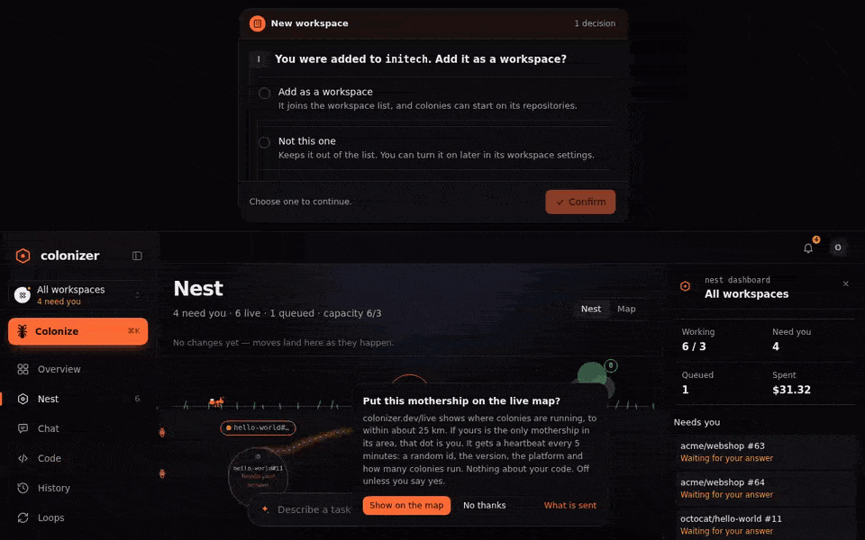

<h1 align="center">Colonizer</h1>

<p align="center">
  <b>Every task runs in its own microVM, and your secrets stay on the host.</b><br>
  The open-source core: the agent asks you with choices, and your machine opens the pull request.
</p>

<p align="center">
  
  
  
  
</p>

```sh
cargo install colonizer-harness --locked && colonizer setup
# no Rust toolchain? curl -fsSL https://colonizer.dev/install.sh | sh
```

<p align="center">
  <a href="#development">Try the mock cockpit locally</a>
  &nbsp;·&nbsp;
  <a href="docs/install.md">Docs</a>
  &nbsp;·&nbsp;
  <a href="docs/architecture.md">Architecture</a>
  &nbsp;·&nbsp;
  <a href="docs/audit.md">Audit</a>
</p>

<p align="center">
  
</p>

> **Not ready for unattended work on sensitive repositories.** An external audit of v0.1.3 found four
> ways past the wall that keeps secrets on the host, and they are not fixed yet
> ([docs/audit.md](docs/audit.md)).


---

## What it is

- **A colony per task.** Every task gets its own KVM microVM with a fresh git worktree and an agent
  inside. The agent can do anything in there.
- **Secrets stay home.** The GitHub token never enters a colony, and the agent's API credential is
  swapped in by the sandbox's host-side TLS proxy on the way out ([trust model](docs/trust-model.md)).
- **One hop away.** Every colony joins a private mesh with the machine that launched it, so its chat
  and a real terminal are right there.
- **Decisions, not prose.** When the agent needs you, it asks with choices. When the work is done, your
  machine, the mothership, commits it and opens the pull request.
- **The open-source core.** MIT, running on one machine today: Linux with KVM, or an Apple Silicon Mac.
  The hosted Colonizer is not built yet.

## Run it

You need `git`, `gh`, `curl` and `tar`. On Linux, give your user `/dev/kvm`
(`sudo usermod -aG kvm "$USER"`, then log out and back in) and install native Claude Code, which
colonies run. Install the latest [release](https://github.com/Colonizer-dev/harness/releases) with a
Rust toolchain (1.88 or newer), or without one by piping the installer script instead — the crate is
on crates.io as `colonizer-harness`, and `setup` fetches that release's own installer for the version
it installed. Either way the release is checked against its `SHA256SUMS` and its build attestation,
and `~/.local/bin/colonizer` is linked (if `~/.local/bin` is not on your `PATH`, run that path); then:

```sh
colonizer          # starts the mothership, prints a sign-in link and opens it
colonizer open     # reprints the link
colonizer --help   # the rest
```

To build from source (Node.js 20.19+ or 22.12+, and Rust 1.98+):

```sh
git clone https://github.com/Colonizer-dev/harness && cd harness
scripts/install.sh      # builds everything into ./dist
dist/bin/colonizer
```

## How it works

The `colonizer` binary on your machine is the mothership: it runs the web UI, a bundled Headscale and
userspace `tailscaled`, and the provider gateway. Each colony is a microVM running `colonizer-agentd`,
which supervises the agent runner (Claude Code by default) against `/workspace`. The agent contract is
JSON Lines on stdio, so an agent module can be written in anything. Colony output is untrusted until
the mothership has sanitized it and opened the pull request. The diagram is in
[docs/vision.md](docs/vision.md#shape); the design is in [docs/architecture.md](docs/architecture.md).

## Docs

| | |
| :--- | :--- |
| [Install](docs/install.md) · [Configuration](docs/configuration.md) · [Updates](docs/updates.md) | Requirements, first run, every setting, budgets and quotas, upgrading |
| [CLI](docs/cli.md) · [MCP](docs/mcp.md) · [Colonies](docs/colonies.md) · [Fleet](docs/fleet.md) | Driving a mothership, colony lifecycle, pairing motherships |
| [Architecture](docs/architecture.md) · [Protocol](docs/protocol.md) · [Conformance](docs/conformance.md) | Modules, repository layout, the wire format, [UHP](https://unifiedharnessprotocol.org/) conformance |
| [Trust model](docs/trust-model.md) · [Boundaries](docs/boundaries.md) · [Audit](docs/audit.md) · [Path policy](docs/path-policy.md) | Where secrets live, what is enforced, what the audit found |
| [Providers](docs/providers.md) · [Loops](docs/loops.md) · [Jev](docs/jev.md) · [Hosted](docs/hosted.md) | Model providers, built-in loops, second opinions, the hosted contract |
| [Vision](docs/vision.md) · [Gaps](docs/gaps.md) · [Decisions](docs/decisions.md) | Why, the roadmap, what is not built, what was decided against |
| [CHANGELOG](CHANGELOG.md) · [changelog.d/](changelog.d/README.md) | Every release, and what has merged since |
| [Development](docs/development.md) · [Runner authoring](docs/runner-authoring.md) · [Good first issues](docs/good-first-issues.md) | Tests, a new agent module, starter issues |

## Development

Try the cockpit without a mothership: `(cd web && npm run dev)`, then open
`http://127.0.0.1:5173/?mock=1` for the UI against an in-browser mock backend. Every test suite and
script is in [docs/development.md](docs/development.md).

## Contributing and license

See [CONTRIBUTING.md](CONTRIBUTING.md) and [SECURITY.md](SECURITY.md). MIT, see [LICENSE](LICENSE).
Vendor logos in the UI are CC0 artwork from Simple Icons; the marks stay their owners' trademarks. See
[NOTICE](NOTICE).

<p align="center">
  <sub>MIT license · Colonize your backlog.</sub>
</p>
