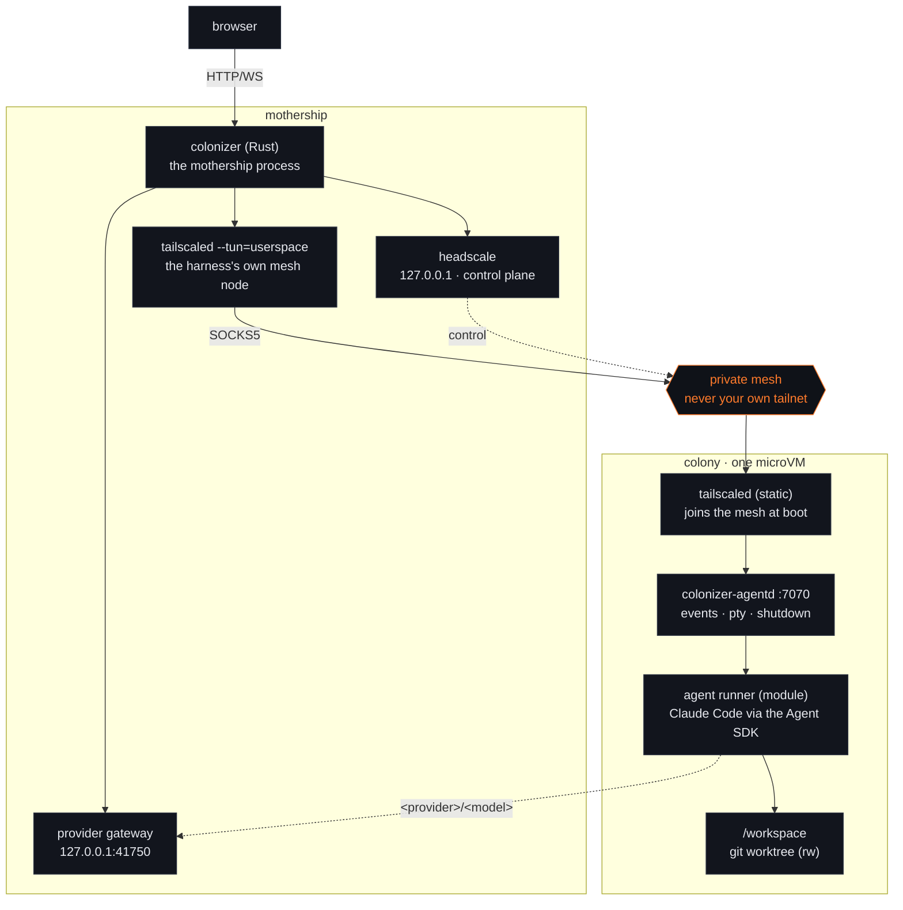
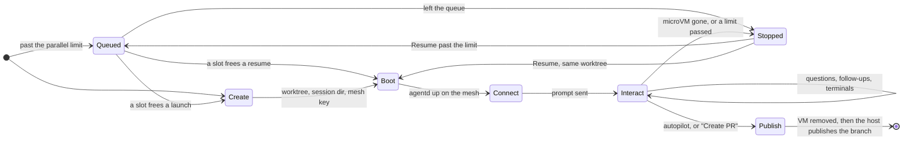

# Colonizer architecture

Colonizer turns a task (a GitHub issue today) into a pull request by running a coding agent
inside a disposable microVM, with a web UI to watch, answer the agent's questions, and open a
terminal in the VM.

Colonizer runs on Linux x86_64 with `/dev/kvm` readable and writable, or an Apple Silicon Mac. An
Intel Mac can't run it, because microsandbox's libkrun backend is aarch64-only. On Linux the host
also needs glibc 2.28 or newer, which the pinned microsandbox binary requires.
[docs/install.md](install.md) has the rest.



## Modules

Every moving part is a module selected and configured in the harness (`~/.config/colonizer/modules.json`,
editable in Settings → Modules). A module kind has one active provider:

| Kind | Providers (v1) | Responsibility |
| --- | --- | --- |
| `source` | `github` | List repositories and issues, fetch an issue for the prompt |
| `sandbox` | `microsandbox` | Boot/stop/remove microVMs with mounts, secrets and network rules. A `preset` picks the image (pinned by digest from `crates/colonizer/images.lock`) and machine size; `auto`, the default, reads the stack off the repository's marker files when the colony's worktree is checked out and falls back to Node when a repository names none; explicit settings override it |
| `mesh` | `headscale` (or `none`) | Private Tailscale-compatible network between harness and VMs |
| `agent` | `claude-code` | Runner that speaks the Colonizer agent protocol inside the VM |
| `interfaces` | `default` | Panels in the session view; `chat` and `terminal` are its settings |
| `publish` | `github-pr` | Commit, push and open the pull request on the host, each only when not already done |
| `memory` | `files`, `mem0` | Shared notes per repository, org and globally; agents propose, the user approves. `mem0` stores approved notes in a mem0 project and writes each colony's copy at boot |
| `watchdog` | `default` | Nudges colonies that stop making progress and flags the ones that need the user |
| `autonomy` | `off`, `judge` | A model answers a colony's questions when nobody does, among the options the agent offered; off by default |
| `notify` | `default` | Announces a colony asking a question, stalling, failing or opening a pull request, or a model provider starting to fail, to the desktop or a webhook. Absent from `modules.json` until first configured; what leaves the mothership is one short line about the colony, never repository content |
| `burn_down` | `default` | Spends a weekly token plan before it resets: launches bug-hunt colonies paced across the window down to a reserve, then stops. Off until configured; see [burn-down](burn-down.md) |
| `voice` | `browser`, `openai`, `groq`, `deepgram`, `elevenlabs`, `openai_compatible` | Speech-to-text for the cockpit composer's microphone. `browser` (the default, also what an absent entry reads as) is the browser's own recogniser and nothing server-side. Any other provider is a transcription API the mothership calls: the browser records a clip, posts it to `/api/voice/transcribe`, and the mothership forwards it with the key (`voice-keys/<provider>`, 0600, or the provider's env var, or a configured OpenAI / Groq model provider's key) and returns the text. Audio goes browser → mothership → service and is not kept; nothing reaches a colony but the words you send |

Two settings layers sit next to the modules:

- **Model providers** (`providers.json`, keys in the system keychain when it works, else `provider-keys/`, 0600): Anthropic-compatible endpoints,
  or OpenAI Chat Completions endpoints the gateway translates, that the agent can route models to as
  `<provider>/<model>`. The Claude Code runner starts a router inside
  the colony that sends those requests to the mothership's provider gateway
  (`host.microsandbox.internal:41750`). The gateway reaches loopback, LAN and tailnet providers, adds the
  key, queues requests per provider (`max_concurrent`), applies long timeouts, and marks the colony busy
  for the watchdog; the runner falls back to a Claude model when the gateway reports the provider
  unreachable, timed out or full.
- **Org workspaces** (`orgs.json`, `known-orgs.json`): per-GitHub-org overrides for agent models, the parallel limit, the
  per-colony budget and host-disk quota, the sandbox stack, memory, the watchdog and notifications, plus an on/off
  switch per org. `known-orgs.json` records the orgs seen on the signed-in GitHub account, so an org that appears for
  the first time asks instead of being adopted silently. A colony belongs to its repository
  owner's org.

## Session lifecycle



0. **Queued** – a colony launched past the parallel limit (global, the org's own, or per repository) is created
   `queued`: no worktree, no microVM, nothing claimed. A resume that lands on a full limit queues too,
   keeping its worktree while it waits. Every five seconds the harness starts the oldest
   queued colony that fits, so a queue drains on its own as colonies finish.
   An org or repository at its own limit doesn't hold up the colonies behind it, and leaving the queue is just Stop.
1. **Create** – source module fetches the issue; the host creates a bare clone + git worktree on a
   `colonizer/issue-<n>-<id>` branch; the harness writes the session directory (`session.json`, `token`,
   `prompt.md`, `boot.sh`, mesh auth key).
2. **Boot** – sandbox module runs `msb run -d` with the image command `sh /colonizer/boot.sh`. The boot
   script starts `tailscaled`, joins the mesh (`--accept-dns=false`, so microsandbox's DNS-based
   secret injection keeps working), then `exec`s `colonizer-agentd`.
3. **Connect** – the harness waits until headscale reports the node online, then connects to
   `ws://<mesh-ip>:7070/v1/events` through its SOCKS5 proxy, persists events, and fans them out to
   browsers. agentd sends the initial prompt to the agent runner.
4. **Interact** – the user watches the chat, answers questions (always multiple choice + "Other"),
   sends follow-ups, and opens terminals (`/v1/pty`), all over the mesh.
5. **Publish** – "Create PR", or autopilot (the `publish` module's `autopilot` setting, on by default)
   when a turn ends without an error or open question and the agent wrote or updated `pr.md` during
   it: agentd shuts the runner down, the VM is removed, and the host publishes with the hardened
   publish step: committing (co-authored by Colonizer Settlers) only what is uncommitted, pushing the colony's
   own `colonizer/…` branch only when origin is behind it, and reusing a pull request that is already
   open for the branch instead of opening a second one. It refuses to push anything else, checked
   before the VM is removed. A publish that fails part-way leaves the colony `failed`, and it can be
   published again from there (the kept worktree and the remote are enough, no new microVM) with the
   remaining steps picked up where the attempt stopped. A turn that ends with an error
   (not an interrupt) holds autopilot and flags the colony (`autopilot_held`). The mesh node is deleted.
6. **Resume** – a microVM that stops on its own (the sandbox's max session length, or the host restarting)
   leaves the worktree behind. Once a minute the harness checks which sandboxes are still running and marks
   a colony whose VM is gone `stopped`, rather than leaving it looking idle. "Resume" boots a fresh microVM
   on the same worktree and branch and tells the agent to continue from what is already there. A resume past
   the parallel limit queues instead, and boots on its worktree when a slot frees. The new
   agentd numbers its events from 1, so the previous transcript is rotated to `events-<n>.jsonl` first.
   Changing models does not need a resume: a live `set_model` switches the running colony's model for
   its next turns and keeps the session (docs/protocol.md §6.1b).

## Per-colony limits

Four sandbox module settings bound colonies, each with a per-org override:

- `max_parallel` caps colonies live at once, global or per org, which is the queue above. Beside it,
  `repo_max_parallel` (default 3, overridable per org) caps colonies live at once in one repository. The
  parallel limits layer instead of shadowing: global, org and repository must all have room, so the tightest wins.
- `budget_usd` caps a colony's whole model spend. The provider gateway counts the usage of every response
  it routes, prices it with the provider's `pricing`, and adds it to the colony's `routed_cost_usd`; the
  budget answers to that plus Claude's own `cost_usd`. Past it, a routed request is refused with `403` and
  the host stops the colony.
- `host_disk` caps what a colony leaves on the host (its worktree plus its session directory), measured
  every five minutes. It does not cover the microVM's root filesystem, which `root_disk` bounds. A colony
  past the quota is stopped and its worktree kept: removing a colony's work is the operator's call.

Two more sandbox settings watch the host's own disk rather than any one colony. `warn_free_disk`
(default 10G) warns in the cockpit when free space on the data dir's volume drops below it, and
`min_free_disk` (default 5G, or `COLONIZER_RECLAIM_MIN_FREE` when no explicit setting is saved) pauses
queue admission below it: queued colonies wait and running ones keep running — the pause
itself deletes nothing — and admission resumes by itself when space returns. Below the floor
the reclaim sweep (unless off with `COLONIZER_RECLAIM=0`) also reclaims finished colonies whose
work is already pushed without waiting for the retention window; unpushed work is never deleted.
0 turns either off.

A fifth sandbox setting carries a per-org override without bounding anything: the org's `stack` pins the
sandbox stack for its colonies, shadowing what the global `preset` would otherwise choose — `auto` by
default, which reads each repository's marker files at boot. `null` inherits.

`max_parallel` and `repo_max_parallel` default to 3. The other two default to unlimited: there is no
dollar figure or byte count that suits every deployment, and a default that silently stopped running colonies on upgrade would
be a surprise. When the host stops a colony, the only stop it decides on its own, the
microVM is torn down, the status goes to `stopped` with the reason in the colony log, and the worktree is
kept: Resume continues once the limit is raised, queued if the parallel limit is full.

## Configuration: refuse loudly, never degrade silently

Every user-facing setting validates where it is set, and every refusal names the setting, the
offending value and the way out: `unknown model tier "soon"; use low, medium or high`, not
"invalid tier". The alternative — accepting the bytes and reading them as a default — turns a typo
into behaviour that looks like a decision, and the operator learns of it from a colony that runs
wrong instead of from an error pointing at the field. So a fallback to a default is allowed only
where it is documented per setting with the reason (the list below), and "warn and continue" needs
the same justification.

Capability-gated features — cache TTL, effort, tool availability, the model-specific fields a
provider may not take — check support at configure or launch time, and either adapt loudly or
refuse. Adapting loudly is the cache-TTL keep/strip decided at provider save (issue #305): the
provider carries `normalize_cache_ttl`, and the gateway's rewrite is logged with the count of blocks
it changed, so the downgrade is in the log, never only in the behaviour.

Closed vocabularies the host decides are refused by name, listing what does exist: an unknown
skillset name, an unknown model tier, a `<provider>/` model prefix no configured provider owns
(issue #366 — the runner would only warn and send those requests to Anthropic), an unknown tool in
the runner's delegation gate. The one warn-and-continue is in the guest, where refusing would leave
no colony at all: the runner's router drops a malformed `COLONIZER_MODEL_ROUTES` entry with a
warning and keeps the rest.

Shadowing is stated precedence plus a configure-time log naming the loser: an org's `stack` wins
over the global preset (stated under Per-colony limits), and a local plugin copy wins over the
vendored one — logged when the skillset is saved and again at each colony boot that loads it.

### Where garbage is caught

| Boundary | Validator | Garbage-in test |
| --- | --- | --- |
| Module settings save | `modules::update` → `validate_settings` | `a_save_refuses_an_unknown_setting_by_name_but_keeps_stored_ones`, `settings_validation_names_unknown_keys_enums_and_types`, `an_enum_refusal_names_the_options` |
| Provider save | `providers::put` | `a_put_over_a_duplicated_id_is_refused_naming_it`, `prices_must_be_amounts_never_negatives_or_infinities` |
| Org save | `orgs::put` → `orgs::validate` | `org_settings_are_validated` |
| Notify, voice, telemetry | notify and voice are module kinds, so the module-settings save validates them; telemetry's PUT is a typed `enabled` bool | — |
| `modules.json` load | `ModulesConfig::load`: damaged file moved aside, sticky `LoadDamage` alert (issue #408) | `a_damaged_modules_json_is_moved_aside_with_an_alert_rather_than_overwritten` |
| `providers.json`, `orgs.json` load | `App::read_config_loud`: defaults plus alert, saves refuse to overwrite | `a_duplicated_load_keeps_the_first_entry_and_names_the_loser`, `a_put_over_a_damaged_orgs_json_is_refused_and_leaves_the_bytes_alone` |
| `claude-accounts.json` load | `claude_accounts::load_meta`: logs and reads empty; writers refuse (409) | `a_corrupt_record_reads_as_empty_and_refuses_to_be_overwritten` |
| `colonizer.toml` load | `FileConfig::load`: logs file, error and fix, continues with defaults | `load_reads_colonizer_toml_from_the_config_dir` |
| `COLONIZER_GATEWAY_BIND` | `Settings::parse_gateway_bind` refuses startup (issue #406) | `gateway_bind_defaults_unset_parses_an_ip_port_and_refuses_everything_else` |
| Colony launch | `sessions::create`: unknown tier, a model naming no configured provider, an uninstalled agent module, missing Claude credentials | none yet (follow-up) |
| Spawn | the boot refuses an unrouted `<provider>/` model setting (`ColonyRoutes::unrouted_provider`); the runner's router warns about malformed routes | `unrouted_providers_are_reported_with_the_value_and_prefix`; `router.test.mjs` |

### Documented fallbacks

The deliberate degradations, each with its reason:

- An unknown sandbox `preset` id contributes no defaults, so a hand-edited `modules.json` still
  boots on its explicit fields instead of failing the launch (presets.rs,
  `an_unknown_preset_degrades_instead_of_failing`). An image the `images.lock` pin does not know
  boots as the bare tag rather than not at all — a colony that cannot boot is worse than one booting
  unpinned (`an_unpinned_image_degrades_to_the_bare_reference`).
- The token savers — `rtk`, Headroom, caveman — warn and continue when the install lacks the piece
  they need: saving tokens is never the reason a colony doesn't start (sessions.rs).
- A module-settings save lets a stored key the schema no longer declares pass through. The Settings
  UI saves back everything `modules.json` holds, and a provider switch keeps the previous provider's
  keys, so refusing them would lock the user out of saving until the file was hand-edited
  (`modules.rs`, `validate_settings`).
- A `colonizer.toml` that will not parse logs its name, the error and the fix, and continues with
  defaults: it is read per commit and per finding at runtime (`findings.rs`, `github.rs`), paths
  that cannot refuse, and there is no startup caller that could.
- A `claude-accounts.json` that will not parse reads as empty on the launch path, which cannot fail;
  the writers refuse to save over it (409), so the defaults never replace the operator's bytes.
- Duplicate provider ids in a hand-edited `providers.json`: the first entry wins, the loser is named
  in a storage alert and a log — the alert slot is shared with the strict read's file-damage alerts,
  which take precedence, so the duplicate warning yields rather than hiding them — and a PUT that
  would save over the shadow is refused.

### The audit

What the rule found, setting by setting — the table reviewers check:

| Setting | Silent behaviour before | Status |
| --- | --- | --- |
| Unknown module-setting key on save | dropped, so the typo read as the default | fixed: refused, naming the known settings |
| Enum refusal | "must be one of the listed options" | fixed: names them |
| Corrupt `colonizer.toml` | a bare "using defaults" | fixed: names file, error, fix |
| Corrupt `claude-accounts.json` | silently reset the default-account choice | fixed: logged, and saves refuse the overwrite |
| Local plugin shadowing vendored | no configure-time log | fixed: logged naming both paths at skillset save (colony boot already logged it) |
| Duplicate provider ids | first wins, silently | fixed: load warning and alert naming the id; PUT refuses |
| Wrong-typed stored module settings | read as `0` / `""` (`max_parallel` of `"eight"` reads as 1) | filed |
| Unknown provider for a non-agent module kind | empty schema, so boot fails in `msb` with an empty image | filed |
| Bare typo'd model ids | pass org/module save and boot; `summary_model` skips even the prefix check (absent from `MODEL_VARS`) | filed |

The filed refusals will read:

- `modules.json: sandbox.max_parallel is "eight" but max_parallel is a number; using the default of 3
  until it is fixed (edit modules.json or re-save the module in Settings)`
- `modules.json: sandbox provider "nonexistent" is not installed (installed: microsandbox); colonies
  cannot boot — set sandbox.provider to a listed provider in Settings → Modules`
- `org model override "claude-opus-4-999" has no provider prefix and is not a known Claude alias; it
  will be sent to Anthropic as-is. Use "provider/model" …`

Two gaps are known and not yet filed: the range and type refusals in `validate_settings` say "out of
range" / "wrong type" without the min, max or expected type, and the launch refusals for an unknown
tier or a bad model override have no direct unit test.

## Mesh design

- Headscale listens on `127.0.0.1`; VMs reach it as `http://host.microsandbox.internal:<port>`
  through a single scoped `allow@host:tcp:<control-port>` rule, not the broad `host` profile
  (which would open every host-loopback port to the untrusted colony; see
  [sandbox-network.md](sandbox-network.md)).
- The harness node is a separate userspace `tailscaled` (own state dir, socket under
  `/run/user/<uid>/colonizer/`, fixed UDP port, `--no-logs-no-support`). It never touches the
  system tailscaled or the user's tailnet. Tailscale publishes no macOS `tailscaled`, so on a Mac the
  bundled one is built from the source pinned in `vendor/vendor.lock` (`scripts/build-tailscaled.sh`);
  on Linux it comes from upstream's tgz.
- VMs get one narrow extra rule, `allow@<host-lan-ip>:udp:<harness-udp-port>`, so WireGuard
  connects directly (≈1 ms) instead of through a public DERP relay. LAN access stays blocked.
- Users: `harness` and `vms`. Policy: `harness@` may reach `vms@:*`; VMs cannot reach each other.
- VM keys are single-use, ephemeral, 30-minute pre-auth keys; nodes are deleted on session end.
- Headscale reads a bundled DERP relay map (`vendor/derpmap.yaml`, refreshed with
  `scripts/update-derpmap.sh`) instead of fetching one, so the mesh starts without internet access.
  Relays are only a fallback; the direct UDP path doesn't need them.

## Trust boundaries

- GitHub token: host only. Claude credential: host only, injected by microsandbox's TLS proxy for
  `api.anthropic.com`; the guest sees a placeholder. Model provider keys: host only, added by the
  provider gateway, which accepts only a live colony's token.
- Git objects and worktree metadata are mounted read-only; publish treats VM output as untrusted.
- agentd requires a per-session bearer token even inside the private mesh.
- Browser API: loopback bind by default, Host/Origin checks (including WebSocket upgrades).
- Network: what a colony's microsandbox profiles allow and deny is in
  [sandbox-network.md](sandbox-network.md).

The external audit of v0.1.3 checked these boundaries against the code; its findings and the
release checkpoints are in [audit.md](audit.md).

## Testing

`cargo test --workspace` is the gate every change passes, and none of it needs KVM, network or
credentials. The deepest layer in it is agentd's (`crates/colonizer-agentd/tests/`): it boots the
real binary as a host process on loopback against a stub agent runner and asserts the documented
behaviour (docs/protocol.md §2–§3): the bearer-token wall, the initial prompt, events stamped with a
gap-free `seq` and an RFC 3339 `ts`, `user_message` and `answer` frames reaching the runner's stdin,
replay from `since`, the PTY roundtrip, and clean shutdown. `cargo test -p colonizer-agentd --test
smoke` runs just the single boot-path pass of those.

What it does not cover is the colony around agentd: the `msb run` boot itself, the session directory
the mothership writes (plugin mounts, `boot.sh`, the mesh key), subagent model resolution and cost
accounting: everything that needs a real microVM and a real model. Two things cover that:
`scripts/build-agentd.sh --smoke` runs agentd's boot checks inside a real microVM on any machine with
`/dev/kvm`, and CI's `colony-e2e` job boots a whole colony end to end on every pull request — a real
mothership, microVM, agentd, claude-code runner and Claude Code CLI against a scratch git repository
and a stub Anthropic-wire model server (`scripts/colony-e2e.mjs`), asserting the colony publishes and
comes back `no_changes`. GitHub-hosted runners do have `/dev/kvm` (the job chmods it for the runner
user), so this needs no self-hosted hardware; what it still does not cover is anything a real model
or a real GitHub write would do.

## Packaging

`scripts/install.sh` produces a self-contained app directory (`COLONIZER_HOME`, default
`~/.local/share/colonizer/app`):

```
bin/colonizer            host server
bin/colonizer-agentd             static musl build (built in a rust:alpine microVM)
bin/claude-guest                 Mac only: linux-arm64 Claude Code, fetched at install time (the host's own binary is Mach-O)
vendor/headscale              pinned + sha256-verified (vendor/vendor.lock)
vendor/tailscale/{tailscale,tailscaled}   static, pinned + verified (built from source on a Mac)
vendor/derpmap.yaml           DERP relay map snapshot (committed)
modules/agents/claude-code/   runner + production node_modules
web/                          built UI
claude-code.lock              guest Claude Code pin: version + sha256 per platform, read at install
images.lock                   each preset's colony image pinned by OCI digest (also compiled in)
```

Two things arrive lazily rather than with the install: the colony image, pulled by digest the first
time it is needed (`--pull-image` does it at install time), and the Headroom bundle when Headroom is
switched on. Each is checked against a pin before use.
