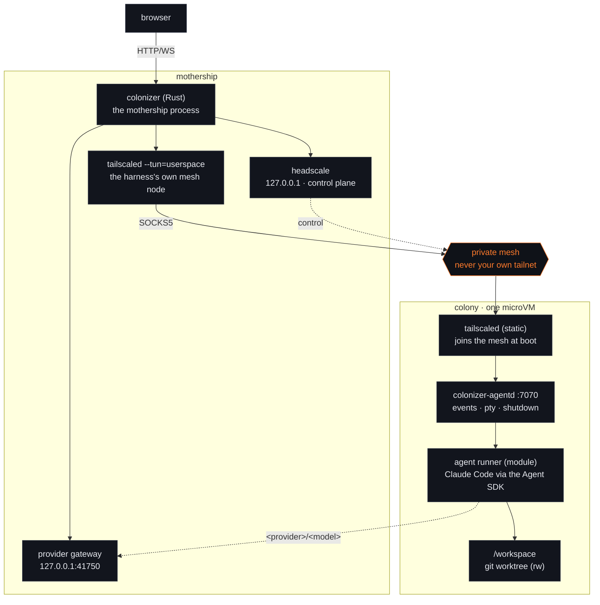
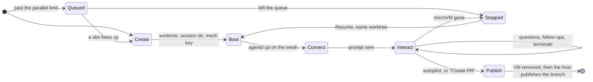

# Colonizer architecture

Colonizer turns a task (a GitHub issue today) into a pull request by running a coding agent
inside a disposable microVM, with a web UI to watch, answer the agent's questions, and open a
terminal in the VM.



## Modules

Every moving part is a module selected and configured in the harness (`~/.config/colonizer/modules.json`,
editable in Settings → Modules). A module kind has one active provider:

| Kind | Providers (v1) | Responsibility |
| --- | --- | --- |
| `source` | `github` | List repositories and issues, fetch an issue for the prompt |
| `sandbox` | `microsandbox` | Boot/stop/remove microVMs with mounts, secrets and network rules. A `preset` picks the image (pinned by digest from `crates/colonizer/images.lock`) and machine size; explicit settings override it |
| `mesh` | `headscale` (or `none`) | Private Tailscale-compatible network between harness and VMs |
| `agent` | `claude-code` | Runner that speaks the Colonizer agent protocol inside the VM |
| `interfaces` | `default` | Panels in the session view; `chat` and `terminal` are its settings |
| `publish` | `github-pr` | Commit, push and open the pull request on the host, each only when not already done |
| `memory` | `files`, `mem0` | Shared notes per repository, org and globally; agents propose, the user approves. `mem0` stores approved notes in a mem0 project and writes each colony's copy at boot |
| `watchdog` | `default` | Nudges colonies that stop making progress and flags the ones that need the user |

Two settings layers sit next to the modules:

- **Model providers** (`providers.json`, keys in `provider-keys/`, 0600): Anthropic-compatible endpoints,
  or OpenAI Chat Completions endpoints the gateway translates, that the agent can route models to as
  `<provider>/<model>`. The Claude Code runner starts a router inside
  the colony that sends those requests to the mothership's provider gateway
  (`host.microsandbox.internal:41750`). The gateway reaches loopback, LAN and tailnet providers, adds the
  key, queues requests per provider (`max_concurrent`), applies long timeouts, and marks the colony busy
  for the watchdog; the runner falls back to a Claude model when the gateway reports the provider
  unreachable, timed out or full.
- **Org workspaces** (`orgs.json`): per-GitHub-org overrides for agent models, the parallel limit, memory
  and the watchdog. A colony belongs to its repository owner's org.

## Session lifecycle



0. **Queued** – a colony launched past the parallel limit (global, or the org's own) is created
   `queued`: no worktree, no microVM, nothing claimed. Every five seconds the harness starts the oldest
   queued colony that fits, so a queue drains on its own as colonies finish.
   An org at its own limit doesn't hold up the colonies behind it, and leaving the queue is just Stop.
1. **Create** – source module fetches the issue; the host creates a bare clone + git worktree on a
   `colonizer/issue-<n>-<id>` branch; the harness writes the session directory (`session.json`, `token`,
   `prompt.md`, `boot.sh`, mesh auth key).
2. **Boot** – sandbox module runs `msb run -d` with the image command `sh /colonizer/boot.sh`. The boot
   script starts `tailscaled`, joins the mesh (`--accept-dns=false`, so microsandbox's DNS-based
   secret injection keeps working), then `exec`s `colonizer-agentd`.
3. **Connect** – the harness waits until headscale reports the node online, then connects to
   `ws://<mesh-ip>:7070/v1/events` through its SOCKS5 proxy, persists events, and fans them out to
   browsers. agentd sends the initial prompt to the agent runner.
4. **Interact** – the user watches the chat, answers questions (always multiple choice + "Other"),
   sends follow-ups, and opens terminals (`/v1/pty`) — all over the mesh.
5. **Publish** – "Create PR", or autopilot (the `publish` module's `autopilot` setting, on by default)
   when a turn ends without an error or open question and the agent wrote or updated `pr.md` during
   it: agentd shuts the runner down, the VM is removed, and the host publishes with the hardened
   publish step — committing (co-authored by Colonizer) only what is uncommitted, pushing the colony's
   own `colonizer/…` branch only when origin is behind it, and reusing a pull request that is already
   open for the branch instead of opening a second one. It refuses to push anything else, checked
   before the VM is removed. A publish that fails part-way leaves the colony `failed`, and it can be
   published again from there — the kept worktree and the remote are enough, no new microVM — with the
   remaining steps picked up where the attempt stopped. A turn that ends with an error
   (not an interrupt) holds autopilot and flags the colony (`autopilot_held`). The mesh node is deleted.
6. **Resume** – a microVM that stops on its own (the sandbox's max session length, or the host restarting)
   leaves the worktree behind. Once a minute the harness checks which sandboxes are still running and marks
   a colony whose VM is gone `stopped`, rather than leaving it looking idle. "Resume" boots a fresh microVM
   on the same worktree and branch and tells the agent to continue from what is already there. The new
   agentd numbers its events from 1, so the previous transcript is rotated to `events-<n>.jsonl` first.

## Mesh design

- Headscale listens on `127.0.0.1`; VMs reach it as `http://host.microsandbox.internal:<port>`
  (microsandbox `host` network profile).
- The harness node is a separate userspace `tailscaled` (own state dir, socket under
  `/run/user/<uid>/colonizer/`, fixed UDP port, `--no-logs-no-support`). It never touches the
  system tailscaled or the user's tailnet.
- VMs get one narrow extra rule, `allow@<host-lan-ip>:udp:<harness-udp-port>`, so WireGuard
  connects directly (≈1 ms) instead of through a public DERP relay. LAN access stays blocked.
- Users: `harness` and `vms`. Policy: `harness@` may reach `vms@:*`; VMs cannot reach each other.
- VM keys are single-use, ephemeral, 30-minute pre-auth keys; nodes are deleted on session end.
- Headscale reads a bundled DERP relay map (`vendor/derpmap.yaml`, refreshed with
  `scripts/update-derpmap.sh`) instead of fetching one, so the mesh starts without internet access.
  Relays are only a fallback; the direct UDP path doesn't need them.

## Trust boundaries

- GitHub token: host only. Claude credential: host only, injected by microsandbox's TLS proxy for
  `api.anthropic.com`; the guest sees a placeholder. Model provider keys: host only, added by the
  provider gateway, which accepts only a live colony's token.
- Git objects and worktree metadata are mounted read-only; publish treats VM output as untrusted.
- agentd requires a per-session bearer token even inside the private mesh.
- Browser API: loopback bind by default, Host/Origin checks (including WebSocket upgrades).

The external audit of v0.1.3 checked these boundaries against the code; its findings and the
release checkpoints are in [audit.md](audit.md).

## Packaging

`scripts/install.sh` produces a self-contained app directory (`COLONIZER_HOME`, default
`~/.local/share/colonizer/app`):

```
bin/colonizer            host server
bin/colonizer-agentd             static musl build (built in a rust:alpine microVM)
vendor/headscale              pinned + sha256-verified (vendor/vendor.lock)
vendor/tailscale/{tailscale,tailscaled}   static, pinned + verified
vendor/derpmap.yaml           DERP relay map snapshot (committed)
modules/agents/claude-code/   runner + production node_modules
web/                          built UI
claude-code.lock              guest Claude Code pin: version + sha256 per platform, read at install
images.lock                   each preset's colony image pinned by OCI digest (also compiled in)
```

Two things arrive lazily rather than with the install: the colony image, pulled by digest the first
time it is needed (`--pull-image` does it at install time), and the Headroom bundle when Headroom is
switched on. Each is checked against a pin before use.
