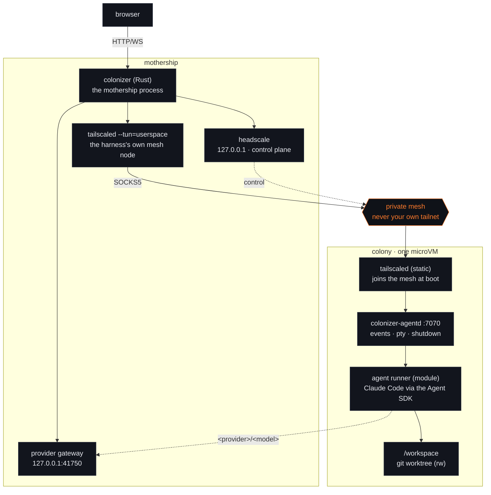
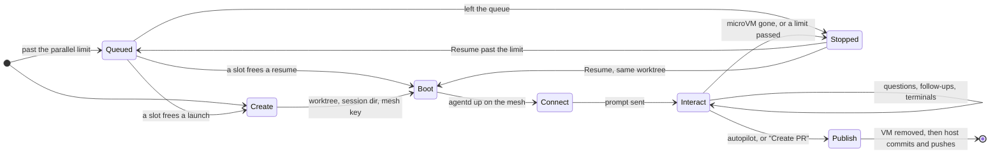

# Colonizer architecture

Colonizer turns a task (a GitHub issue today) into a pull request by running a coding agent
inside a disposable microVM, with a web UI to watch, answer the agent's questions, and open a
terminal in the VM.



## Modules

Every moving part is a module selected and configured in the harness (`~/.config/colonizer/modules.json`,
editable in Settings → Modules). A module kind has one active provider:

| Kind | Providers (v1) | Responsibility |
| --- | --- | --- |
| `source` | `github` | List repositories and issues, fetch an issue for the prompt |
| `sandbox` | `microsandbox` | Boot/stop/remove microVMs with mounts, secrets and network rules. A `preset` picks the image and machine size; explicit settings override it |
| `mesh` | `headscale` (or `none`) | Private Tailscale-compatible network between harness and VMs |
| `agent` | `claude-code` | Runner that speaks the Colonizer agent protocol inside the VM |
| `interfaces` | `default` | Panels in the session view; `chat` and `terminal` are its settings |
| `publish` | `github-pr` | Commit on the host, push, open the pull request |
| `memory` | `files`, `mem0` | Shared notes per repository, org and globally; agents propose, the user approves. `mem0` stores approved notes in a mem0 project and writes each colony's copy at boot |
| `watchdog` | `default` | Nudges colonies that stop making progress and flags the ones that need the user |

Two settings layers sit next to the modules:

- **Model providers** (`providers.json`, keys in `provider-keys/`, 0600): Anthropic-compatible endpoints,
  or OpenAI Chat Completions endpoints the gateway translates, that the agent can route models to as
  `<provider>/<model>`. The Claude Code runner starts a router inside
  the colony that sends those requests to the mothership's provider gateway
  (`host.microsandbox.internal:41750`). The gateway reaches loopback, LAN and tailnet providers, adds the
  key, queues requests per provider (`max_concurrent`), applies long timeouts, and marks the colony busy
  for the watchdog; the runner falls back to a Claude model when the gateway reports the provider
  unreachable, timed out or full.
- **Org workspaces** (`orgs.json`): per-GitHub-org overrides for agent models, the parallel limit, the
  per-colony budget and host-disk quota, memory and the watchdog. A colony belongs to its repository
  owner's org.

## Session lifecycle



0. **Queued** – a colony launched past the parallel limit (global, or the org's own) is created
   `queued`: no worktree, no microVM, nothing claimed. A resume that lands on a full limit queues too,
   keeping its worktree while it waits. Every five seconds the harness starts the oldest
   queued colony that fits, so a queue drains on its own as colonies finish.
   An org at its own limit doesn't hold up the colonies behind it, and leaving the queue is just Stop.
1. **Create** – source module fetches the issue; the host creates a bare clone + git worktree on a
   `colonizer/issue-<n>-<id>` branch; the harness writes the session directory (`session.json`, `token`,
   `prompt.md`, `boot.sh`, mesh auth key).
2. **Boot** – sandbox module runs `msb run -d` with the image command `sh /colonizer/boot.sh`. The boot
   script starts `tailscaled`, joins the mesh (`--accept-dns=false`, so microsandbox's DNS-based
   secret injection keeps working), then `exec`s `colonizer-agentd`.
3. **Connect** – the harness waits until headscale reports the node online, then connects to
   `ws://<mesh-ip>:7070/v1/events` through its SOCKS5 proxy, persists events, and fans them out to
   browsers. agentd sends the initial prompt to the agent runner.
4. **Interact** – the user watches the chat, answers questions (always multiple choice + "Other"),
   sends follow-ups, and opens terminals (`/v1/pty`) — all over the mesh.
5. **Publish** – "Create PR", or autopilot (the `publish` module's `autopilot` setting, on by default)
   when a turn ends without an error or open question and the agent wrote or updated `pr.md` during
   it: agentd shuts the runner down, the VM is removed, and the host commits (co-authored by Colonizer),
   pushes the colony's own `colonizer/…` branch and opens the PR with the hardened publish step. It
   refuses to push anything else, checked before the VM is removed. A turn that ends with an error
   (not an interrupt) holds autopilot and flags the colony (`autopilot_held`). The mesh node is deleted.
6. **Resume** – a microVM that stops on its own (the sandbox's max session length, or the host restarting)
   leaves the worktree behind. Once a minute the harness checks which sandboxes are still running and marks
   a colony whose VM is gone `stopped`, rather than leaving it looking idle. "Resume" boots a fresh microVM
   on the same worktree and branch and tells the agent to continue from what is already there. A resume past
   the parallel limit queues instead, and boots on its worktree when a slot frees. The new
   agentd numbers its events from 1, so the previous transcript is rotated to `events-<n>.jsonl` first.

## Per-colony limits

Three sandbox module settings bound one colony, each with a per-org override that shadows the default:

- `max_parallel` caps colonies live at once, global or per org — the queue above.
- `budget_usd` caps a colony's whole model spend. The provider gateway counts the usage of every response
  it routes, prices it with the provider's `pricing`, and adds it to the colony's `routed_cost_usd`; the
  budget answers to that plus Claude's own `cost_usd`. Past it, a routed request is refused with `403` and
  the host stops the colony.
- `host_disk` caps what a colony leaves on the host — its worktree plus its session directory — measured
  every five minutes. It does not cover the microVM's root filesystem, which `root_disk` bounds. A colony
  past the quota is stopped and its worktree kept: removing a colony's work is the operator's call.

`max_parallel` defaults to 3. The other two default to unlimited — there is no dollar figure or byte
count that suits every deployment, and a default that silently stopped running colonies on upgrade would
be a surprise. When the host stops a colony — the only stop it decides on its own — the
microVM is torn down, the status goes to `stopped` with the reason in the colony log, and the worktree is
kept: Resume continues once the limit is raised, queued if the parallel limit is full.

## Mesh design

- Headscale listens on `127.0.0.1`; VMs reach it as `http://host.microsandbox.internal:<port>`
  (microsandbox `host` network profile).
- The harness node is a separate userspace `tailscaled` (own state dir, socket under
  `/run/user/<uid>/colonizer/`, fixed UDP port, `--no-logs-no-support`). It never touches the
  system tailscaled or the user's tailnet.
- VMs get one narrow extra rule, `allow@<host-lan-ip>:udp:<harness-udp-port>`, so WireGuard
  connects directly (≈1 ms) instead of through a public DERP relay. LAN access stays blocked.
- Users: `harness` and `vms`. Policy: `harness@` may reach `vms@:*`; VMs cannot reach each other.
- VM keys are single-use, ephemeral, 30-minute pre-auth keys; nodes are deleted on session end.
- Headscale reads a bundled DERP relay map (`vendor/derpmap.yaml`, refreshed with
  `scripts/update-derpmap.sh`) instead of fetching one, so the mesh starts without internet access.
  Relays are only a fallback; the direct UDP path doesn't need them.

## Trust boundaries

- GitHub token: host only. Claude credential: host only, injected by microsandbox's TLS proxy for
  `api.anthropic.com`; the guest sees a placeholder. Model provider keys: host only, added by the
  provider gateway, which accepts only a live colony's token.
- Git objects and worktree metadata are mounted read-only; publish treats VM output as untrusted.
- agentd requires a per-session bearer token even inside the private mesh.
- Browser API: loopback bind by default, Host/Origin checks (including WebSocket upgrades).

## Packaging

`scripts/install.sh` produces a self-contained app directory (`COLONIZER_HOME`, default
`~/.local/share/colonizer/app`):

```
bin/colonizer            host server
bin/colonizer-agentd             static musl build (built in a rust:alpine microVM)
vendor/headscale              pinned + sha256-verified (vendor/vendor.lock)
vendor/tailscale/{tailscale,tailscaled}   static, pinned + verified
vendor/derpmap.yaml           DERP relay map snapshot (committed)
modules/agents/claude-code/   runner + production node_modules
web/                          built UI
```

Nothing is downloaded at runtime.
