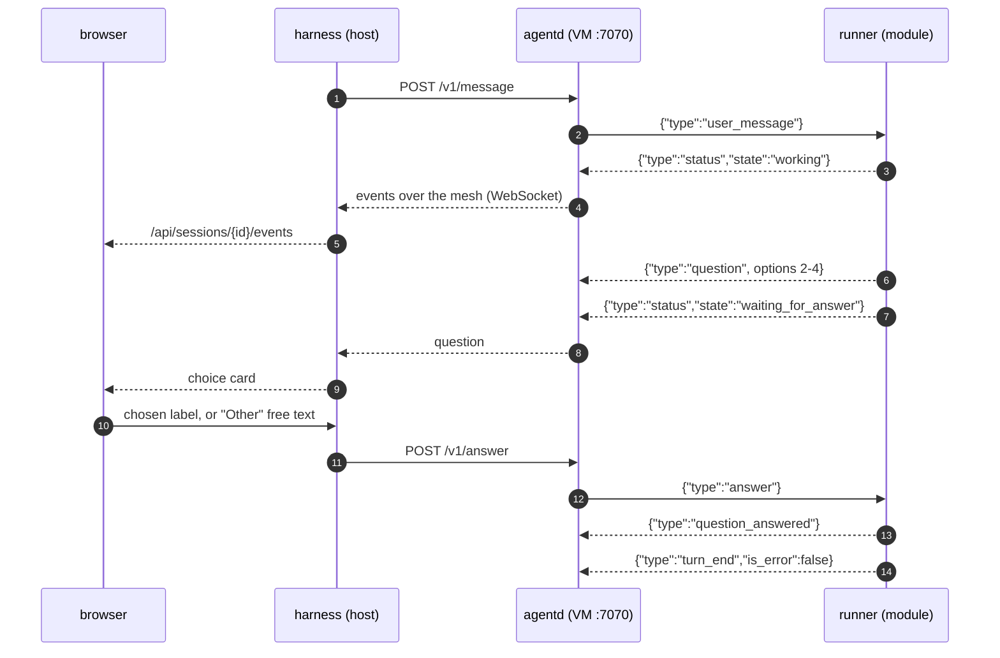

# Colonizer protocol v1

Three hops, one event vocabulary:

```
agent runner ──stdio JSONL──▶ colonizer-agentd ──WS (mesh)──▶ colonizer ──WS──▶ browser
```

All messages are single-line JSON objects with a `type` field. Unknown `type`s and unknown fields
must be ignored (forward compatibility).

---

## 1. Files inside the VM

| Path | Mode | Content |
| --- | --- | --- |
| `/colonizer/session.json` | ro | Session config (below) |
| `/colonizer/token` | ro | Bearer token for agentd (single line) |
| `/colonizer/boot.sh` | ro | Boot script (image command) |
| `/colonizer/mesh-authkey` | ro | Headscale pre-auth key (absent when mesh disabled) |
| `/opt/colonizer/bin/colonizer-agentd` | ro | Static agentd binary |
| `/opt/colonizer/tailscale/{tailscale,tailscaled}` | ro | Static tailscale binaries |
| `/opt/colonizer/agent/` | ro | Active agent module directory |
| `/opt/claude/bin/claude` | ro | Claude Code binary (claude-code module only) |
| `/workspace` | rw | Git worktree |
| `/harness/out` | rw | Files the agent hands to the host (e.g. `pr.md`) |
| `/var/lib/colonizer/events.jsonl` | VM-local | agentd event log (replay source) |

`session.json`:

```json
{
  "session_id": "ab12cd34",
  "workspace": "/workspace",
  "listen": "0.0.0.0:7070",
  "agent": {
    "module": "claude-code",
    "command": ["node", "/opt/colonizer/agent/runner.mjs"],
    "env": { "COLONIZER_MODEL": "" }
  },
  "initial_prompt": "You are resolving GitHub issue #12 ..."
}
```

---

## 2. Agent runner contract (module ⇄ agentd, stdio JSON Lines)

agentd spawns `agent.command` with `cwd = workspace`, the VM environment plus `agent.env`, stdin/stdout
piped, stderr captured as `log` events (level `warn`). Right after spawning, if `initial_prompt` is
non-empty, agentd writes a `user_message` command with `id: "initial"`.

A question travels browser ⇄ harness ⇄ agentd ⇄ runner, and the same four hops carry the answer
back:



### Commands (agentd → runner stdin)

```jsonc
{"type":"user_message","id":"u-1","text":"Also update the docs"}
{"type":"answer","question_id":"toolu_01…","answers":{"Which database?":"Postgres","Features?":["Auth","Billing"]},"response":null}
{"type":"interrupt"}
{"type":"shutdown"}          // finish gracefully and exit(0) within 10 s
```

`answers` maps each question's exact `question` text to the chosen option label, an array of labels
(multi-select), or free text ("Other"). `response` (optional) is a free-form reply that dismisses the
whole question card instead.

### Events (runner stdout → agentd)

```jsonc
{"type":"status","state":"idle|working|waiting_for_answer|error|exited","detail":"optional"}
{"type":"user_message","id":"u-1","text":"…"}                      // echo when a message is accepted
{"type":"assistant_text_delta","message_id":"msg_…","block_index":0,"delta":"Hel"}   // optional streaming
{"type":"assistant_text","message_id":"msg_…","block_index":0,"text":"Hello"}        // final block text; supersedes deltas
{"type":"thinking","message_id":"msg_…","block_index":1,"text":"summary"}            // optional
{"type":"tool_call","message_id":"msg_…","tool_call_id":"toolu_…","name":"Bash","input":{"command":"ls"}}
{"type":"tool_result","tool_call_id":"toolu_…","output":"…","is_error":false}        // output ≤ 20 000 chars
{"type":"question","question_id":"toolu_…","message_id":"msg_…","questions":[
  {"question":"Which database?","header":"Database","multi_select":false,
   "options":[{"label":"Postgres","description":"…","preview":null},{"label":"SQLite","description":"…"}]}
]}
{"type":"question_answered","question_id":"toolu_…","answers":{…},"response":null}
{"type":"turn_end","is_error":false,"result":"final text or null","cost_usd":0.42,"duration_ms":81234}
{"type":"log","level":"info|warn|error","message":"…"}
```

Rules:

- A question is **never** also emitted as `tool_call`/`tool_result`; use `question` / `question_answered`.
- Agents must ask the user only through `question` events (the Claude Code runner appends a system
  prompt instruction and routes `AskUserQuestion` through `canUseTool`). Every question has 2–4
  options; UIs always add "Other".
- `status` must be emitted on every state change. `waiting_for_answer` while a question is open.
- On `shutdown` or stdin EOF: emit `status exited` and exit.

---

## 3. colonizer-agentd API (VM, port 7070)

Every request requires `Authorization: Bearer <contents of /colonizer/token>`; otherwise `401`.
Browsers never talk to agentd; only the harness does, over the mesh.

agentd assigns each runner event a monotonically increasing `seq` (starting at 1) and `ts` (RFC 3339
UTC), appends it to `/var/lib/colonizer/events.jsonl`, and broadcasts it. agentd's own diagnostics are
`log` events with the same numbering. If the runner exits, agentd emits
`{"type":"status","state":"exited","detail":"exit code N"}`.

### `GET /v1/health`

```json
{"ok": true, "version": "0.1.0", "agent": {"state": "working", "running": true, "last_seq": 42}}
```

### `GET /v1/events?since=<seq>` (WebSocket)

- Server → client text frames: every stored event with `seq > since`, then live events.
- Client → server text frames: runner commands (§2). agentd forwards `user_message`, `answer`,
  `interrupt` to the runner's stdin unchanged. Invalid frames are ignored.
- Multiple concurrent clients are allowed.

### `GET /v1/pty?cols=<n>&rows=<n>` (WebSocket)

Starts `/bin/bash -l` (fallback `/bin/sh`) in `/workspace` with `TERM=xterm-256color` in a new PTY.

- Client → server **binary** frames: raw input bytes.
- Client → server **text** frames: `{"type":"resize","cols":120,"rows":40}`.
- Server → client **binary** frames: raw output bytes.
- On shell exit: text frame `{"type":"exit","code":0}`, then close. Closing the socket kills the shell.

### `POST /v1/shutdown`

Sends `shutdown` to the runner, waits up to 10 s, then kills it. Response `{"ok": true}`.

---

## 4. Harness API (browser)

REST (JSON, errors as `{"error": "…"}` with a 4xx/5xx status):

| Method & path | Purpose |
| --- | --- |
| `GET /api/status` | Connections (GitHub, Claude), sandbox, mesh summary |
| `GET /api/modules` | `[{kind, provider, providers:[{id,name,description}], enabled, settings, schema}]` |
| `PUT /api/modules/{kind}` | `{provider, enabled, settings}` → saves config |
| `GET /api/repos` · `GET /api/repos/{owner}/{repo}/issues` | Source module |
| `POST /api/sessions` | `{repo, issue?, title?, instructions?, autopilot?}` → `Session` (omit `issue` for an open session: the agent asks what to work on; omit `autopilot` to use the `publish` module's `autopilot` setting, on by default) |
| `GET /api/sessions` · `GET /api/sessions/{id}` | `Session` list / one |
| `POST /api/sessions/{id}/publish` | Stop the agent, commit (co-authored by Colonizer), push the colony's own `colonizer/…` branch (never the base or default branch), open PR |
| `POST /api/sessions/{id}/stop` | Stop and remove the VM, keep the worktree |
| `POST /api/sessions/{id}/resume` | Boot a fresh microVM on the kept worktree and brief the agent to continue (`stopped`/`failed` colonies that still have their worktree) |
| `POST /api/sessions/{id}/cleanup` | Remove worktree + local branch (VM must be stopped) |
| Settings / Claude login endpoints | Unchanged from v0 (`/api/settings/*`, `/api/claude-login*`) |

Module `schema` is a JSON Schema subset (also used for `settings` in agent `module.json` manifests):

```json
{
  "type": "object",
  "properties": {
    "image":  { "type": "string",  "title": "Image", "description": "glibc-based OCI image", "default": "node:24-bookworm" },
    "cpus":   { "type": "integer", "title": "vCPUs", "minimum": 1, "maximum": 64, "default": 4 },
    "model":  { "type": "string",  "title": "Model", "enum": ["", "opus", "sonnet", "haiku"], "default": "" },
    "draft":  { "type": "boolean", "title": "Open PRs as drafts", "default": false }
  }
}
```

Supported property keys: `type` (`string` | `integer` | `number` | `boolean`), `title`, `description`,
`default`, `enum` (renders a select), `minimum`, `maximum`. `settings` holds the current values;
missing values mean the `default`.

`Session`:

```json
{
  "id": "ab12cd34", "repo": "owner/repo", "issue": 12, "issue_title": "…",
  "status": "starting|running|waiting_for_answer|idle|publishing|pr_opened|no_changes|stopped|failed",
  "branch": "colonizer/issue-12-ab12cd34", "base": "main", "worktree": "/…",
  "sandbox": "colonizer-ab12cd34", "mesh": {"name": "colonizer-ab12cd34", "ip": "100.64.0.3"},
  "agent": "claude-code", "autopilot": false,
  "pr_url": null, "error": null, "cost_usd": 0.42, "cleaned_up": false,
  "created_at": "…", "updated_at": "…"
}
```

### `GET /api/sessions/{id}/events?since=<seq>` (WebSocket)

Server → client:

- On connect: `{"type":"session","session":Session}`, then the last ≤200 harness logs as
  `{"type":"harness_log","level":"info|error","message":"…","ts":"…"}`, then agent events with
  `seq > since` (same objects as §3, including `seq`/`ts`), then live.
- Whenever the session changes: `{"type":"session","session":Session}`.

Client → server:

```jsonc
{"type":"user_message","text":"…"}                        // harness assigns the id
{"type":"answer","question_id":"…","answers":{…},"response":null}
{"type":"interrupt"}
```

### `GET /api/sessions/{id}/terminal?cols=<n>&rows=<n>` (WebSocket)

Byte-for-byte proxy of agentd `/v1/pty` (same binary/text frame rules).

---

## 5. Web UI contract

- Stack: Vite + React + TypeScript + Tailwind v4 + assistant-ui (`useExternalStoreRuntime`) + xterm.js.
  Built to `web/dist`; dev server proxies `/api` (incl. WebSockets) to `http://127.0.0.1:7878`.
- Layout: sidebar (repositories → issues, sessions list) · session view (header with status, branch,
  mesh name, cost, actions: Create PR, Stop, Clean up) · chat panel and terminal panel side by side
  (tabs below 900 px). Settings dialog: Connections (GitHub, Claude subscription login) and Modules.
- Events → assistant-ui messages: `user_message` → user message; `assistant_text(_delta)`, `thinking`,
  `tool_call` + `tool_result` → parts of the current assistant message; `question` → a tool-call part
  with `toolName: "ask_user"` rendered by a registered tool UI.
- Choice card (`ask_user`): one section per question with its header chip; options as large selectable
  cards (radio, or checkboxes when `multi_select`) showing label + description; `preview` rendered as
  monospace text (markdown) or a sandboxed `iframe srcdoc` (HTML); an always-present "Other…" option
  with a text field; a single Submit button that sends `answer`. Once `question_answered` arrives the
  card collapses to a summary of the chosen answers.
- The composer sends `user_message`; a Stop button sends `interrupt` while the agent is working.
- Light and dark themes via `prefers-color-scheme`; usable at 400 px width.

---

## 6. v1.1 additions: model routing, org workspaces, shared memory, watchdog

### 6.1 Model routing (runner)

Model strings are `<provider>/<model-id>` for non-Anthropic providers (e.g. `deepseek/deepseek-flash`,
`local/deepseek-flash`). Anything without a known provider prefix (`opus`, `claude-opus-5`, …) goes to
Anthropic unchanged.

Runner environment set by the mothership:

| Variable | Meaning |
| --- | --- |
| `COLONIZER_MODEL` | Orchestrator (main thread) model |
| `COLONIZER_SUBAGENT_MODEL` | Default model for subagents (maps to `CLAUDE_CODE_SUBAGENT_MODEL`) |
| `COLONIZER_BACKGROUND_MODEL` | Model for background work (maps to `ANTHROPIC_DEFAULT_HAIKU_MODEL`) |
| `COLONIZER_MODEL_ROUTES` | JSON array of routes (below); empty or absent means Anthropic only |

```json
[{"provider": "deepseek", "prefix": "deepseek/", "base_url": "https://api.deepseek.com/anthropic",
  "auth": "x-api-key", "key_env": "COLONIZER_PROVIDER_KEY_DEEPSEEK"}]
```

`auth` is `x-api-key`, `bearer` or `none`. `key_env` names an env var holding the key. Since v1.2 the
mothership points every route at its provider gateway with `auth: none` and a colony token instead, so
no key enters the colony (§6.5); `key_env` remains for routes set by hand. When any route or non-default
model is configured, the runner starts
a local router on `127.0.0.1` and points Claude Code's `ANTHROPIC_BASE_URL` at it:

- Requests whose JSON `model` matches a route prefix: strip the prefix, send to `base_url` + the request
  path (`/v1/messages`, `/v1/messages/count_tokens`), replace `authorization`/`x-api-key` with the route's
  credential, drop Anthropic OAuth betas from `anthropic-beta`, stream the response back unchanged.
  If the upstream has no `count_tokens`, answer `{"input_tokens": ceil(chars / 4)}`.
- Everything else: forward to `https://api.anthropic.com` with headers unchanged.

### 6.2 Shared memory (runner ⇄ mothership)

Approved notes are mounted read-only in every colony:

```
/colonizer/memory/global/  MEMORY.md  notes/<id>.md
/colonizer/memory/org/     MEMORY.md  notes/<id>.md     (the colony's GitHub org)
/colonizer/memory/repo/    MEMORY.md  notes/<id>.md     (the colony's repository)
```

`MEMORY.md` is an index (`- [Title](notes/<id>.md) — first line`). `COLONIZER_MEMORY_DIR=/colonizer/memory`
tells the runner memory is enabled. The runner exposes two tools to the agent: `memory_search`
(search the mounted notes) and `memory_propose` (scope `repo` | `org` | `global`, `title`, `content`).
Proposing emits a runner event; nothing is written inside the colony:

```jsonc
{"type":"memory_proposal","scope":"repo","title":"Run tests with --locked","content":"markdown…","tags":["tests"]}
```

The mothership records it as a pending proposal and broadcasts `{"type":"memory_proposed","proposal":{…}}`
(no `seq`) on the colony's event stream. Approved proposals become notes and appear in every colony's
mount immediately.

### 6.3 Mothership API additions

**Model providers** (credentials stay on the mothership, keys stored 0600):

| Method & path | Purpose |
| --- | --- |
| `GET /api/providers` | `[{id, name, base_url, auth, has_key, models: [string], preset: "deepseek"\|"local"\|"custom"}]` |
| `PUT /api/providers/{id}` | `{name, base_url, auth, models, api_key?}`: `api_key` omitted keeps the saved key, `""` removes it |
| `DELETE /api/providers/{id}` | Remove a provider |
| `GET /api/models` | `[{id, label, provider}]` for model pickers: Anthropic aliases plus `<provider>/<model>` for every provider model |

Presets: `deepseek` = `https://api.deepseek.com/anthropic`, `x-api-key`, models `deepseek-flash`,
`deepseek-v4-pro`. `local` = `http://127.0.0.1:8080`, `none`, no models. Loopback base URLs are rewritten
to `host.microsandbox.internal` inside colonies.

The agent module schema gains `subagent_model` and `background_model` next to `model` (all free-text
strings; UIs offer `GET /api/models` as suggestions).

**Org workspaces.** `Session` gains `"org": "<repo owner>"`.

| Method & path | Purpose |
| --- | --- |
| `GET /api/orgs` | `[{org, colonies: {live, total}, pending_memory, settings}]` for every org seen in repositories, colonies or saved settings |
| `PUT /api/orgs/{org}` | `{settings}`; every field optional, missing or `null` inherits the global module setting |

```json
{"settings": {
  "agent": {"model": "opus", "subagent_model": "deepseek/deepseek-flash", "background_model": null},
  "max_parallel": 2,
  "memory": {"enabled": true},
  "watchdog": {"enabled": true, "stall_minutes": 15, "max_nudges": 3}
}}
```

**Shared memory.** `scope` is `global`, `org` (key = org) or `repo` (key = `owner/repo`).

| Method & path | Purpose |
| --- | --- |
| `GET /api/memory?scope=&key=` | `{scope, key, notes: [Note], proposals: [Proposal]}` |
| `GET /api/memory/proposals` | Every pending proposal, newest first |
| `POST /api/memory/proposals/{id}/approve` | Optional `{title, content}` edits; creates the note |
| `POST /api/memory/proposals/{id}/reject` | Discard |
| `POST /api/memory/notes` | `{scope, key, title, content}`: a note written by you |
| `DELETE /api/memory/notes/{id}?scope=&key=` | Remove a note |

`Note` = `{id, scope, key, title, content, tags, created_at, source}`; `Proposal` adds `status`
(`pending`). `source` = `{session_id, repo}` or `{user: true}`.

**Watchdog.** New module kind `watchdog` (provider `default`; settings `enabled` = true,
`stall_minutes` = 15, `max_nudges` = 3, `waiting_minutes` = 30) and kind `memory` (provider `files`;
settings `enabled` = true, `require_review` = true). `Session` gains `last_activity_at` and
`attention`:

```json
{"attention": {"reason": "stalled|waiting_for_answer|nudges_exhausted|autopilot_held", "since": "…", "nudges": 2}}
```

Every minute the mothership checks live colonies. A colony that is `running` with no agent event for
`stall_minutes` is nudged with a `user_message` whose id starts with `watchdog-` (UIs render it as a
notice, not a user bubble), at most `max_nudges` times per stall; then `attention.reason` becomes
`nudges_exhausted`. A question open longer than `waiting_minutes` sets `waiting_for_answer`. An
autopilot colony whose turn ends with an error (not an interrupt) is not published and gets
`autopilot_held`. Any new agent event clears `attention`; a disabled watchdog clears only the reasons
it sets itself.

**Autopilot.** When a turn ends, an autopilot colony is published only if the turn ended without an
error or open question and the agent wrote or updated `/harness/out/pr.md` since the previous turn
ended. An unchanged `pr.md` from an earlier turn doesn't publish a colony the maintainer is still
talking to.

### 6.4 UI additions

- Sidebar org switcher (All orgs, then each org) filtering repositories and colonies; org chip on
  colonies; per-org settings dialog with an "inherit" state for every field.
- Settings → Connections → Model providers: add from preset (DeepSeek, Local) or custom, base URL, auth,
  key (write-only), model list. Agent module model fields get suggestions from `GET /api/models`.
- Memory view with pending proposals (approve, edit then approve, reject), notes per scope (global, org,
  repo), and a pending count badge in the sidebar.
- Watchdog: amber attention badge on colonies, the reason in the colony header, and `watchdog-` messages
  rendered as notices.

### 6.5 Provider gateway (v1.2, issue #5)

Routed (non-Anthropic) model traffic goes through a gateway on the mothership instead of straight from
the colony. The mothership is on the operator's networks (tailnet, LAN), holds the provider keys, and
sees every colony, so it can enforce per-provider concurrency, long timeouts, health and fallback.

The gateway listens on `127.0.0.1:41750` (`COLONIZER_GATEWAY_BIND`). Colonies reach it as
`http://host.microsandbox.internal:41750`; a colony with any route gets the `host` network profile.
Provider keys never enter colonies.

**Routes.** `COLONIZER_MODEL_ROUTES` entries gain fields:

```json
[{"provider": "strix", "prefix": "strix/",
  "base_url": "http://host.microsandbox.internal:41750/providers/strix", "auth": "none",
  "headers": {"x-colonizer-colony": "<per-colony token>"},
  "timeout_secs": 900, "context_tokens": 131072, "fallback_model": "claude-sonnet-5"}]
```

**Runner.**

- Adds a route's `headers` to every request routed through it.
- For routes referenced by `COLONIZER_MODEL`, `COLONIZER_SUBAGENT_MODEL` or `COLONIZER_BACKGROUND_MODEL`
  (the "used" routes), sets in Claude Code's environment:
  - when the largest `timeout_secs` is above 300: `CLAUDE_STREAM_IDLE_TIMEOUT_MS` = min(t·1000, 1800000),
    `API_TIMEOUT_MS` = t·1000 + 60000, `API_FORCE_IDLE_TIMEOUT` = `0`,
    `CLAUDE_ASYNC_AGENT_STALL_TIMEOUT_MS` = t·1000;
  - when any used route has `context_tokens`: `CLAUDE_CODE_MAX_CONTEXT_TOKENS` = the smallest of them.
- **Fallback.** When a routed request returns 502, 503 or 504 with an `x-colonizer-fallback` header and
  the route has `fallback_model`, resend the same request to Anthropic (as for unrouted models, with the
  headers Claude Code sent) with `model` set to `fallback_model`, and emit
  `{"type":"log","level":"warn","message":"provider strix unavailable (queue_timeout); used claude-sonnet-5"}`. A gateway that can't be reached at all also falls back (reason `gateway unreachable`). `thinking: {type: "enabled"}` is rewritten to `{type: "adaptive"}`, which current Claude models require.
  Without `fallback_model`, return the gateway's response unchanged.

**Gateway endpoint** `ANY /providers/{id}/{path}`:

- Requires `x-colonizer-colony` to match a live colony's token; otherwise `401`.
- Forwards to the provider's `base_url` + `/{path}` + query, with `content-type`, `accept`,
  `anthropic-version` and `anthropic-beta` (minus `oauth-*` betas) plus the provider credential. It never
  forwards the client's `authorization` or `x-api-key`.
- `max_concurrent`: waits up to `queue_timeout_secs` for a slot, then answers `503`
  `{"type":"error","error":{"type":"overloaded_error","message":"…"}}` with `x-colonizer-fallback: queue_timeout`.
- Connection failure: `502` `api_error` with `x-colonizer-fallback: unreachable`. No response headers within
  `timeout_secs`: `504` with `x-colonizer-fallback: timeout`. A response body silent for `timeout_secs`
  is ended.
- For a `text/event-stream` response, a silence of 15 s between events gets a `: keep-alive\n\n`
  comment (ignored by any SSE parser) instead of ending the body; this covers a long, silent GGUF
  prefill. Pings are only sent at an event boundary, never inside a partly forwarded event. They don't
  reset the `timeout_secs` deadline, so a provider that never sends a real byte still times out. Non-SSE
  bodies are never pinged.
- Errors use the Anthropic error shape so Claude Code reports them normally.
- A colony with a request in flight through the gateway counts as making progress for the watchdog.

**Provider fields** (all optional): `timeout_secs` (30-3600, default 600), `max_concurrent` (1-64, absent =
unlimited), `queue_timeout_secs` (1-3600, default `timeout_secs`), `context_tokens` (1024-2000000),
`fallback_model` (a Claude model; the aliases `opus`, `sonnet`, `haiku` and `fable` are resolved to model IDs in routes, because a fallback request goes to the API as is). `GET /api/providers` also returns `in_flight` and
`queued`.

**Health.** `GET /api/providers/{id}/health` probes `GET {base_url}/v1/models` with a 5 s timeout:

```json
{"reachable": true, "status": 200, "latency_ms": 42, "models": ["deepseek-v4-flash"], "error": null, "checked_at": "…"}
```

At colony start the mothership probes every used provider and logs a warning for each unreachable one
(the colony still starts; fallback covers it when configured).
