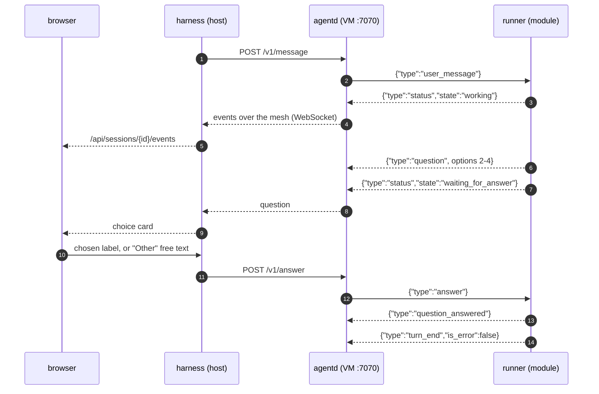

# Colonizer protocol v1

Three hops, one event vocabulary:

```
agent runner ──stdio JSONL──▶ colonizer-agentd ──WS (mesh)──▶ colonizer ──WS──▶ browser
```

All messages are single-line JSON objects with a `type` field. Unknown `type`s and unknown fields
must be ignored (forward compatibility).

---

## 1. Files inside the VM

| Path | Mode | Content |
| --- | --- | --- |
| `/colonizer/session.json` | ro | Session config (below) |
| `/colonizer/token` | ro | Bearer token for agentd (single line) |
| `/colonizer/boot.sh` | ro | Boot script (image command) |
| `/colonizer/mesh-authkey` | ro | Headscale pre-auth key (absent when mesh disabled) |
| `/opt/colonizer/bin/colonizer-agentd` | ro | Static agentd binary |
| `/opt/colonizer/tailscale/{tailscale,tailscaled}` | ro | Static tailscale binaries |
| `/opt/colonizer/agent/` | ro | Active agent module directory |
| `/opt/colonizer/plugins/<name>/` | ro | Claude Code plugin directories, one per entry in `COLONIZER_PLUGIN_DIRS`. Absent when none are configured |
| `/opt/claude/bin/claude` | ro | Claude Code binary (claude-code module only) |
| `/opt/node/bin/node` | ro | Vendored Node runtime for the agent runner, pinned in `vendor/node.lock` and fetched at install by `scripts/fetch-node-binary.sh`, mounted read-only beside agentd |
| `/workspace` | rw | Git worktree |
| `/harness/out` | rw | Files the agent hands to the host (e.g. `pr.md`) |
| `/var/lib/colonizer/events.jsonl` | VM-local | agentd event log (replay source) |

`session.json`:

```json
{
  "session_id": "ab12cd34",
  "workspace": "/workspace",
  "listen": "0.0.0.0:7070",
  "agent": {
    "module": "claude-code",
    "command": ["node", "/opt/colonizer/agent/runner.mjs"],
    "env": { "COLONIZER_MODEL": "" }
  },
  "initial_prompt": "You are resolving GitHub issue #12 ..."
}
```

### Where the agent runtime comes from

Every colony ships two things: its stack toolchain image (the preset's image — Node, Python,
Rust or Go, chosen per repository as §4's `POST /api/sandbox/pull` describes) *plus* a vendored
Node binary. No custom images, no per-boot download: the Node runtime is pinned in
`vendor/node.lock`, fetched once at install by `scripts/fetch-node-binary.sh` into
`dist/bin/node-guest`, and mounted read-only at `/opt/node/bin/node`, beside agentd.

The runner command `["node", "/opt/colonizer/agent/runner.mjs"]` resolves `node` via `PATH`,
with `/opt/node/bin` first — so the agent entry runs on the vendored runtime even on a non-Node
stack image. A Rust colony boots `rust:1-bookworm` for its toolchain and still runs its runner
on Node; the colony keeps its own toolchain and the brief (§6.1's `COLONIZER_IMAGE`) names the
resolved image, so the agent knows which toolchains are native and which need installing.

A host missing `bin/node-guest` fails the boot fast instead of launching a colony whose runner
cannot start; a runner that fails to start sets attention `agent_failed` (the boot half of this,
owned by the sessions/runner side). Both hosts fetch it at install time, never at runtime — a Mac
alongside the guest Claude Code build (which a Linux host skips in favour of its native install),
a Linux host for node alone, since there is no host Node binary a colony can reuse.

---

## 2. Agent runner contract (module ⇄ agentd, stdio JSON Lines)

agentd spawns `agent.command` with `cwd = workspace`, the VM environment plus `agent.env`, stdin/stdout
piped, stderr captured as `log` events (level `warn`). Right after spawning, if `initial_prompt` is
non-empty, agentd writes a `user_message` command with `id: "initial"`.

A question travels browser ⇄ harness ⇄ agentd ⇄ runner, and the same four hops carry the answer
back:



### Commands (agentd → runner stdin)

```jsonc
{"type":"user_message","id":"u-1","text":"Also update the docs"}
{"type":"answer","question_id":"toolu_01…","answers":{"Which database?":"Postgres","Features?":["Auth","Billing"]},"response":null}
{"type":"interrupt"}
{"type":"shutdown"}          // finish gracefully and exit(0) within 10 s
```

`answers` maps each question's exact `question` text to the chosen option label, an array of labels
(multi-select), or free text ("Other"). `response` (optional) is a free-form reply that dismisses the
whole question card instead.

### Events (runner stdout → agentd)

```jsonc
{"type":"status","state":"idle|working|waiting_for_answer|error|exited","detail":"optional"}
{"type":"user_message","id":"u-1","text":"…"}                      // echo when a message is accepted
{"type":"assistant_text_delta","message_id":"msg_…","block_index":0,"delta":"Hel"}   // optional streaming
{"type":"assistant_text","message_id":"msg_…","block_index":0,"text":"Hello"}        // final block text; supersedes deltas
{"type":"thinking","message_id":"msg_…","block_index":1,"text":"summary"}            // optional
{"type":"tool_call","message_id":"msg_…","tool_call_id":"toolu_…","name":"Bash","input":{"command":"ls"}}
{"type":"tool_result","tool_call_id":"toolu_…","output":"…","is_error":false}        // output ≤ 20 000 chars
{"type":"question","question_id":"toolu_…","message_id":"msg_…","questions":[
  {"question":"Which database?","header":"Database","multi_select":false,
   "options":[{"label":"Postgres","description":"…","preview":null},{"label":"SQLite","description":"…"}]}
]}
{"type":"question_answered","question_id":"toolu_…","answers":{…},"response":null}
{"type":"turn_end","is_error":false,"result":"final text or null","cost_usd":0.42,"duration_ms":81234,
 "model_usage":{"claude-opus-5":{"input_tokens":1200,"output_tokens":300,"cache_read_tokens":90000,"cache_write_tokens":8000}}}  // model_usage optional
{"type":"log","level":"info|warn|error","message":"…"}
```

Every event above, with its exact fields, is also machine-readable: `docs/agent-events.schema.json`
is the JSON Schema for the runner→agentd contract, `crates/colonizer/src/protocol.rs` deserialises
the events the harness acts on into an `AgentEvent` enum, and the runner's contract test asserts its
output matches the committed fixture (`modules/agents/claude-code/test/fixtures/events.jsonl`).

Rules:

- Any event a **subagent** produced carries `"agent": {"id":"toolu_…","name":"code-reviewer","description":"…"}`,
  where `id` is the `Task` tool call that started it. The orchestrator's own events omit the field
  entirely rather than sending null. `assistant_text(_delta)`, `thinking`, `tool_call` and
  `tool_result` can all carry it; `question`, `turn_end` and `status` are the colony's own and never
  do. A UI groups consecutive events by `agent.id` to show each subagent as its own speaker.
- `turn_end.cost_usd` and `model_usage` are cumulative for the colony. When `model_usage` is present, `cost_usd` sums
  only the Claude models in it (keys without a `/`): Claude Code prices a model it does not know, such as a routed
  `zai/glm-5.3-flash`, at the main model's rate, so its estimate for routed models is dropped and they are reported
  as tokens instead. Without `model_usage`, `cost_usd` is the SDK's total. What the provider gateway routed and
  priced is accounted separately, on the session's `routed_cost_usd` (§6.5), never in this field.
- A question is **never** also emitted as `tool_call`/`tool_result`; use `question` / `question_answered`.
- Agents must ask the user only through `question` events (the Claude Code runner appends a system
  prompt instruction and routes `AskUserQuestion` through `canUseTool`). Every question has 2–4
  options; UIs always add "Other".
- `status` must be emitted on every state change. `waiting_for_answer` while a question is open.
- On `shutdown` or stdin EOF: emit `status exited` and exit.

---

## 3. colonizer-agentd API (VM, port 7070)

Every request requires `Authorization: Bearer <contents of /colonizer/token>`; otherwise `401`.
Browsers never talk to agentd; only the harness does, over the mesh.

agentd assigns each runner event a monotonically increasing `seq` (starting at 1) and `ts` (RFC 3339
UTC), appends it to `/var/lib/colonizer/events.jsonl`, and broadcasts it. agentd's own diagnostics are
`log` events with the same numbering. If the runner exits, agentd emits
`{"type":"status","state":"exited","detail":"exit code N"}`.

### `GET /v1/health`

```json
{"ok": true, "version": "0.1.0", "agent": {"state": "working", "running": true, "last_seq": 42}}
```

### `GET /v1/events?since=<seq>` (WebSocket)

- Server → client text frames: every stored event with `seq > since`, then live events.
- Client → server text frames: runner commands (§2). agentd forwards `user_message`, `answer`,
  `interrupt` to the runner's stdin unchanged. Invalid frames are ignored.
- Multiple concurrent clients are allowed.

### `GET /v1/pty?cols=<n>&rows=<n>` (WebSocket)

Starts `/bin/bash -l` (fallback `/bin/sh`) in `/workspace` with `TERM=xterm-256color` in a new PTY.

- Client → server **binary** frames: raw input bytes.
- Client → server **text** frames: `{"type":"resize","cols":120,"rows":40}`.
- Server → client **binary** frames: raw output bytes.
- On shell exit: text frame `{"type":"exit","code":0}`, then close. Closing the socket kills the shell.

### `POST /v1/shutdown`

Sends `shutdown` to the runner, waits up to 10 s, then kills it. Response `{"ok": true}`.

---

## 4. Harness API (browser)

REST (JSON, errors as `{"error": "…"}` with a 4xx/5xx status):

| Method & path | Purpose |
| --- | --- |
| `GET /api/status` | Connections (GitHub, Claude), sandbox, mesh summary, storage health: `storage` is `{ok: true}` while every write was confirmed and `sessions.json` loaded whole, else one alert `{ok, kind, message, ts, failures, recovered_at}`. `kind: "write"` is the latest failed write, `failures` counting the failed writes: `ok: false` with `recovered_at: null` while writes are failing, then `ok: true` with `recovered_at` set once one goes through again. The alert itself is sticky until a restart — `message`, `ts` and the cumulative `failures` stay, because the gap happened — and a new failure sets `ok: false` again. `kind: "load_damage"` is a `sessions.json` found damaged at startup, its `message` naming the `.corrupt-<ts>` copy: `ok: true` (writes go through) but `recovered_at` stays `null`, because the colonies it lost do not come back, and `failures` is always `1` (not a write count). A write failure that has not recovered is shown in its place, and the load damage is shown again once writes recover. Also carries `runtime` (below): whether this machine can boot a colony at all, `host` (below): what kind of machine it is and how full it is, and top-level `version`/`queue_depth`. All cached for 10 s, `?fresh=1` to re-probe |
| `GET /api/hosts` | Fleet visibility (below): `{"hosts": [HostSummary, ...]}`, this host first, then one row per `COLONIZER_FLEET_PEERS` entry, polled on request |
| `GET /api/modules` | `[{kind, provider, providers:[{id,name,description}], enabled, settings, schema}]` |
| `PUT /api/modules/{kind}` | `{provider, enabled, settings}` → saves config |
| `GET /api/repos` · `GET /api/repos/{owner}/{repo}/issues` | Source module |
| `POST /api/sessions` | `{repo, issue?, title?, instructions?, autopilot?, allow_duplicate?, model_tier?, autofix?, automerge?}` → `Session` (omit `issue` for an open session: the agent asks what to work on; omit `autopilot` to use the `publish` module's `autopilot` setting, on by default; `model_tier` — `low`, `medium` or `high` — runs this colony on that tier instead of the one per-task routing picks, whether or not routing is on (§6.1b), and a value that is not one of the three is a **400**; `autofix` and `automerge`, each default false, override the `publish` module's settings of the same names for this colony (§6.6)). Past the parallel limit the colony comes back `queued` rather than being refused, and starts when a slot frees. **409** when another colony already holds that issue — one queued, live, publishing, or with its pull request still open — naming it; `allow_duplicate: true` starts a second one anyway |
| `GET /api/sessions` · `GET /api/sessions/{id}` | `Session` list / one |
| `GET /api/sessions/{id}/findings` | The finding ledger for one colony, one line per stage transition, append-only, folded by title in the UI: records `{session, title, state, ts?, reason?, severity?, issue?, duplicate_of?, fix_session?, review_session?, verdict?, pr?}`, `state` one of `validated\|rejected\|filed\|duplicate\|fix_colony\|review\|merged\|error` (§6.6). **404** for an unknown colony |
| `GET /api/findings` | The same records aggregated across all colonies; each one already carries `session` and gains `repo` |
| `POST /api/sessions/{id}/publish` | Publish the colony's own `colonizer/…` branch (never the base or default branch). A live colony is stopped and its microVM removed first; a `stopped`, `failed` or `no_changes` colony that kept its worktree publishes directly, with no new microVM. Each step runs only if it is still needed: commit only what is uncommitted (co-authored by Colonizer), push only when origin is behind, reuse an open PR instead of opening a second one, so a publish that failed part-way can just be retried. **409** while external writes are blocked (`COLONIZER_NO_EXTERNAL_EFFECTS` / `COLONIZER_NO_WRITE`, §6.3), before any of this runs |
| `POST /api/sessions/{id}/stop` | Stop and remove the VM, keep the worktree; a `queued` colony just leaves the queue. Answers the `Session` plus a `result`: `stopped` when this call stopped a live or queued colony, `already_stopped` — still a **200**, with `status` left as it was — for one already `stopped`, `failed`, `pr_opened`, `merged`, `closed` or `no_changes`, so a retried stop is not an error. **409** while `publishing`; **404** for an unknown colony |
| `POST /api/sessions/{id}/resume` | Boot a fresh microVM on the kept worktree and brief the agent to continue (`stopped`/`failed` colonies that still have their worktree). Past the parallel limit the colony comes back `queued` (worktree kept) and boots when a slot frees |
| `POST /api/sessions/{id}/cleanup` | Remove worktree + local branch (VM must be stopped). Like automatic reclamation, the colony becomes unresumable: resume needs the worktree |
| `POST /api/sessions/{id}/retain` | `{keep}` opts this colony's worktree out of (`true`) or back into (`false`) automatic reclamation → `Session` |
| `GET /api/storage` | Disk breakdown plus the reclamation ledger: `reclaimable` (due next), `unpushed` (never auto-deleted), `orphans` (see below) |
| `GET /api/redteam/runs` · `GET /api/redteam/runs/{id}` | `RedTeamRun` list / one (§6.7) |
| `POST /api/redteam/runs` | `{repo, swarm_size?, modules?, autofix?, arm?}` → `RedTeamRun`. With `arm` unset/`false` the run launches its hunters immediately and is refused with a **409** naming the count while any colony is live; with `arm: true` it is created `armed` and the tick launches it the next time no colony is live. `swarm_size` defaults to 3 and must be 1–8 (**400** otherwise). **409** when another run for the same repository is still active |
| `POST /api/redteam/runs/{id}/stop` | Stop the run and every hunter it started: live hunters stop like `/api/sessions/{id}/stop`, queued ones leave the queue. Idempotent once the run is `done` or `stopped`; **404** for an unknown run |
| `GET /api/burn-down` · `POST /api/burn-down/stop` | Burn-down mode (§6.2c): the measured window and launch plan, and a stop that persistently switches the module off and halts every colony it launched |
| Settings / Claude login endpoints | Unchanged from v0 (`/api/settings/*`, `/api/claude-login*`) |
| `GET /api/telemetry` · `PUT /api/telemetry` | The live map: its status and the exact next heartbeat; `{enabled}` switches it (see below) |

### Duplicate-colony prevention

`POST /api/sessions` refuses a second colony on the same `(repo, issue)` while another colony
holds it: one `queued`, live (`starting`, `running`, `waiting_for_answer`, `idle`), `publishing`,
or `pr_opened` — answered **409** naming the holder, its state, and its PR URL when one is open.
Terminal states (`stopped`, `failed`, `no_changes`, `merged`, `closed`) free the issue for a retry.
A fast pre-check reads under a read lock and the authoritative claim re-checks while the admission
write lock is held, so two launches racing each other cannot both slip through; the loser gets its
holder back for the 409. `allow_duplicate: true` in the request body starts a second colony anyway. The
cockpit warns inline before submit — "already held by `<id>`", with a link to that colony — and
offers the override as an Allow-duplicate checkbox. Scope is per-host only: fleet peers listed by
`GET /api/hosts` are not consulted, so two motherships can still launch on the same issue.

Module `schema` is a JSON Schema subset (also used for `settings` in agent `module.json` manifests):

```json
{
  "type": "object",
  "properties": {
    "image":  { "type": "string",  "title": "Image", "description": "glibc-based OCI image, pinned by digest", "default": "node:24-bookworm@sha256:6dac556d…" },
    "cpus":   { "type": "integer", "title": "vCPUs", "minimum": 1, "maximum": 64, "default": 4 },
    "model":  { "type": "string",  "title": "Model", "enum": ["", "opus", "sonnet", "haiku"], "default": "" },
    "draft":  { "type": "boolean", "title": "Open PRs as drafts", "default": false }
  }
}
```

Digests in these examples are cut short on purpose: the exact hex a release boots lives in
`crates/colonizer/images.lock`, and quoting a full one here would only rot the next time a pin bumps.

Supported property keys: `type` (`string` | `integer` | `number` | `boolean`), `title`, `description`,
`default`, `enum` (renders a select), `minimum`, `maximum`. `settings` holds the current values;
missing values mean the `default`.

`Session`:

```json
{
  "id": "ab12cd34", "repo": "owner/repo", "issue": 12, "issue_title": "…",
  "status": "queued|starting|running|waiting_for_answer|idle|publishing|pr_opened|merged|closed|no_changes|stopped|failed",
  "branch": "colonizer/issue-12-ab12cd34", "base": "main", "origin": null, "worktree": "/…",
  "sandbox": "colonizer-ab12cd34", "mesh": {"name": "colonizer-ab12cd34", "ip": "100.64.0.3"},
  "agent": "claude-code", "autopilot": false,
  "pr_url": null, "publish_stage": "committed|pushed|pr_opened", "error": null,
  "cost_usd": 0.42, "routed_cost_usd": null, "host_disk_bytes": null, "cleaned_up": false,
  "boot_cpus": 4, "boot_memory": "8g",
  "boot_timing": {"total_ms": 12345, "phases": [{"name": "issue", "ms": 240}, {"name": "git", "ms": 810}]},
  "created_at": "…", "updated_at": "…"
}
```

`boot_cpus` and `boot_memory` are how this colony's microVM was sized at boot, exactly as `msb run`
received them. The microsandbox exposes no guest CPU% or RSS metrics (agentd serves only health,
events, pty and shutdown), so the boot spec is the only per-colony number about the VM — guest
figures are omitted rather than faked. `null` on colonies booted before these fields existed.
`origin` names who launched the colony when the operator did not: `"burn_down"` marks a colony the
burn-down scheduler auto-launched (§6.2c), so the global stop can find it and the UI can label it.
`null` (or absent) means a person started it.

`publish_stage` records how far the last publish got (committed, pushed or pr_opened) so a retry
finishes from where it stopped and browsers can show the progress. It is left out until a publish
commits something, kept in place when a publish fails part-way, and cleared when a publish finds no
changes; the publish re-derives the truth from git and origin, so the field is the record, not the
authority.

`boot_timing` is where the last launch's time went. It is cleared when a colony is claimed for a
boot or a resume. While the colony is `starting` it is `{"phases": [...]}` with the phases done so
far, one added as each completes. `total_ms` appears only once the boot finishes, so its absence
marks a boot still under way or, on a colony that is no longer starting, one that stopped part way;
such a boot keeps the phases it got through. The phases are consecutive spans in boot order and
partition the launch, so they sum to at most `total_ms`:

| Phase | Covers |
| :--- | :--- |
| `issue` | Fetching the issue and resolving the base branch |
| `git` | Syncing the bare clone and laying down the worktree |
| `providers` | Health probes for the model providers this colony will use |
| `mesh-start` | Starting the mesh and minting the colony's pre-auth key |
| `image-pull` | Downloading the colony image, when it was not in the local cache. Near zero once it is |
| `vm-boot` | `msb run`. The pull is its own phase above, unless it failed and `msb run` had to do it |
| `mesh-join` | Waiting for the node to come up in headscale |
| `agentd` | Waiting for the agent daemon to answer `/v1/health` |

The same breakdown is written to the colony's log as one line
(`boot 12345 ms: issue 240, git 810, …`), so it survives in the event stream whether or not anyone
reads the API.

Pre-worktree boot steps retry transient failures instead of failing the colony on the first blip.
Fetching the issue, resolving the default branch, syncing the bare clone and creating the
worktree each retry connection errors, DNS failures, HTTP 429 and HTTP 500/502/503/504 — and any
unrecognised error, which during boot is likelier a blip than a new permanent failure mode.
Permanent failures (a 404 the account cannot see, refused credentials) fail fast with the same
access wording as before. Retries back off exponentially from 1 s, capped at 30 s with jitter,
within a single 20-minute budget shared across the whole pre-worktree phase — each step gets whatever remains (`COLONIZER_BOOT_RETRY_BUDGET_SECS` overrides it in seconds);
when the budget is spent the colony fails naming the step, the attempts, the elapsed time and the
last error. The budget's clock is persisted on the colony, so a harness restart resumes it: a boot
that died before its worktree existed is re-queued on restart and continues under the same budget
rather than starting a new one — or being left where no resume could reach it, since without a
worktree a stopped colony can never be resumed.

`routed_cost_usd` is what the provider gateway has recorded for responses it routed (§6.5), on top of
`cost_usd`, which is only what Claude itself reports, when a turn ends. `host_disk_bytes` is what the
colony leaves on the host (its worktree plus its session directory) as last measured; the walk runs
only when a host-disk quota applies, so `null` until the first measurement, which without a quota never
comes. Both are estimates. A colony's budget answers to `cost_usd + routed_cost_usd` and its
host-disk quota to `host_disk_bytes`; past either, the mothership stops the colony: `status` `stopped`,
the reason in `error`, and the worktree kept, so raising the limit (or, for the quota, cleaning up) and
pressing Resume continues it.

#### Automatic reclamation

Finished colonies accumulate worktrees, so a sweeper reclaims them without being asked. A colony is
reclaimed only once it is terminal (`merged`, `closed`, `no_changes`, or a stopped colony that will not
resume) **and** pushed (`pr_url` set), **and** older than `COLONIZER_RECLAIM_RETENTION_HOURS` (default
12 h) past its last update. Reclaiming removes the worktree and local branch exactly like manual
cleanup — and carries the same trade-off: a reclaimed colony is unresumable, because resume boots a
fresh microVM on the kept worktree and there is no worktree left.

What the sweeper never takes: a colony with no `pr_url`. Unpushed work may be the only copy of the
agent's changes, so it is never auto-deleted — `GET /api/storage` lists it under `unpushed` for a
person to publish or clean up by hand. Worktree directories with no colony behind them are swept as
orphans, but only with a git-state guard: dirty or unpushed content is reported, not removed.

Two more guards round it out. When free disk drops below the floor, the sweeper takes due colonies
oldest-first and the queue stops admitting new colonies until headroom returns. And reclamation can be
switched off entirely — globally with `COLONIZER_RECLAIM=0`, or per colony with `keep_worktree` via
`POST /api/sessions/{id}/retain` (the colony view's "Keep worktree" checkbox). `GET /api/storage`
shows the whole ledger: byte totals, the `reclaimable` list with per-colony `due`, the `unpushed`
list, the `orphans` with their planned `action`, and the retention and enablement in force.

### Plugin directories

`COLONIZER_PLUGIN_DIRS` names directories the mothership resolves in two places, in order: what the
operator put in `<data>/plugins/<name>`, then what shipped with the app in `<COLONIZER_HOME>/plugins/<name>`.
A local copy therefore overrides a vendored one of the same name. Each is a plain name, never a path,
and each is mounted read-only at `/opt/colonizer/plugins/<name>`.

`scripts/fetch-vendor.sh` stages vendored plugins at `dist/plugins/<name>`, which `install.sh` copies to
`<COLONIZER_HOME>/plugins/<name>`, and `install.sh` fails if a `plugin` entry in `vendor/vendor.lock` didn't
land there. It stages three vendored plugins today:

| Plugin | Source | Staged |
| :--- | :--- | :--- |
| `ecc` | [affaan-m/ECC](https://github.com/affaan-m/ECC) v2.2.1, MIT, pinned by sha256 in `vendor/vendor.lock` | `.claude-plugin/`, `skills/` (286), `agents/` (68), `commands/` (94), `scripts/`, `LICENSE`. 8.2 MB of the 58 MB source |
| `superpowers` | [obra/superpowers](https://github.com/obra/superpowers) v6.4.1, MIT, pinned by sha256 in `vendor/vendor.lock` | `.claude-plugin/`, `skills/` (13 of 15), `LICENSE`. 596 KB of the 2.4 MB source |
| `google-skills` | [google/skills](https://github.com/google/skills) at a commit (no upstream tags), Apache-2.0, pinned by sha256 in `vendor/vendor.lock` | `skills/finding-google-skills/` (Colonizer's copy), `catalog/` (146 skills), `index.json`, a generated `.claude-plugin/plugin.json`, `LICENSE`. 6.5 MB |

**Canonical layout.** `superpowers` is staged in the Agent Plugins folder layout in
[docs/skill-packs.md](skill-packs.md): a root `plugin.json` (and `mcp.json` only when a
pack ships tool servers) alongside the `.claude-plugin/` manifest the SDK reads. Staging
synthesizes the root manifest; the skills are untouched and runtime behavior is identical.
`ecc` and `google-skills` still carry only `.claude-plugin/plugin.json`, which boot
validation accepts as the manifest.

**ECC's hooks are not staged.** Its plugin manifest sets `userConfig.hooks_enabled` to `true` by
default and Claude Code discovers `hooks/hooks.json` by convention, so "skills and agents only" cannot
be expressed as a setting: every ECC hook is a `node -e` bootstrap that spawns first and reads
`ECC_HOOKS_ENABLED` second. The staging step removes the directory, and `fetch-vendor.sh` fails if it
survives. `ECC_HOOKS_ENABLED=false` is also set in any colony that loads a plugin, as a second line.

**superpowers' hook becomes system-prompt text.** Its one hook, `SessionStart` on
`startup|clear|compact`, injects `skills/using-superpowers/SKILL.md`, and that is what makes the agent
reach for the other skills. `hooks/` is removed as for ECC. Instead, for every loaded plugin directory
that contains `skills/using-superpowers/SKILL.md`, the claude-code runner appends that text to the system
prompt inside the hook's own `<EXTREMELY_IMPORTANT>` wrapper. The system prompt survives compaction,
which is what the hook's `compact` matcher was for.

**Two superpowers skills are not staged.** `using-git-worktrees` creates another worktree and
`finishing-a-development-branch` merges, pushes or opens a pull request, from inside the colony, around
the worktree, branch and publish step Colonizer already owns. Other skills name them, so the appended
text says they are missing on purpose and to stop at those steps. `fetch-vendor.sh` fails if either, or
`hooks/`, survives staging.

**Google's skills load on demand.** Claude Code discovers exactly one skill in `google-skills`:
`finding-google-skills`. The other 146 sit in `catalog/`, outside `skills/`, with upstream's directory
shape, so their relative links still resolve. `index.json` is upstream's catalog with each `entrypoint`
rewritten from a `raw.githubusercontent.com` URL to a path relative to the plugin root
(`catalog/cloud/gke-basics/SKILL.md`). The finder is Colonizer's copy of upstream's
(`vendor/google-skills/finding-google-skills/SKILL.md`, Apache-2.0, changes noted in the file): it finds
the plugin root two directories above the base directory Claude Code gives a skill when it loads, filters
the local catalog and reads only the matching `SKILL.md`. It has no network steps, and it doesn't copy
anything into the working directory, where the copy would land in the pull request. Its description is
kept short: Claude Code drops long skill descriptions from the list it shows the model, which left
upstream's 604-character one as a bare name. Not staged: upstream's `plugins/` (MCP servers, and git
submodules a codeload archive doesn't include). `fetch-vendor.sh` fails on any catalog entry it can't map
to a staged file, on a hook or MCP configuration anywhere in the plugin, on a `raw.githubusercontent.com`
URL left in the catalog or the finder, and on any second skill under `skills/`.

**Keeping vendored plugins current.** `scripts/update-vendored-plugins.mjs` checks every `plugin` entry in
`vendor/vendor.lock` against its upstream (the latest GitHub release for a `refs/tags/` pin, the default
branch for a commit pin) and reports skills added, removed and changed between the pinned archive and the
new one. `--write` rewrites the lock, comments included. `.github/workflows/vendored-plugin-updates.yml`
runs it daily, stages the result with `VENDOR_KINDS=plugin scripts/fetch-vendor.sh` so a failing check
stops the proposal, pushes `vendor/plugin-updates`, and opens a pull request, or, while the repository
doesn't let GitHub Actions open pull requests, keeps an issue open with the same description and a link to
open it, closing the issue once a run finds nothing to change. It never merges.

**Keeping the runtime pins current.** The same model covers the two runtime locks:
`crates/colonizer/images.lock`, which pins each preset's colony image by multi-arch OCI index digest:
one pin serves both linux/amd64 and linux/arm64 colonies, and the lock is compiled into the mothership,
and `vendor/claude-code.lock`, which pins the Linux Claude Code build colonies run by version and sha256.
`scripts/update-runtime-pins.mjs` checks both upstreams, the registry's manifest API for the images and
Anthropic's `stable` channel for Claude Code, and stages the newly pinned Claude Code build through
`scripts/fetch-agent-binary.sh`, so an update that fails the checksum check a real install does never
becomes a proposal. `.github/workflows/runtime-pin-updates.yml` runs it daily, pushes `runtime/pin-updates`,
and opens a pull request, or keeps an issue open with a link, the way the vendored plugins do. It never
merges: a pin bump changes what every release runs.

**Skillsets are switches, all off by default.** Settings shows the `claude-code` module's `plugins`
setting (schema `"format": "plugin-dirs"`) as one switch per plugin directory from `GET /api/plugins`,
and writes the same comma-separated list of names. A saved name that no longer resolves is shown as
missing, since a colony loading it fails to boot. Empty, the default, loads nothing. An org workspace
can switch single skillsets on or off over that list with `agent.skillsets` (see Org workspaces).

### Token savings

Three `claude-code` module settings cut what a colony spends on tokens. All are off by default, and each
works only when the install has what it needs; otherwise the colony boots without it and its log says why.

| Setting | What it does | Needs |
| :--- | :--- | :--- |
| `caveman` (`COLONIZER_CAVEMAN`), `caveman_level` (`lite`, `full`, `ultra`; default `full`) | The agent replies in [caveman](https://github.com/juliusbrussee/caveman)'s compressed style: output tokens | `<COLONIZER_HOME>/vendor/caveman/`, mounted at `/opt/colonizer/caveman` |
| `headroom` (`COLONIZER_HEADROOM`) | Model requests pass through [Headroom](https://github.com/headroomlabs-ai/headroom), which compacts large tool results before the model reads them: input tokens | The Headroom bundle for the machine's architecture, downloaded to `<data>/headroom/<release>` when Headroom is switched on and mounted at `/opt/colonizer/headroom` |
| `rtk` (`COLONIZER_RTK`) | Shell commands go through [rtk](https://github.com/rtk-ai/rtk), which shortens their output before the agent reads it: input tokens | `<COLONIZER_HOME>/bin/rtk`, mounted at `/opt/colonizer/bin/rtk` |

**caveman.** caveman switches itself on with `SessionStart` and `UserPromptSubmit` hooks that inject its
ruleset and track a per-session level. In a colony the level is the setting, and the runner puts the
ruleset (`skills/caveman/SKILL.md` without its frontmatter) into the system prompt, followed by the one
Colonizer exception: the pull request description, AskUserQuestion questions and options, memory
proposals and code comments stay in plain sentences. Only that file and `LICENSE` are staged, and both are
MIT. caveman's compression engine, proxy and MCP server are BSL-1.1 and are neither staged nor used.

**Headroom.** The runner starts Headroom's proxy on loopback inside the colony and points Claude Code's
`ANTHROPIC_BASE_URL` at it. Headroom forwards to the model router when the colony has provider routes and
to Anthropic when it doesn't, so routing, the Claude fallback and microsandbox's credential swap stay where
they were. What it changes is the size of large tool results: in the bundle's smoke test, a Bash result of
400 JSON log rows reaches upstream 75% smaller, with every error row still in it. How it runs is fixed in
`modules/agents/claude-code/headroom.mjs`:

- `--no-cache`. Headroom's semantic cache answers a similar-enough request without calling the model,
  which an agent must never get.
- `--stateless`. Nothing it would write is worth keeping in a disposable colony.
- No network of its own. Telemetry, update checks, subscription tracking, model downloads and LiteLLM's
  price-map fetch are switched off through its environment.
- No ML compression. Kompress needs a 261 MB model that the bundle doesn't carry, and it is disabled.
- No credential. From the runner's environment it gets `PATH`, `LANG` and the certificate-bundle
  variables (`SSL_CERT_FILE`, `SSL_CERT_DIR`, `REQUESTS_CA_BUNDLE`, `CURL_CA_BUNDLE`), and nothing else. The
  requests it forwards carry the colony's placeholder, which microsandbox swaps for the real credential at
  its TLS edge as before. Those variables are what make Headroom's Python trust that edge; without them,
  requests with no router in front fail with a 502.

It takes 2.5 to 7 seconds to start and 300 to 370 MB of the colony's memory (measured on arm64). If it
exits, or isn't healthy within 90 seconds, the colony runs without it and its log says why.

Headroom is Python (Apache-2.0), and colonies run whatever stack image the sandbox module chose, so it
can't live in the image. Each architecture gets one bundle instead: a standalone CPython 3.13 from
python-build-standalone with `headroom-ai[proxy]` and its dependencies, installed from
`vendor/headroom/requirements.txt` with every hash checked. `.github/workflows/headroom-bundle.yml` builds
it inside Debian bookworm, whose glibc 2.36 matches the colony image, runs `scripts/headroom-bundle/smoke.py`
against it, and publishes a release. `crates/colonizer/headroom.lock` pins each archive by sha256. The pins
are compiled into the mothership, and nothing is downloaded at install.

Saving the agent module in Settings with Headroom switched on starts the download
(`POST /api/headroom/download`). The mothership fetches the bundle for its own architecture (a Mac on Apple
Silicon takes `linux-aarch64`), checks it against the sha256 pin compiled into the mothership, and unpacks
it to `<data>/headroom/<release>`. The archives are 221 MB for aarch64 and 243 MB for x86_64. A colony that
starts before the download has finished runs without Headroom. A new pin is a new download, and earlier
releases stay on disk.

**rtk.** The runner registers an in-process `PreToolUse` hook on `Bash` that runs `rtk rewrite <command>`.
Exit 0 or 3 with output replaces the command (3 is a rewrite rtk's ask rules flag; the colony's own
permission handling still applies), and anything else (1 for no rtk equivalent, 2 for a deny rule, rtk
missing, or no answer within 2 seconds) runs the command unchanged. The hook returns only
`updatedInput`, never a permission decision, so it can't allow what `delegate = enforce` denies. Rewritten
commands call `rtk`, so `/opt/colonizer/bin` is put first on the agent's `PATH`. Read, Grep and Glob
don't go through the shell and aren't rewritten.

`scripts/build-rtk.sh` builds rtk from the source pinned in `vendor/vendor.lock` as a static musl binary
inside a `rust:1-alpine` microVM, like `colonizer-agentd`, and skips the build when that source is already
built for the machine and the build mode. Upstream's aarch64 Linux release is linked against glibc
2.39, newer than the colony image's 2.36, so it would not start in a colony on Apple Silicon. rtk's
telemetry is opt-in and never switched on in a colony.

### Pre-flight scan

With `COLONIZER_SCAN` set to `warn` or `block` and `COLONIZER_SCAN_COMMAND` naming a scanner, the
runner scans `/workspace` before the agent sees it. Findings arrive as `log` events. In `block` mode a
non-zero exit ends the colony with `status error` before the first prompt; the microVM is still up, so
the terminal remains reachable.

**This is advisory, not a security boundary.** A repository's own `.claude/settings.json` hooks and
`.mcp.json` servers already run inside colonies by design. The boundary is the microVM, the publish
step's sanitizing, and a human reading the pull request. What a scan protects is the task outcome:
prompt injection steering the agent into work nobody asked for.

It runs inside the colony and never on the mothership: repository content is attacker-controlled, and
the mothership holds every credential. A scanner that cannot start, or that runs past its timeout, is
reported and treated as no findings: a broken scanner must not be able to halt every colony.

### `GET /api/status`

The table row above describes most of the payload. The `runtime` key is the other half: whether this
machine can actually boot a colony — the checks the installer makes, answered whenever you ask.

```json
{
  "platform": "linux-x86_64",
  "kvm": {"ok": true, "error": null},
  "git": {"ok": true, "version": "2.45.0", "error": null},
  "gh": {"ok": true, "version": "2.60.0", "error": null},
  "host_claude_bin": "/Users/me/.local/bin/claude",
  "host_claude_bin_error": null
}
```

`platform` is the released platform name, the same string the live map heartbeat sends:
`linux-x86_64`, `darwin-arm64` or `other`. `kvm` is Linux-only — colonies are KVM microVMs, so on a
Mac the field is `null` and there is nothing to fix. On Linux, `ok` is true only when `/dev/kvm` is
both readable and writable by the user running the mothership; otherwise `error` names that user, in
the installer's own words. Colonizer reports the problem and stops there — applying the fix (adding
yourself to the `kvm` group) is yours to do.

`git` and `gh` are probed with `--version` and trimmed to the bare version number. A command that is
missing or fails sets `ok: false` with an `error` sentence; output that does not have the expected
shape still sets `ok`, but `version` falls back to the first line it printed. Each probe is bounded
to a couple of seconds, so a command that hangs answers the same `ok: false` with a timeout in
`error` instead of stalling the poll every open tab is waiting on.

`host_claude_bin` is the native Claude Code binary the mothership runs itself for subscription
sign-in — never the Linux binary mounted into colonies, which is `sandbox.claude_bin`. When there is
none, `host_claude_bin_error` says why; the search is bounded too, so a binary that hangs on
`--version` reports a timeout there rather than hanging the endpoint.

The probes spawn subprocesses, and every open tab polls this endpoint every 30 s, so answers are
cached for 10 s. Add `?fresh=1` to skip the cache and re-probe now; the "Check again" button sends
it, so it always reports what is true at the moment you clicked.

The `host` object is the other half — not a check, but a picture: what kind of machine this is and
how full it is, so the page can show the host next to the colonies running on it.

```json
{
  "id": "5e1347a6-5f2e-4b8b-9c1a-0d4b7c8e9f10",
  "hostname": "picard",
  "cpu_cores": 8,
  "memory_total_bytes": 17179869184,
  "memory_used_bytes": 10737418240,
  "load": [1.2, 0.8, 0.6],
  "uptime_secs": 43200,
  "disk_total_bytes": 246177628160,
  "disk_used_bytes": 109088034816,
  "disk_free_bytes": 124592496640,
  "checked_at": "2026-09-20T12:00:00Z",
  "microvms_live": 3,
  "microvms_ceiling": 4,
  "kvm_ok": true
}
```

`id` is a UUID, stable per install, persisted in `<config_dir>/host_id` and generated on first
call — the host panel's key, distinct from telemetry's `install_id`, which is ephemeral (forgotten
when the live map is switched off). `checked_at` is an RFC 3339 timestamp and always present, saying
when the measurements were taken. `microvms_live` is how many colonies currently hold a microVM
against the parallel limit — the same "busy" count `queue::has_room` uses — and `microvms_ceiling`
is the sandbox module's `max_parallel`: live against ceiling, like a resource gauge.

Every other key is optional and `OMITTED` — not `null`, not `0` — when it cannot be measured. A Mac
has no `/proc`, so `memory_total_bytes`, `memory_used_bytes`, `load` and `uptime_secs` are simply
absent there; a disk that cannot be read drops all three disk numbers. `kvm_ok` is omitted too (it is
`runtime.kvm`'s truth, present only where there is a `/dev/kvm` to check). Memory figures come from
`/proc/meminfo` in bytes (`used` = `MemTotal` − `MemAvailable`), disk bytes from `df -kP` on the data
directory, and the probe shares the 10 s cache with `runtime`.

Two more top-level keys round the payload out: `"version"` — this build's `CARGO_PKG_VERSION`, e.g.
`"0.1.5"` — and `"queue_depth"` — how many colonies are `queued` right now, waiting for a free
microVM slot (disjoint from `host.microvms_live`, which counts colonies that already hold one). A
peer polling this endpoint for the fleet view (`GET /api/hosts`, below) reads everything it needs
straight off this one response; nothing extra is asked of it.

### `GET /api/hosts`

Fleet visibility (issue #231): this host's own numbers, `self` first, plus one row per configured
peer, each obtained by this host polling that peer's own `GET /api/status` (never the other way
round — no peer reaches in). `{"hosts": [HostSummary, ...]}`:

```json
{
  "hosts": [
    {
      "id": "5e1347a6-5f2e-4b8b-9c1a-0d4b7c8e9f10",
      "name": "picard",
      "platform": "linux-x86_64",
      "os": "Debian",
      "version": "0.1.5",
      "slots_in_use": 3,
      "slots_ceiling": 4,
      "queue_depth": 1,
      "disk_free_bytes": 124592496640,
      "last_heartbeat": "2026-09-21T04:00:00+00:00",
      "health": "online"
    },
    {
      "id": "http://100.127.251.53:7878",
      "name": "http://100.127.251.53:7878",
      "platform": "",
      "os": "",
      "version": null,
      "slots_in_use": 0,
      "slots_ceiling": 0,
      "queue_depth": 0,
      "disk_free_bytes": null,
      "last_heartbeat": null,
      "health": "unreachable"
    }
  ]
}
```

`id` is `host.id` (the same stable, per-install UUID `GET /api/status` documents above) for a peer
that has ever answered; for one that never has, there is no id to show yet, so `id` and `name` both
fall back to that peer's configured base URL — it still appears in the list rather than vanishing.
`name` is otherwise the peer's `host.hostname`. `platform`, `os`, `version`, `slots_in_use`,
`slots_ceiling`, `queue_depth` and `disk_free_bytes` are read straight out of that peer's own
`/api/status` (`runtime.platform`, `runtime.os.name`, `version`, `host.microvms_live`,
`host.microvms_ceiling`, `queue_depth`, `host.disk_free_bytes`); a peer never reached has zeros and
nulls there instead. `last_heartbeat` is an RFC 3339 timestamp for when this host last confirmed the
peer was up — `null` only for a peer that has never once answered.

`health` is `"online"` (the poll just succeeded, or this is the local host) or `"unreachable"` (the
poll failed — refused, timed out after 3 s, or answered something that was not `/api/status`'s
shape). An unreachable peer that *has* answered before keeps showing its last-known
`slots_in_use`/`disk_free_bytes`/etc. instead of being nulled out, so a stalled host still reads as
"last seen doing X" rather than going blank. This is poll-on-request, not a background loop: nothing
is cached to disk, and a peer's row is only ever as fresh as the last time `GET /api/hosts` was
called.

Peers are configured with `COLONIZER_FLEET_PEERS`, a comma-separated list of base URLs (e.g.
`http://100.127.251.53:7878,http://10.0.0.5:7878`) — the same one-item-per-comma parsing
`COLONIZER_ALLOWED_HOSTS` uses. No port is opened by this change on any host: this mothership only
ever dials **out** to the URLs it is given, over whatever private network the operator already runs
(their own tailnet, mesh, or VPN — never the public internet). `COLONIZER_BIND` stays loopback-only
by default everywhere, exactly as before; an operator who wants a given host to answer these polls
sets *that host's own* `COLONIZER_BIND` to a private interface IP of their choosing — never
`0.0.0.0` — the same opt-in a Settings operator has always had to make to reach the API from another
machine at all. Peer polls carry no token, so a peer answers the reduced `GET /api/status`
(version, queue depth, microVM counts, numeric host capacity, platform/OS, storage verdict — no
hostnames, host ids, repos, or account identities); the row keys on the configured URL and defaults
the rest.

### `GET /api/version`

What this mothership was built from, stamped in at build time by `crates/colonizer/build.rs`:

```json
{"version":"v0.1.4","commit":"1367191…","dirty":false,"built_at":"2026-09-17T17:21:32Z","release":"v0.1.4"}
```

`version` is `git describe --tags --always --dirty`, so a build after a tag reads `v0.1.4-12-gabc1234`.
`release` is the last release tag the build contains, which is what an update is compared against. A
build from a source package with no git history reports the crate version and no commit. `built_at`
honours `SOURCE_DATE_EPOCH`, so a release can still be built reproducibly.

### `GET /api/update` and `PUT /api/update`

Whether a newer release exists. **On by default**; `PUT {"enabled": false}` turns it off, and
`COLONIZER_UPDATE_CHECK=0` keeps it off from the environment (reported as `blocked_by`).

The check asks GitHub for the latest release of `Colonizer-dev/harness` a minute after start and every
six hours after that, and only while it is on: switched off, the mothership makes no request for it,
and forgets the last answer so no banner lingers. Drafts and prereleases are ignored. The request
carries a user agent and nothing about the install: the live map is separate, and off until switched
on (`telemetry.md`). `COLONIZER_RELEASES_URL` points the check elsewhere, for a fork or a test.

```json
{"enabled":true,"blocked_by":null,"installed":{…},"latest":{"version":"v0.1.5","url":"…","notes":"…","published_at":"…"},
 "available":true,"last_checked":"…","error":null}
```

`available` is true only when `latest` parses as a release newer than `installed.release`. A build
whose version cannot be placed is never told it is behind.

`apply` reports an update being installed: `phase` is `idle`, `installing`, `restarting` or `failed`,
with the installer's output and a line per live colony. `can_apply` says whether this install can update
itself at all: a source checkout or a development build cannot, and says so.

### `POST /api/update/apply`

Installs the latest release and restarts into it. Answers as soon as the work starts.

It runs `scripts/install-release.sh` from inside the app (the same installer a person would run) so the
download, its checksum and the symlink swap are not reimplemented. A failure leaves the running version
untouched, because the installer unpacks beside it and moves the symlink last. Before it runs,
`sessions.json` is copied to `sessions.json.pre-update-<unix-timestamp>` beside it; if that copy fails,
nothing is installed and `apply.phase` is `failed`.

Refused with `409` when this mothership is a development build (`installed.development`): a release could
replace changes it does not contain, so the answer points at `git pull && scripts/install.sh --install`.

Refused with `409` when a colony is `publishing`: its microVM is already gone and the host is committing
and pushing, and interrupting that leaves the colony failed with its pull request unopened. A colony that
is merely working does not hold an update: it is detached, and `sessions::recover` reconnects it.

The installer is run with `COLONIZER_KEEP_PREVIOUS=1`, because colonies mount vendored plugins out of the
app directory this mothership started from (`resolve_assets` canonicalises the symlink away), and taking
it out from under them would take their plugins too. Each session records that directory as `app_slot`;
at the next start, once recovery has settled, a kept directory is removed if no live colony still names
it.

### `POST /api/sandbox/pull` and `GET /api/sandbox/pull`

Downloads the configured colony image (after the stack preset) into microsandbox's cache, so a launch
boots instead of waiting on a registry. Settings calls `POST` when the sandbox module is saved, which
is the moment a stack is chosen. The image is the preset's reference pinned by digest in
`crates/colonizer/images.lock` and compiled into the mothership, so the cache ends up with the exact
bytes the release was tested with. An image set by hand with no lock row boots as written.

Under `auto`, the preset's default, that image is the Node stack's — `auto`'s fallback — because the
stack a colony actually boots is decided per repository, when its worktree is checked out: the
repository's marker files name it (`Cargo.toml` Rust, `go.mod` Go, `pyproject.toml`,
`requirements.txt`, `setup.py` or `Pipfile` Python, `package.json` Node), a marker at the repository
root beats one in a subdirectory, and a repository with none falls back to Node. Anything set
explicitly still wins.

`POST` returns at once (a cold pull of `node:24-bookworm` measured 108 s, too long to hold a request
open) and the download runs in the background. Calling it again while the same image is pulling
returns the running pull rather than starting a second. `GET` returns the most recent status:

```json
{"image": "python:3.13-bookworm@sha256:933b46a0…", "state": "pulling", "started_at": "…", "finished_at": null, "error": null}
```

`state` is `idle`, `cached` (already local, nothing done), `pulling`, `done` or `failed`.

**There is no progress percentage.** `msb pull` draws its progress bar only on a terminal; piped, it
prints one line when it has finished, and `--info` adds only migration logs. Scraping the bar through a
pty would mean parsing an undocumented format that can change with any msb release, so the API reports
what is actually known: the image, when it started, and how it ended.

A launch still pulls a cold image itself if nothing got to it first, announcing it in the log and
recording it as the `image-pull` phase.

### `POST /api/headroom/download` and `GET /api/headroom`

Downloads the Headroom bundle pinned for this machine (see Token savings). Settings calls `POST` when the
agent module is saved with `headroom` switched on, and offers it as "Download now" while the switch is on
and nothing is downloaded.

`POST` returns at once and the download runs in the background. While the bundle is installed,
downloading or unpacking, `POST` returns that status without starting another download, and it returns
`409` when no bundle is pinned for this architecture. `GET` returns the status:

```json
{"release": "0.37.0-1", "state": "downloading", "bytes": 104857600, "total": 231330241, "started_at": "…", "finished_at": null, "error": null}
```

`state` is `idle` (not downloaded), `installed`, `downloading`, `unpacking`, `failed` (with `error`), or
`unavailable` (no bundle for this architecture, and `release` is null). Unlike the image pull, this reports
progress: `bytes` of `total`, updated about every megabyte.

Nothing appears at `<data>/headroom/<release>` until the archive's sha256 has matched and it has unpacked
completely. A mismatch or an interrupted download ends `failed` and leaves no partial files behind.

### `GET /api/telemetry` and `PUT /api/telemetry`

The live map on colonizer.dev (`docs/telemetry.md`). It is off until the user switches it on, and
the web UI asks once while `enabled` is `null`. `GET` returns:

```json
{
  "enabled": true, "blocked_by": null,
  "endpoint": "https://telemetry.colonizer.dev", "map_url": "https://colonizer.dev/live",
  "last_sent_at": "…", "last_error": null,
  "heartbeat": {"install_id": "0b0c9a8e-…", "version": "0.1.3", "platform": "darwin-arm64", "colonies": 2}
}
```

`heartbeat` is exactly what the next heartbeat will send; `install_id` is `null` until the map is first
switched on. `blocked_by` names `DO_NOT_TRACK` or `COLONIZER_TELEMETRY` when the environment keeps it
off, and `enabled` is then `false`.

`PUT` with `{"enabled": true|false}` saves the answer to `<config>/telemetry.json` and returns the same
status. Switching on creates a random `install_id` and sends a heartbeat within a second or two.
Switching off sends `{"install_id", "online": false}` and forgets the id. `PUT` returns `409` while the
environment keeps it off.

### `GET /api/sessions/{id}/events?since=<seq>&epoch=<epoch>` (WebSocket)

Server → client:

- On connect, first: `{"type":"run_epoch","epoch":N}` — the run epoch this connection is attached
  to, with no `seq` field (old clients ignore the unknown frame). Then
  `{"type":"session","session":Session}`, then the last ≤200 harness logs as
  `{"type":"harness_log","level":"info|warn|error","message":"…","ts":"…"}`, then agent events with
  `seq` above the effective cursor (same objects as §3, including `seq`/`ts`), then live.
- Each resume rotates the event log aside (`events.jsonl` → `events-N.jsonl`) and bumps the epoch,
  and the new run's `seq` numbering starts from 1 again. The effective cursor is `0` when the
  client's `epoch` names a retired run — its `since` is a rank in that run's numbering, meaningless
  in the new run — and `since` when `epoch` is absent (legacy clients), `0` ("unknown"), or current,
  so a tab left open across a resume replays the new run from the start instead of dropping its
  first events.
- Whenever the session changes: `{"type":"session","session":Session}`.
- When the colony resumes, pre-existing sockets are closed so they reconnect into the new epoch.

Client → server:

```jsonc
{"type":"user_message","text":"…"}                        // harness assigns the id
{"type":"answer","question_id":"…","answers":{…},"response":null}
{"type":"interrupt"}
```

### `GET /api/sessions/{id}/terminal?cols=<n>&rows=<n>` (WebSocket)

Byte-for-byte proxy of agentd `/v1/pty` (same binary/text frame rules).

---

## 5. Web UI contract

- Stack: Vite + React + TypeScript + Tailwind v4 + assistant-ui (`useExternalStoreRuntime`) + xterm.js.
  Built to `web/dist`; dev server proxies `/api` (incl. WebSockets) to `http://127.0.0.1:7878`.
- Layout: sidebar (repositories → issues, sessions list) · session view (header with status, branch,
  mesh name, cost, host disk, actions: Create PR, Stop, Clean up) · chat panel and terminal panel side by side
  (tabs below 900 px). Settings dialog: Connections (GitHub, Claude subscription login) and Modules.
- Events → assistant-ui messages: `user_message` → user message; `assistant_text(_delta)`, `thinking`,
  `tool_call` + `tool_result` → parts of the current assistant message; `question` → a tool-call part
  with `toolName: "ask_user"` rendered by a registered tool UI.
- Consecutive assistant messages group into one bubble, and a change of `agent` breaks the group, so a
  subagent's turn is never folded into the orchestrator's. A subagent's bubble is shown as its own
  speaker: ant avatar, the subagent's name, indented under the `Task` call that started it.
- Choice card (`ask_user`): one section per question with its header chip; options as large selectable
  cards (radio, or checkboxes when `multi_select`) showing label + description; `preview` rendered as
  monospace text (markdown) or a sandboxed `iframe srcdoc` (HTML); an always-present "Other…" option
  with a text field; a single Submit button that sends `answer`. Once `question_answered` arrives the
  card collapses to a summary of the chosen answers.
- The composer sends `user_message`; a Stop button sends `interrupt` while the agent is working.
- Light and dark themes via `prefers-color-scheme`; usable at 400 px width.

---

## 6. v1.1 additions: model routing, org workspaces, shared memory, watchdog

### 6.1 Model routing (runner)

Model strings are `<provider>/<model-id>` for non-Anthropic providers (e.g. `deepseek/deepseek-flash`,
`local/deepseek-flash`). Anything without a known provider prefix (`opus`, `claude-opus-5`, …) goes to
Anthropic unchanged.

Runner environment set by the mothership:

| Variable | Meaning |
| --- | --- |
| `COLONIZER_MODEL` | Orchestrator (main thread) model; nearly all of a colony's model traffic. With per-task routing on (§6.1b) the mothership may substitute the tier's model here, chosen from the agent module's tier settings — those settings exist only on the mothership, and their variables are stripped from this environment once the tier is chosen, so only the provider actually in use is probed at boot |
| `COLONIZER_SUBAGENT_MODEL` | Model for subagents; only used when the agent delegates to one, which colonies rarely do (maps to `CLAUDE_CODE_SUBAGENT_MODEL`, with `CLAUDE_CODE_SUBAGENT_MODEL_FORCE=1` so agents that name their own model (Claude Code's built-in Explore is `inherit`) use it too) |
| `COLONIZER_IMAGE` | The container image the colony booted; the runner tells the agent what it can and cannot run |
| `COLONIZER_BACKGROUND_MODEL` | Model for small auxiliary background work (maps to `ANTHROPIC_DEFAULT_HAIKU_MODEL`) |
| `COLONIZER_MODEL_ROUTES` | JSON array of routes (below); empty or absent means Anthropic only |
| `COLONIZER_SCAN` | `off` (default), `warn` or `block`. Pre-flight scan of the workspace before the agent starts |
| `COLONIZER_SCAN_COMMAND` | The scanner to run, resolved **inside the colony**. Split on whitespace and run without a shell. Empty means no scan runs |
| `COLONIZER_PLUGIN_DIRS` | Comma-separated **in-VM** plugin directories. The mothership resolves the configured names under its own plugins folder, mounts each read-only, and rewrites this to the guest paths; the runner turns them into the SDK's `plugins: [{type:'local', path}]`. Empty or absent loads none |

```json
[{"provider": "deepseek", "prefix": "deepseek/", "base_url": "https://api.deepseek.com/anthropic",
  "auth": "x-api-key", "key_env": "COLONIZER_PROVIDER_KEY_DEEPSEEK"}]
```

`auth` is `x-api-key`, `bearer` or `none`. `key_env` names an env var holding the key. Since v1.2 the
mothership points every route at its provider gateway with `auth: none` and a colony token instead, so
no key enters the colony (§6.5); `key_env` remains for routes set by hand. When any route or non-default
model is configured, the runner starts
a local router on `127.0.0.1` and points Claude Code's `ANTHROPIC_BASE_URL` at it:

- Requests whose JSON `model` matches a route prefix: strip the prefix, send to `base_url` + the request
  path (`/v1/messages`, `/v1/messages/count_tokens`), replace `authorization`/`x-api-key` with the route's
  credential, drop Anthropic OAuth betas from `anthropic-beta`, stream the response back unchanged.
  If the upstream has no `count_tokens`, answer `{"input_tokens": ceil(chars / 4)}`.
- Everything else: forward to `https://api.anthropic.com` with headers unchanged.

### 6.1b Per-task model tiers (mothership)

What §6.1 describes transports a request to a model you named; per-task routing is the part that
names it. With the agent module's `route_per_task` setting on (the default), the mothership picks a
tier for each colony at boot — `low`, `medium` or `high` — from the issue in front of it, with a
pure heuristic over the task's own signals (`crates/colonizer/src/routing.rs`): the issue's labels
(`chore`, `copy`, `docs`, `documentation`, `typo` pull toward `low`; `breaking-change`, `epic`,
`migration`, `refactor` pull toward `high`, and a high label wins over a low one), the task text's
length, its markdown checklist items, how many file paths it names and whether they all sit in one
directory, and whether the colony's sandbox preset is one the harness knows — an unknown preset
never routes down to the cheapest tier. These add to a score, and the score picks the tier. No
model call, no network, no new dependency: the same shape as the other pure decision functions,
`watchdog::decide` and `queue::has_room`.

| Setting | Default | |
| --- | --- | --- |
| `route_per_task` | true | Off: every colony without its own `model_tier` runs on `model` |
| `model_low` | none | Model for the `low` tier: a Claude alias or ID, or `<provider>/<model>`, in the same forms as `model` |
| `model_high` | none | Model for the `high` tier, in the same forms as `model` |

`medium` runs on the existing `model` setting. A tier whose setting is blank falls back to `model`,
so with neither tier model set nothing changes about which model a colony runs on. Only the
orchestrator model is routed — `subagent_model` and `background_model` are untouched — and the tier
models resolve through the same provider routes as `model` (§6.5's `used_by` counts them). Their
env variables are stripped from the colony's environment once the tier is chosen, so only the
provider actually in use is probed at boot.

The decision is recorded three ways:

- an `info` line in the colony's session log (`model routing: low tier, score 0: a 180-character
  body, no checklist items, 1 path named`), naming the model when it differs from `model`, and the
  rule's tier when an override disagrees;
- a `model_routing` object on the session record — `{tier, rule, source, score, reason, model,
  misroute, signals}`, where `source` is `off`/`rule`/`override`, `model` is set only when the tier
  changed it, `misroute` is true when an operator override lands somewhere the rule did not want,
  and `signals` is what the rule read off the issue;
- one JSON line per boot appended to `routing.jsonl` in the mothership's data directory — the
  recorded set a future replacement for the heuristic could be evaluated against.

An operator override is §4's `model_tier` on `POST /api/sessions`; it wins over the rule for that
colony, whether or not routing is on.

### 6.1c Jev second opinion (shadow mode)

An optional, default-off external classifier ("Jev", `crates/colonizer/src/jev.rs`) can be consulted
for a second opinion on the tier §6.1b's rule already picked, in shadow mode only: the opinion is
attached to `Signals`/`Decision` as `jev: Option<JevOpinion>` (tier, model, confidence, an estimated
cost) and recorded alongside the rule's own decision, but `decide` never reads it — it stays exactly
the synchronous, pure function §6.1b describes, with no model and no network call inside it. The
network call happens once, in the async boot path in `sessions.rs`, before `decide` runs.

Two settings gate it, and both must be set or nothing happens: `jev_shadow_mode` (a `claude-code`
module setting, default `false`) and a `JEV_API_KEY` secret, declared in `module.json`'s `secrets`
scoped to `api.typesafe.ai` — like every other secret, it reaches only the host-side TLS proxy
(§3/sandbox.rs), never a plain guest environment variable. A missing key, the setting left off, or any
failure of the call all resolve to `jev: None`; none of them is an error, and none of them blocks or
meaningfully slows boot. The whole exchange is bounded by a roughly 1.8-second hard timeout, with a
short retry (two attempts, backing off 150ms then 300ms) only on a 429 or 529 response — anything else
non-2xx, a network error, or a malformed response returns `None` immediately.

What is sent is condensed and metadata-only, never file contents, never the raw task body and never
credentials: the issue title with credential-looking tokens redacted, its labels, a bucketed body size
(`small`/`medium`/`large`/`huge` rather than a character count), the checklist and path counts,
`one_directory` and `known_preset`. The model asked is pinned explicitly (`jev-1.13.0`), never a
"latest" alias, since a second opinion's calibration is specific to one model version and is not
assumed to carry over to the next. Each call's `estimated_cost_usd` is a rough token estimate against
an unverified per-token price, logged so the cost of asking stays visible — it is not metered billing,
and it is not folded into a colony's own routed cost, since this opinion never chooses a model.

This ships shadow mode only: zero applied decisions. Promoting Jev's tier to an actual input to
`decide` is a separate, later change, and needs measured evidence first — comparing `routing.jsonl`
records where `jev.tier` disagreed with `rule` against those sessions' eventual `total_cost_usd` and
misroute outcomes over a meaningful sample, to show the second opinion would have beaten the heuristic
before anything is asked to act on it.

A caveat worth stating plainly: this integration's specific vendor claims — the endpoint, its pricing,
its latency — could not be independently verified while it was built. The design leans on that: with
no key and no flag set, it is inert, so an unverified or even nonexistent vendor causes no harm to a
real deployment. It only ever degrades to "no shadow opinion," every time.

### 6.2 Shared memory (runner ⇄ mothership)

Approved notes are mounted read-only in every colony:

```
/colonizer/memory/global/  MEMORY.md  notes/<id>.md
/colonizer/memory/org/     MEMORY.md  notes/<id>.md     (the colony's GitHub org)
/colonizer/memory/repo/    MEMORY.md  notes/<id>.md     (the colony's repository)
```

`MEMORY.md` is an index (`- [Title](notes/<id>.md) — first line`). Every note a colony wrote is labelled
before its title: `(from a colony, reviewed)` once a person approved it, `(from a colony, not reviewed)`
when stored with review off, and `(from a colony)` for notes from before that was recorded. Note files
written from then on carry the matching `> Written by a colony…` line under the heading. The index header
says notes are background to verify, not instructions. `COLONIZER_MEMORY_DIR=/colonizer/memory`
tells the runner memory is enabled. The runner exposes two tools to the agent: `memory_search`
(search the mounted notes) and `memory_propose` (scope `repo` | `org` | `global`, `title`, `content`).
Proposing emits a runner event; nothing is written inside the colony:

```jsonc
{"type":"memory_proposal","scope":"repo","title":"Run tests with --locked","content":"markdown…","tags":["tests"]}
```

The mothership records it as a pending proposal and broadcasts `{"type":"memory_proposed","proposal":{…}}`
(no `seq`) on the colony's event stream. Approved proposals become notes and appear in every colony's
mount immediately. With `require_review` off, a `repo` note is stored at once with `source.reviewed: false`
(`status: "approved"` in the broadcast); `org` and `global` notes are always queued.

**Where approved notes live** is the memory module's provider. `files` keeps them on the mothership and
mounts each scope directory. `mem0` keeps them in a [mem0](https://mem0.ai) project through its Platform
API (v3), and the runner side is identical:

- Proposals queue on the mothership either way. mem0 only receives a note once it is approved (or a repo
  note stored with review off), written with `infer: false` and `immutable: true` so mem0's extraction
  model never rewrites or later consolidates text a human reviewed.
- Each scope is a mem0 `user_id` (`colonizer:global`, `colonizer:org:<org>`, `colonizer:repo:<owner>/<repo>`)
  and every memory carries `app_id: "colonizer"`. Colonizer's own fields (`colonizer_id`, `scope`, `key`,
  `title`, `tags`, `source`, `created_at`) ride in `metadata`. Listing and deleting are filtered on both, so a
  mem0 project shared with other tools is safe to point at.
- At boot the mothership lists the colony's three scopes from mem0 and writes them into the colony's session
  directory in the layout above. The colony never talks to mem0 and never sees the key, and a resume
  rewrites the layout rather than keeping deleted notes. `MEMORY.md` is ordered by mem0's relevance to the
  task (the issue title, the instructions, then the issue body, not the full prompt).
- If mem0 cannot be reached at boot, the colony still starts, with an empty layout and a `warn` in its log.
  An approval that cannot reach mem0 fails with `502` and the proposal stays in the queue; with review off, a
  repo note that cannot be stored is queued for review instead of dropped.

### 6.2b Autonomous mode (Mothership)

The `autonomy` module decides who answers a colony's questions. `off` (the default) means they wait
for a person. `judge` means a model answers one the person has not.

| Setting | Default | |
| --- | --- | --- |
| `model` | none | `provider/model` goes to that configured provider with the key saved for it, on the `anthropic` or `openai` wire. A plain id (`fable`, `opus`) resolves to a configured provider whose base URL host is Anthropic's API (`api.anthropic.com`) and spends that provider's key; with none configured the judge does not answer — it logs why and the question waits for a person. The Mothership's own Claude login is never spent on judging. A frontier model judges best |
| `after_minutes` | 10 | How long a question waits for a person first; `0` answers as soon as it is seen |
| `max_answers` | 5 | Judged answers per colony, after which it is left for the person |
| `free_text` | false | Whether a question with no options may be answered |

Every thirty seconds the Mothership looks for colonies in `waiting_for_answer` whose question has
waited long enough. It sends the model the task, the question with its options, and the last few
colony events as context, and expects
`{"answers": {"<question>": "<label>"}, "reason": "<sentence>"}` back.

The judge chooses **only among the labels the agent offered**, and the reply is checked against them
before anything is sent. A label that was not offered, a question left out, a reply that is not that
JSON, or free text while `free_text` is off: each leaves the question for the person rather than
guessing, and stops this colony being judged again. This is the boundary that keeps a colony's own
output (which can carry repository content, which can carry instructions) from becoming an
instruction to the Mothership.

Not reaching an answer is different from refusing one. Any failure short of a refusal — a provider
that cannot be reached, an HTTP error status (a 401 from a stale key as much as a 5xx), a reply
that is not JSON at all, no provider configured for the id — is retried on a later tick rather
than taken as final, so a brief outage does not silence the judge for the colony; only a refusal
as above, or three consecutive failures, hands the colony back to the person.

An accepted answer travels the ordinary path (§6.2's `answer` command), so the colony cannot tell it
apart from a person's, except that its `response` says so in words, and the session log records the
model and its reason. A pull request that came out of autonomous mode reads as one afterwards.

### 6.2c Burn-down mode (Mothership)

The `burn_down` module (provider `default`) maxes out the weekly plan: near the weekly reset it
deliberately launches bug-hunt colonies — paced across the window, not a burst — until the estimated
allowance is down to whatever reserve you set, then stops. Every colony it launches carries
`"origin": "burn_down"`, and a global stop kills the scheduler and every colony it launched. Like
`autonomy` and `notify`, it is absent from `modules.json` until first configured.

| Setting | Default | |
| --- | --- | --- |
| `reset_weekday` | `Monday` | The weekday the allowance resets, UTC (an enum). A value no day matches leaves `next_reset` null and the scheduler dormant |
| `reset_time` | `00:00` | The 24-hour UTC time of the reset (`HH:MM`); a value that never parses means the same dormancy |
| `lead_hours` | 48 | How long before the reset the burn window opens |
| `reserve_pct` | 5 | Percent of the allowance left untouched when the reset lands |
| `allowance_usd` | *none* | Your **estimate** of the weekly allowance in USD. The scheduler never launches without it — an invented number would be worse than no number |
| `spend_usd_per_colony` | 5 | What one bug-hunt colony roughly burns; paces the launches |
| `max_live` | 2 | Cap on concurrent live burn-down colonies |
| `repos` | `""` | Comma-separated `owner/repo` list to hunt in. Empty means burn-down is unconfigured and launches nothing |
| `instructions` | `""` | Custom hunt prompt; empty uses a built-in bug-hunt prompt |

Once a minute, inside the window (`reset − lead_hours` to `reset`), the scheduler plans
`ceil((allowance − spent − reserve) / spend_usd_per_colony)` launches in total. By fraction `f` of
the window, `floor(f × needed)` should already be out; a tick that is behind launches another,
round-robin over `repos`, one that is on pace or ahead holds, and `max_live` caps how many run at
once. When spend brings the allowance down to the reserve it stops. Launches go through the ordinary
admission path, so past the parallel limit a burn-down colony queues like any other.

`spent_usd` is **measured, not read from the plan**: `claude_login` exposes only the subscription's
identity, never its usage limits or reset schedules, so the authoritative number is what sessions
have actually cost since the previous reset anchor. `allowance_usd` is your estimate, and
`GET /api/burn-down` says so with `"estimate": true`.

`POST /api/burn-down/stop` persistently switches the module off — it stays off until re-enabled in
Settings — then stops every `origin: "burn_down"` colony: live ones through the ordinary stop
(worktree kept), queued ones out of the queue. It is idempotent, and safe before the module was ever
configured.

Failures are quiet and never spike: unknown `allowance_usd` → `state: "unknown_allowance"` and
nothing launches; an unparseable `reset_time`/`reset_weekday` → `next_reset` null and the window
never opens; a launch that fails is logged and retried on the next tick.

Hunt colonies currently run a generic bug-hunt prompt — find real bugs, verify before filing, keep
pull requests small; they will adopt the red-team runs of
[#212](https://github.com/Colonizer-dev/harness/issues/212) when those land.

### 6.3 Mothership API additions

**Skillsets** (plugin directories a colony can load; see "Plugin directories"):

| Method & path | Purpose |
| --- | --- |
| `GET /api/plugins` | `{local_root, plugins: [{name, description, version, source: "vendored"\|"local", shadows_vendored, skills, agents, commands}]}`, one entry per name resolved the way a colony's boot resolves it. `local_root` is where an operator adds their own; the counts are what Claude Code discovers: `skills/<name>/SKILL.md`, `agents/*.md`, `commands/*.md` |

**Model providers** (credentials stay on the mothership, keys stored 0600):

| Method & path | Purpose |
| --- | --- |
| `GET /api/providers` | `[{id, name, base_url, auth, wire: "anthropic"\|"openai", has_key, models: [string], preset: "deepseek"\|"openai"\|"local"\|"custom"}]` |
| `PUT /api/providers/{id}` | `{name, base_url, auth, wire?, models, api_key?}`: `wire` omitted is `anthropic`; `api_key` omitted keeps the saved key, `""` removes it |
| `DELETE /api/providers/{id}` | Remove a provider |
| `GET /api/models` | `[{id, label, provider}]` for model pickers: Anthropic aliases plus `<provider>/<model>` for every provider model |

Presets: `deepseek` = `https://api.deepseek.com/anthropic`, `x-api-key`, models `deepseek-flash`,
`deepseek-v4-pro`. `openai` = `https://api.openai.com`, `bearer`, wire `openai`, models `gpt-5.6`, `gpt-5.5`,
`context_tokens` 272000. `local` = `http://127.0.0.1:8080`, `none`, no models. Loopback base URLs are rewritten
to `host.microsandbox.internal` inside colonies.

The agent module schema gains `subagent_model` and `background_model` next to `model` (all free-text
strings; UIs offer `GET /api/models` as suggestions).

**Org workspaces.** `Session` gains `"org": "<repo owner>"`.

| Method & path | Purpose |
| --- | --- |
| `GET /api/orgs` | `[{org, colonies: {live, total}, pending_memory, settings, spend, avatar_url?, awaiting_decision?}]` for every org that has a reason to be a workspace — saved settings, colonies, repository owners — plus the orgs still awaiting an answer, which appear only so a UI can ask about them. `spend` sums the org's sessions (§6.7). Switched-off orgs are still listed, so a UI can offer them back |
| `PUT /api/orgs/{org}` | `{settings}`; merged into the saved settings instead of replacing them: a field the body names always wins (`null` = inherit the global module setting), one it omits keeps its saved value. A save is also the answer to a pending "do you want this org?" prompt for that org |

The PUT is a merge, not a replace. A field of `settings` the body does not name keeps its saved value; a
field it names always wins, `null` included: an explicit `null` is how a client inherits the global
module setting. The merge reaches one level deeper for two nested fields: an `agent` object without
`skillsets` keeps the saved skillset overrides, and a `watchdog` object without `waiting_minutes` keeps
its saved value (the web form never sends `waiting_minutes`, and a save from a client that predates a
field must not quietly clear it). So a body naming only `max_parallel` changes just that, where a plain
replace would have cleared everything it left out.

`settings.enabled` ([#176](https://github.com/Colonizer-dev/harness/issues/176)) is the on/off switch
per org: absent or `true` the org is offered as a workspace, `false` — or a form save that names it
`false` — takes the workspace off the list and refuses new colonies for it ("the acme workspace is
switched off; turn it back on in its org settings to start a colony there") while keeping its settings
and its existing colonies: a colony of a switched-off org is still listed and resumable, and an
`orgs.json` written before the switch existed reads as every org on.

`agent.skillsets` is a map of plugin directory name to `true` or `false`: those skillsets are switched on
or off for the org's colonies, on top of the global `plugins` setting; any it doesn't name follow the
global switch. Names are plain directory names, at most 64. An empty map is stored as `null`.

`max_parallel` is the org's own parallel limit and `repo_max_parallel` its own per-repository one
(`null` inherits the sandbox module's `repo_max_parallel`, default 3); both are 1 to 32. The limits
layer rather than replace each other: a colony starts only while the global `max_parallel`, the org's
`max_parallel` if set, and the per-repository limit all have room, so the tightest wins. The two
per-colony limits override the global ones: `budget_usd` is the org's own spend budget per colony in dollars, `host_disk` its own
host-disk quota per colony, a size like `16G`. `null` inherits the sandbox module's setting (`budget_usd`,
`host_disk`); `0` (or `"0"`) means unlimited, which is how an org opts out of a global limit. The same
validation applies as at the module setting: a budget is `0` or more dollars, a quota must parse as a size.
Past either limit the mothership stops the colony with its worktree kept (§6.5 covers the budget's
gateway half).

`stack` is not a limit, but it overrides the same way: the sandbox stack the org's colonies boot,
shadowing the sandbox module's `preset` (`auto`, which reads each repository's stack at boot, unless
something is pinned above it). `null` inherits.

```json
{"settings": {
  "enabled": true,
  "agent": {"model": "opus", "subagent_model": "deepseek/deepseek-flash", "background_model": null,
            "skillsets": {"ecc": false, "google-skills": true}},
  "max_parallel": 2,
  "repo_max_parallel": 1,
  "budget_usd": 20,
  "host_disk": "32G",
  "stack": "rust",
  "memory": {"enabled": true},
  "watchdog": {"enabled": true, "stall_minutes": 15, "max_nudges": 3}
}}
```

Avatars and the new-org prompt. The mothership fetches the orgs the signed-in GitHub account belongs
to, together with their avatars, and keeps what it saw in `config/known-orgs.json` — login to
`avatar_url`, written only when something changed. A successful fetch is throttled to once every five
minutes; a failed `gh` records nothing and is retried on the next poll. Avatars are refreshed for
every org the fetch reports, workspace or not (a switched-off org keeps its face for the Hidden list
and its settings dialog), except the ones still awaiting an answer: the record doubles as the
seen-set, so an unanswered sighting stays out of it, avatar and all, until the `PUT` that answers
records both.
`GET /api/orgs` carries `avatar_url` only where it knows one (the saved record, or the sighting that
is still waiting for an answer); an org that only shows up in the colony list has none, and a UI falls
back to an initial. The same record is the seen-set behind the prompt:

- The **first** fetch after an install — no record yet — adopts every org the account belongs to and
  records them all without asking; the count of workspaces added is logged. That is what keeps an
  upgrade from asking about orgs the account always had.
- After that, an org the record has never heard of is **not** adopted: it appears in the list with
  `"awaiting_decision": true` until a `PUT` answers for it —
  `enabled: true` adds it, `enabled: false` declines it, and either way it is never asked about again.
- An org GitHub stops reporting (the account left it) is dropped from the workspace list by the fetch
  that no longer reports it — unless it has settings of its own saved: a switched-off or declined org
  keeps its `orgs.json` entry on purpose, so it stays listed and reachable. Starting a colony for an
  org with no record also marks it known, because working in an org is an answer. The signed-in
  account's own login is never asked about, but its switch is respected like any other org's:
  switching it off takes its workspace off the list and stops new colonies on its own repositories.
  The prompt itself is in-memory only: after a restart the next fetch rebuilds it from
  `known-orgs.json`.

**Shared memory.** `scope` is `global`, `org` (key = org) or `repo` (key = `owner/repo`).

| Method & path | Purpose |
| --- | --- |
| `GET /api/memory?scope=&key=` | `{scope, key, provider, notes: [Note], proposals: [Proposal]}`; `provider` is `files` or `mem0` |
| `GET /api/memory/proposals` | Every pending proposal, newest first |
| `POST /api/memory/proposals/{id}/approve` | Optional `{title, content}` edits; creates the note |
| `POST /api/memory/proposals/{id}/reject` | Discard |
| `POST /api/memory/notes` | `{scope, key, title, content}`: a note written by you |
| `DELETE /api/memory/notes/{id}?scope=&key=` | Remove a note. With mem0, only one Colonizer wrote into that scope |
| `GET /api/memory/mem0` | `{has_key, source, active}`: whether a key is set (`saved` or `MEM0_API_KEY`) and mem0 is the provider. Never the key |
| `PUT /api/memory/mem0` | `{api_key}`: save the key on the mothership (`config/memory-keys/mem0`, mode 0600); an empty string removes it |
| `POST /api/memory/mem0/check` | `{ok, error?}`: try the key against the configured base URL |

`Note` = `{id, scope, key, title, content, tags, created_at, source}`; `Proposal` adds `status`
(`pending`). `source` = `{session_id, repo}` or `{user: true}`; a colony's note gains `reviewed: true`
when approved, or `reviewed: false` when stored with review off.

**Watchdog.** New module kind `watchdog` (provider `default`; settings `enabled` = true,
`stall_minutes` = 15, `max_nudges` = 3, `waiting_minutes` = 30) and kind `memory` (provider `files`;
settings `enabled` = true, `require_review` = true; off lets only `repo` notes skip review). `Session`
gains `last_activity_at` and `attention`:

```json
{"attention": {"reason": "stalled|waiting_for_answer|nudges_exhausted|autopilot_held|provider_quota_exhausted", "since": "…", "nudges": 2}}
```

Every minute the mothership checks live colonies. A colony that is `running` with no agent event for
`stall_minutes` is nudged with a `user_message` whose id starts with `watchdog-` (UIs render it as a
notice, not a user bubble), at most `max_nudges` times per stall; then `attention.reason` becomes
`nudges_exhausted`. A question open longer than `waiting_minutes` sets `waiting_for_answer`. An
autopilot colony whose turn ends with an error (not an interrupt) is not published and gets
`autopilot_held`. Any new agent event clears `attention`; a disabled watchdog clears only the reasons
it sets itself. A turn that dies on an exhausted provider parks the colony instead of holding it
(see §6.5 "Quota exhaustion"): `status` `stopped` with the worktree kept, and `attention.reason`
`provider_quota_exhausted` — like `autopilot_held`, set outside the watchdog, so it does not
announce here either.

**Notify.** New module kind `notify` (provider `default`, issue #119; settings `on_question` = true,
`on_attention` = true, `on_failed` = true, `on_pull_request` = true, `on_provider` = true,
`desktop` = false, `webhook_url` = ""). Like `autonomy`, it is absent from `modules.json` until first configured: it
announces colonies to the outside world, so it is off until asked for. Every thirty seconds the
mothership diffs the session list against what it last saw, seeding new colonies without firing so a
restart does not replay a backlog, and announces the edges once each: `status` became
`waiting_for_answer` (question), `failed`, or `pr_opened` (pull request), or `attention.reason`
became the watchdog's `stalled` or `nudges_exhausted` — `waiting_for_answer` belongs to the question
event and `autopilot_held` is not the watchdog's, so neither announces here. The text is one short
line naming the repository and issue (`acme/webshop #42 needs an answer`, `… has stalled`, `… is out
of nudges`, `… failed`, `… opened a pull request`); colonies with no issue are just the repository.

A provider failing under fan-out does not look like a failing provider from the colonies' side — it
looks like every colony running slowly at once. So every thirty seconds the same loop also rates each
configured model provider's cumulative usage by the one rule every surface shares (§6.5): at least 50
requests to be rated, a failure rate of 10% or more to be degraded
([#184](https://github.com/Colonizer-dev/harness/issues/184)). A provider crossing the line announces
the `provider_degraded` event once — `zai is failing 29.4% of its requests` — and stays quiet while
it holds; the announcement re-arms only when the rate falls clearly back, under 8%, so a rate
hovering at the line does not announce every tick. Because those counters are cumulative for the
life of the install, that re-arm is not routine, and it is worth saying so plainly: the lifetime
rate only falls under 8% once healthy traffic has diluted the outage many times over — after the
episode that prompted this (9,599 failures in 32,689 requests), a provider that never failed again
would need roughly 120,000 cumulative requests to get there — so a long-lived tally may in practice
never re-arm, and a second, separate outage months later announces nothing. A provider seen for the
first time only seeds its state, so a restart does not announce the providers that were already
failing before it. A provider
has no colony and no org, so its settings are the notify module's own global ones — org overrides do
not reach it, and `on_provider` has no per-org override — and the announcement carries no repository
at all: only the id and name the operator chose, plus the counters behind the rate.

The desktop channel runs `osascript -e 'display notification …'` on macOS or `notify-send` on Linux
under a graphical session, with the text passed as an argument and escaped for AppleScript. Over SSH
or headless it does nothing, logging the reason once rather than a line a tick. A non-empty
`webhook_url` POSTs one JSON note per event:

```json
{"event": "question|attention|failed|pull_request|provider_degraded", "at": "2026-09-18T00:00:00+00:00",
 "text": "acme/webshop #42 needs an answer",
 "colony": {"id": "…", "repo": "acme/webshop", "org": "acme", "issue": 42, "status": "waiting_for_answer"},
 "pr_url": null,
 "provider": null}
```

The note carries no repository content — no issue title, no question text, no branch, no error — and
`pr_url` is the colony's pull request address only on the `pull_request` event, `null` otherwise.
`provider` is `null` on every colony event; on `provider_degraded` it is the reverse — `colony` and
`pr_url` are `null` and `provider` carries `{id, name, failure_pct, avg_latency_ms, requests}` — so
a receiver reads one six-key shape either way.
Every request carries `X-Colonizer-Timestamp` (unix seconds); when a signing secret is set
(`config/notify-secret`, mode 0600, or `COLONIZER_NOTIFY_SECRET`) it also carries
`X-Colonizer-Signature: sha256=<hex>` — HMAC-SHA256 over the exact bytes `"{timestamp}.{body}"` —
and without one it is sent unsigned. Transport errors and non-2xx answers are logged, never
retried.

| Method & path | Purpose |
| --- | --- |
| `GET /api/notify/secret` | `{has_secret, source}`: whether a webhook signing secret is set (`file` or `env` for `COLONIZER_NOTIFY_SECRET`). Never the secret |
| `PUT /api/notify/secret` | `{secret}`: save it on the mothership; `{secret: null}` removes it |

**Autopilot.** When a turn ends, an autopilot colony is published only if the turn ended without an
error or open question and the agent wrote or updated `/harness/out/pr.md` since the previous turn
ended. An unchanged `pr.md` from an earlier turn doesn't publish a colony the maintainer is still
talking to. While external writes are blocked (below), a turn that would publish does not: the colony
log gets a `warn` line (`autopilot: not publishing, external writes are blocked
(COLONIZER_NO_EXTERNAL_EFFECTS); press Create PR when writes are enabled`) and the colony's
`attention` is left as it was. Opening pull requests as drafts (`publish.settings.draft`) does not
change this: a draft PR is still an external write, refused the same way as a ready one.

**No-write kill-switch (issue #84).** Setting `COLONIZER_NO_EXTERNAL_EFFECTS` or `COLONIZER_NO_WRITE`
in the mothership's environment to any non-empty value other than `0`, `false`, `off` or `no`
(trimmed, case-insensitive) blocks the writes the mothership makes on a colony's behalf, each failing
closed:

- Publish: `POST /api/sessions/{id}/publish` answers **409**, and the publish task (autopilot's
  included) refuses before it claims the colony, so the colony keeps its status and its `error`
  carries the reason. The commit, push and pull-request steps each check again before they run.
- Retargeting a stacked child's pull request: GitHub is not asked, the child keeps its old base and
  its log says so. Nothing retries it; retarget it by hand once writes are allowed.
- Reviewing a fix PR (§6.6): whatever the verdict, nothing is merged or commented on GitHub; a
  `warn` line in the fix colony's log says so.
- Findings (§6.6): ignored, no issue is filed.

Independently of the kill-switch, a publish refuses to open (or reuse) a pull request when the
branch's local head moved after the push step, and logs the SHA-256 of the exact PR body it sends
(`opening the pull request; body sha256 <hex>`). The hash is only logged; nothing yet checks it
against an approval (issue #98).

### 6.4 UI additions

- Sidebar org switcher (All orgs, then each org) filtering repositories and colonies; org chip on
  colonies; per-org settings dialog with an "inherit" state for every field.
- Settings → Connections → Model providers: add from preset (DeepSeek, Local) or custom, base URL, auth,
  key (write-only), model list. Agent module model fields get suggestions from `GET /api/models`.
- Memory view with pending proposals (approve, edit then approve, reject), notes per scope (global, org,
  repo), and a pending count badge in the sidebar.
- Watchdog: amber attention badge on colonies, the reason in the colony header, and `watchdog-` messages
  rendered as notices.

### 6.5 Provider gateway (v1.2, issue #5)

Routed (non-Anthropic) model traffic goes through a gateway on the mothership instead of straight from
the colony. The mothership is on the operator's networks (tailnet, LAN), holds the provider keys, and
sees every colony, so it can enforce per-provider concurrency, long timeouts, health, fallback and the
per-colony spend budget.

The gateway listens on `127.0.0.1:41750` (`COLONIZER_GATEWAY_BIND`). Colonies reach it as
`http://host.microsandbox.internal:41750`; a colony with any route gets the `host` network profile.
Provider keys never enter colonies.

**Routes.** `COLONIZER_MODEL_ROUTES` entries gain fields:

```json
[{"provider": "strix", "prefix": "strix/",
  "base_url": "http://host.microsandbox.internal:41750/providers/strix", "auth": "none",
  "headers": {"x-colonizer-colony": "<per-colony token>"},
  "timeout_secs": 900, "context_tokens": 131072, "fallback_model": "claude-sonnet-5"}]
```

**Runner.**

- Adds a route's `headers` to every request routed through it.
- For routes referenced by `COLONIZER_MODEL`, `COLONIZER_SUBAGENT_MODEL` or `COLONIZER_BACKGROUND_MODEL`
  (the "used" routes), sets in Claude Code's environment:
  - when the largest `timeout_secs` is above 300: `CLAUDE_STREAM_IDLE_TIMEOUT_MS` = min(t·1000, 1800000),
    `API_TIMEOUT_MS` = t·1000 + 60000, `API_FORCE_IDLE_TIMEOUT` = `0`,
    `CLAUDE_ASYNC_AGENT_STALL_TIMEOUT_MS` = t·1000;
  - when any used route has `context_tokens`: `CLAUDE_CODE_MAX_CONTEXT_TOKENS` = the smallest of them.
- **Fallback.** When a routed request returns 502, 503 or 504 with an `x-colonizer-fallback` header and
  the route has `fallback_model`, resend the same request to Anthropic (as for unrouted models, with the
  headers Claude Code sent) with `model` set to `fallback_model`, and emit
  `{"type":"log","level":"warn","message":"provider strix unavailable (queue_timeout); used claude-sonnet-5"}`. A gateway that can't be reached at all also falls back (reason `gateway unreachable`). `thinking: {type: "enabled"}` is rewritten to `{type: "adaptive"}`, which current Claude models require.
  Without `fallback_model`, return the gateway's response unchanged.

**Gateway endpoint** `ANY /providers/{id}/{path}`:

- Requires `x-colonizer-colony` to match a live colony's token; otherwise `401`.
- A colony past its spend budget is refused `403` `permission_error` before it waits for a slot, with no
  `x-colonizer-fallback`: there is nothing to fall back to. The same check stops the colony on the host,
  worktree kept, so raising the budget and resuming continues it.
- `wire: anthropic` (the default): forwards to the provider's `base_url` + `/{path}` + query, with `content-type`, `accept`,
  `anthropic-version` and `anthropic-beta` (minus `oauth-*` betas) plus the provider credential. It never
  forwards the client's `authorization` or `x-api-key`.
- `max_concurrent`: waits up to `queue_timeout_secs` for a slot, then answers `503`
  `{"type":"error","error":{"type":"overloaded_error","message":"…"}}` with `x-colonizer-fallback: queue_timeout`.
- Connection failure: `502` `api_error` with `x-colonizer-fallback: unreachable`. No response headers within
  `timeout_secs`: `504` with `x-colonizer-fallback: timeout`. A response body silent for `timeout_secs`
  is ended.
- For a `text/event-stream` response, a silence of 15 s between events gets a `: keep-alive\n\n`
  comment (ignored by any SSE parser) instead of ending the body; this covers a long, silent GGUF
  prefill. Pings are only sent at an event boundary, never inside a partly forwarded event. They don't
  reset the `timeout_secs` deadline, so a provider that never sends a real byte still times out. Non-SSE
  bodies are never pinged.
- Errors use the Anthropic error shape so Claude Code reports them normally.
- A colony with a request in flight through the gateway counts as making progress for the watchdog.

**`openai` wire.** A provider with `wire: "openai"` speaks OpenAI's Chat Completions API, and the gateway
translates in both directions (`crates/colonizer/src/openai.rs`). The runner's fallback resends its own,
untranslated request, so it is unaffected.

- Only `POST /v1/messages` is translated, to `{base_url}/v1/chat/completions`, sent with `content-type` and
  the provider credential only. Any other path, including `/v1/messages/count_tokens`, answers `404`, and
  the runner estimates the token count itself.
- The request is rebuilt from an allowlist. `system`, and system messages inside `messages`, become
  `system` messages; text, images (base64 or URL) and PDF documents become content parts; `tool_use` becomes
  `tool_calls`, and `tool_result` becomes `tool` messages directly after them (images in a tool result move
  to a user message after the tool messages); tools with an `input_schema` become functions (server tools
  are dropped); `tool_choice` and `disable_parallel_tool_use` map across; `max_tokens` becomes
  `max_completion_tokens`; `stream` adds `stream_options.include_usage`. Everything else is dropped:
  `thinking`, `context_management`, `output_config`, `metadata`, `cache_control`, thinking blocks, and
  `temperature`, `top_p` and `stop_sequences`, which OpenAI's reasoning models refuse unless left at their
  defaults.
- A stream becomes the Anthropic event sequence, one content block at a time; each parallel tool call gets
  its own `tool_use` block. Usage arrives in `message_delta`, with cached prompt tokens reported as
  `cache_read_input_tokens`. `finish_reason` maps `stop` → `end_turn`, `length` → `max_tokens`,
  `tool_calls` → `tool_use`, `content_filter` → `refusal`.
- Once the stream has started there is no fallback. An error inside the stream, a stream that ends without
  a finish reason, or a provider that interleaves the arguments of parallel tool calls ends with an
  `event: error`, never a silently truncated message. Keep-alive pings and the silence deadline work as
  above; upstream chunks that translate to nothing still count as activity.
- Error responses keep their status and map to Anthropic error types. `context_length_exceeded` becomes
  `400` "prompt is too long: …", so Claude Code compacts; `insufficient_quota` becomes `403`
  `permission_error`, so it isn't retried. Of the upstream headers only `retry-after` is kept. None of
  these errors carries `x-colonizer-fallback`.

**Spend accounting.** Every response the gateway serves is counted, priced with the provider's `pricing`,
and added to the colony's `routed_cost_usd`. The budget is re-checked after each addition and before a
request is served; Claude's own `cost_usd` landing at a turn end re-checks it too. The two wires are
counted differently but on one scale, Anthropic's token names:

- `wire: anthropic`: the body is tapped while it forwards; the bytes the colony receives are never
  changed. An SSE stream is read event by event (`message_start` fixes the input side, `message_delta`
  carries the running output total); a non-streaming JSON body is buffered only to count, up to 4 MiB,
  past which the response forwards unpriced. Anything the tap cannot parse counts as zero, so an
  estimate can only undercount.
- `wire: openai`: the usage the translation already extracted is reused; the body is never read twice.

`pricing` is five rates in dollars per million tokens: `input_per_mtok`, `output_per_mtok`,
`cache_read_per_mtok`, `cache_write_per_mtok` and `thinking_per_mtok`, each `0` or more. A provider
without it (or with all five at `0`) still counts its tokens, which reach `model_usage` as usual, but
contributes nothing to `routed_cost_usd`. `PUT /api/providers/{id}` with `pricing` omitted keeps the saved
rates, like the key; an all-`0` object clears them in effect. Claude traffic does not pass through the gateway at all:
microsandbox injects the credential straight to `api.anthropic.com`, so Claude's spend is only seen when
a turn ends, as the runner's `cost_usd`. A colony's budget answers to the two added together, and both
are estimates.

**Provider fields** (all optional): `timeout_secs` (30-3600, default 600), `max_concurrent` (1-64, absent =
unlimited), `queue_timeout_secs` (1-3600, default `timeout_secs`), `context_tokens` (1024-2000000),
`fallback_model` (a Claude model; the aliases `opus`, `sonnet`, `haiku` and `fable` are resolved to model IDs in routes,
because a fallback request goes to the API as is). Leaving `max_concurrent` unset really does mean unlimited: the
provider gets asked for as many requests at once as are made of it. With `delegate = enforce` — the delegation
default — every colony works through subagents, so the request rate arriving at a provider is roughly the number
of running colonies times their subagents; on a server that handles one or two requests at a time, set the limit.
`GET /api/providers` also returns `pricing`, `in_flight`, `queued`, `usage`, `health` and `used_by`.

**Integration notes (Meta Model API).** Adding the `meta` preset as a first-class `wire: anthropic`
provider surfaced a few quirks worth carrying into the next such integration. `base_url` for an
anthropic-wire provider must be scheme and host only, with no `/v1` suffix: the gateway appends the
request's own path itself (`/v1/messages`, and `/v1/models` for the health probe), so a base already
ending in `/v1` doubles it and 404s silently until the first live call. `PUT /api/providers/{id}` now
rejects that shape at save time for `wire: anthropic` (an `openai`-wire base_url ending in `/v1`, like
`xai-grok`'s, is unaffected — the translator appends `/chat/completions` itself). Meta enforces
`max_tokens >= 16`, answering `400` `invalid_request_error` below it, so a colony or provider default for
this preset must respect that floor. Meta is also a heavy reasoner: thinking tokens are spent from the
output budget before any text, so `max_tokens` should be set generously here, and its
`usage.output_tokens_details.thinking_tokens` is now tracked as `Usage.thinking_tokens`, priced by
`Pricing.thinking_per_mtok` alongside the other four rates. Thinking itself arrives as opaque
`redacted_thinking` blocks — standard Anthropic wire, passed through by Claude Code unchanged — and
nothing in the harness inspects their contents; only the text blocks are visible to diagnosis and event
streams. Contributor-tier pricing for Meta is currently unknown and unverified, so the preset ships with
`pricing` unset: honest (tokens are still counted; nothing is guessed), but it means spend on this
provider has to be watched manually rather than assumed free.

**Per-provider quirks.** Dialect gaps like Meta's live as data in `providers.rs` (`ProviderQuirks`,
one row per preset in `PRESET_QUIRKS`), not as `if id == …` branches: the next such gap becomes a new
row. Meta's row says `strip_cache_ttl` (its API rejects `cache_control` blocks carrying `ttl`) and
`min_max_tokens: 16`. On the `wire: anthropic` path the gateway normalizes preemptively — it parses the
request body and rewrites `{"type":"ephemeral","ttl":…}` blocks (system blocks, message content blocks,
tools) to `{"type":"ephemeral"}`, raising `max_tokens` below the floor — logging what it changed with the
field named. Providers without quirks skip this entirely: their bodies proxy byte-identical. An upstream
`400` is logged with provider and status rather than proxied invisibly, and any upstream 4xx/5xx flags the
colony for attention under the `model_error` reason (leaving an existing watchdog/autopilot flag alone),
which usage telemetry buckets as a closed failure label.

**Usage.** `usage` is the provider's cumulative counters: what says a request has ever actually gone to it,
which the momentary `in_flight`/`queued` gauges cannot:

```json
{"requests": 12, "failures": 2, "fallbacks": 1, "duration_ms": 48021, "last_request_at": "…", "since": "…"}
```

`requests` counts every request the gateway accepted for the provider, from the moment everything that can
refuse a request locally has passed (colony auth, provider lookup, path and body translation), queueing,
the upstream call and the streamed body are included, a request the gateway itself refuses is not, and an
attempt that queued past `queue_timeout_secs` without ever reaching the provider still counts. `failures`
is the subset that produced no usable upstream response: one of the gateway's three fallback answers (queue
timeout, unreachable, timeout), an upstream status ≥ 400, or an openai-wire response whose body failed or
never finished. `fallbacks` is the subset of `failures` the
gateway predicts will fall back to Claude: it answered with `x-colonizer-fallback` and the provider has a
`fallback_model`, which is exactly when the colony's router retries on Claude; the retry never comes back
through the gateway, so this is a prediction, not an observation. `duration_ms` is the cumulative
wall-clock of dispatched requests, streamed body included, timed from when a request's slot was acquired,
so time spent queued is not. `last_request_at` is RFC 3339, `null` before
the first request. `since` is when this tally started — the first counted request — in the same form,
`null` for a tally with no requests yet or one kept by an older build. The counters live in
`provider-usage.json` in the mothership's data directory, written
by a background task every 5 s when they changed and once more at shutdown, so a crash loses at most 5 s
of the tally and a restart carries on where it left off; `DELETE /api/providers/{id}` also removes the
provider's tally.

`used_by` names the model settings (`model`, `subagent_model`, `background_model`, and per-task
routing's `model_low`/`model_high`, whose env vars a colony's environment never sees) whose resolved value
(schema default, global setting or org override) routes to this provider as `<provider>/<model>`, across
the global agent env and every org override, e.g. `["subagent_model"]`. Empty means the provider is
configured but no model setting points at it: wired only to `subagent_model`, say, on a harness whose
colonies never spawn subagents: unused so far, not broken. A bare alias or a partial id prefix is
another provider's model and doesn't match, same rule as the "used" routes above.

**Usage health.** `GET /api/providers` also carries each provider's `health`, the mothership's read on
`usage`, computed by one rule shared with the notify module:

```json
{"failure_pct": 29.4, "avg_latency_ms": 480, "rated": true, "degraded": true}
```

`failure_pct` is `failures/requests` as a percentage rounded to one decimal place (`0` with no
requests), `avg_latency_ms` is `duration_ms/requests` (`0` with no requests), `rated` is whether
there are at least 50 requests — enough to judge a provider by its failure rate; a handful of early
failures is noise — and `degraded` is `rated` with a `failure_pct` of 10% or more, so an unrated
provider is never degraded. One rule, so a provider the fan-out is drowning looks the same
everywhere: `GET /api/status` carries a `model_providers` array of
`{id, name, requests, failure_pct, avg_latency_ms, degraded}`, so the status poll answers "is it the
provider?" without opening the providers screen, and the notify module's `provider_degraded` event
announces the same verdict when it first appears (§6.3).

**Quota exhaustion.** An upstream 429/403 — or turn text with no status at all, from the colony-side
turn-end scan — whose message says the plan ran out — "quota has been exhausted",
"weekly limit", "token-plan" with limit/reset phrasing, `insufficient_quota`, billing/plan quota
wording beside an exhaustion verb, or "usage limit" with reset phrasing, never a bare rate limit or
a refused model — is quota exhaustion, and the gateway treats it apart from transport failure. Any
other status is not exhaustion, whatever it says. The anthropic wire forwards the error body
verbatim; the OpenAI wire forwards the translated body (the classifier reads the raw error code
there, since translation drops `insufficient_quota`). Either way the provider is recorded as
exhausted (in `provider-quota.json` in the mothership's data directory, written on every change, so a
restart keeps it; a record whose reset has passed or whose TTL has run out is dropped on load) with
the reset the message named — or, when the message names none, a 15-minute TTL after which the record
lapses and the queue re-probes — and the answer carries `x-colonizer-quota-exhausted` (the reset
words, or `exhausted`). An upstream 2xx clears the record at once. When the
provider has a `fallback_model` the answer also carries `x-colonizer-fallback:
provider_quota_exhausted`, and the colony router retries on Claude exactly as for 502/503/504 —
failover happens at request level, so an operator opts a role out by unsetting that role's
provider's `fallback_model`, or everything at once with `COLONIZER_QUOTA_FALLBACK=0`.
`GET /api/providers` carries `quota_exhausted` (`{reset_at, reset_unix}`, null while healthy) per
provider, and a quota-exhausted provider reads `health.degraded: true` whatever its failure rate
says. `GET /api/status` carries `quota`: `{paused, reason, reset_at, reset_unix, providers}` —
`paused` when every routable provider (every `used_by` non-empty one, or every provider when none
is used) is exhausted, with the earliest reset and the queue holder's own `reason`. A paused queue
admits nothing; the overview banners the reason. A colony whose turn dies on an exhausted provider
is parked: `status` `stopped` with the worktree kept (reused until #213 adds a real `Parked`
state, so slots release and resume works today) and `attention.reason`
`provider_quota_exhausted`. The queue's 5 s tick requeues parked colonies whose provider recovered
— reset passed, or the provider deleted — and leaves the rest parked.

**Health.** `GET /api/providers/{id}/health` probes `GET {base_url}/v1/models` with a 5 s timeout:

```json
{"reachable": true, "status": 200, "latency_ms": 42, "models": ["deepseek-v4-flash"], "error": null, "note": null, "checked_at": "…"}
```

The probe is informational, not a routing gate. An Anthropic-wire endpoint need not serve `/v1/models`,
so a 404 from one comes back as `reachable: true` with the real `status`, empty `models` and
`"note": "no model list"`; `note` is `null` in every other case.

At colony start the mothership probes every used provider and logs a warning for each unreachable one
(the colony still starts; fallback covers it when configured).

### 6.6 Findings

A colony that notices a real problem outside its task (a bug, a security gap, documentation promising
what the code does not do) files it as a GitHub issue instead of fixing it in the pull request.

Runner side. When the mothership sets `COLONIZER_FINDINGS=true`, the Claude Code runner adds an
in-process MCP server `colonizer_findings` with one tool, `finding_file { title, body, evidence }`,
and a system prompt instruction: confirm a finding with a fresh subagent before filing it, and put
how it was confirmed in `evidence`. Only the orchestrator may call it: a `PreToolUse` hook refuses a
call that carries `agent_id`, whatever the delegation mode, and tells the subagent to report the
finding instead. A call emits:

```jsonc
{"type":"finding","title":"llms.txt promises career pages the scanner cannot fetch","body":"markdown…","evidence":"A subagent read model.rs:9-14 and providers/mod.rs:4-19…"}
```

Mothership side. The GitHub token never enters a colony, so filing happens on the host:

- Setting: `publish.settings.file_findings`, default `true`. When it is off the variable is not set, and
  a `finding` event that arrives anyway is ignored.
- Kill-switch: while external writes are blocked (§6.3), a `finding` event is ignored with an `info`
  line in the colony log (`ignored a finding: external writes are blocked
  (COLONIZER_NO_EXTERNAL_EFFECTS), so no issue is filed`). This is checked after the setting above and
  before the finding is parsed or validated, so no validation call is made and nothing is written to
  the ledger.
- Validation: `title` (one line, ≤ 200 chars), `body` (≤ 20 000) and `evidence` (≤ 5 000) are all
  required. A finding without evidence is not filed.
- Cap: at most 5 per colony, counted from `sessions/<id>/findings.jsonl`. A GitHub error does not use
  one up.
- Duplicates: open issues are searched by title words (normalised, so no search qualifiers can be
  injected), and one whose normalised title matches exactly means nothing is created.
- Filing: `gh issue create` on the colony's own repository, labelled `colonizer-finding` (created if
  missing, and dropped if the token cannot apply it). The body carries the finding, a "How it was
  confirmed" section and a footer naming the colony and the issue it was working on.
- Every outcome (filed, duplicate, over the cap, rejected, failed) is a line in the colony log. The
  agent is told only that the finding was handed over.

Validation. A finding is filed only after the mothership validates it with a fresh host-side call on
the orchestrator model — the agent module's `model` setting (§6.1). The call is a session of its own:
same model, no shared context with the colony, and nothing it sees is written back into the colony. It
reads the finding's `title`, `body` and `evidence` and answers with a verdict. Nothing reaches GitHub
without a `validated` event, and a `rejected` finding is recorded with its reason and shown, never
dropped — a rejection a human disagrees with stays visible in the ledger and the transcripts.

Each transition is appended to the hunter colony's own `sessions/<id>/events.jsonl` — the same file
`scripts/colony-report.mjs` reads — with the usual `seq` and `ts`, so the colony's report and
transcript show the whole chain:

```jsonc
{"type":"validated","title":"…","severity":"low|medium|high|critical"}
{"type":"rejected","title":"…","reason":"…"}
{"type":"fix_colony","title":"…","session":"<fix colony id>","issue":"<issue url>"}
{"type":"review","title":"…","session":"<review session id>","verdict":"pass|fail","pr":"<pr url>"}
{"type":"merged","title":"…","session":"<fix colony id>","pr":"<pr url>"}
```

These five are host-generated: the mothership appends them to the hunter colony's events.jsonl, the
runner never emits them, and the runner-event schema in `docs/agent-events.schema.json` is unchanged —
the runner events stay the §2 set plus `finding`. Every transition is also one line of the ledger,
`sessions/<id>/findings.jsonl`, which the findings endpoints (§4) and the report read: records
`{session, title, state, ts?, reason?, severity?, issue?, duplicate_of?, fix_session?, review_session?,
verdict?, pr?}`, `state` one of `validated|rejected|filed|duplicate|fix_colony|review|merged|blocked|error`. A
good run is `validated → filed → fix_colony → review → merged`; rejections and failures stay too —
append-only, one line per stage transition, folded by title in the UI.

### 6.7 Red-team runs

A red-team run raids one repository with up to 8 hunter colonies (default 3). Each hunter gets a
distinct focus — error handling, concurrency, input validation, resource exhaustion, auth
boundaries, core-flow logic, silent failures, API contract mismatches — and an explicit non-overlap
clause listing the other focuses, so the swarm does not duplicate one another's work. Hunters report
what they find with the findings tool (§6.6); with `autofix` unset they are briefed never to open,
merge or autofix anything, and run with autopilot off. They go through the normal `POST /api/sessions`
path, so the parallel limit applies: a hunter may sit `queued` until a slot frees.

`RedTeamRun`:

```jsonc
{"id": "rt_ab12cd34", "repo": "owner/repo", "org": "owner",
 "state": "armed|waiting|running|draining|done|stopped",
 "swarm_size": 3, "modules": ["general"], "autofix": false,
 "hunters": [{"session_id": "ab12cd34", "title": "Red-team hunter 1/3: …", "module": "general",
              "version": null, "focus": "error handling and edge cases"}],
 "counts": {"found": 0, "validated": 0, "rejected": 0, "filed": 0},
 "created_at": "…", "started_at": null, "ended_at": null, "gate_reason": null}
```

The gate. A run may only *launch* while no colony is live (a ``SessionStatus::is_live()`` state
anywhere, whatever the org). `POST` with `arm` unset/`false` ("start now") launches its hunters
inside the handler and draws a **409** while the gate is closed, e.g. `2 colonies are live — a
red-team run can only start when the nest is empty`. With `arm: true` the run is created `armed` and
the background tick launches it on the next empty-nest pass; while colonies are live it waits with
`gate_reason` set (e.g. `2 colonies are live — waiting for the nest to empty`). Only one run per
repository may be active at a time (**409**).

States. `armed` → `running` when the hunters launch — or `waiting` while every launched hunter is
still queued for a parallel slot — with `waiting` ⇄ `running` as hunters queue and start. When no
hunter is live but some are still in flight (publishing, PR open, queued) the run is `draining`,
and lands `done` once every hunter is `merged`, `closed`, `no_changes`, `stopped` or `failed` — or
its session is gone (a restart's hunt). `counts` are read from the hunters' findings ledgers (§6.6)
and count distinct findings (by title, per hunter) by the stages they reached: `found` every
finding, `validated`/`rejected` the orchestrator's verdicts, `filed` those filed or matched to an
open issue.
`POST /api/redteam/runs/{id}/stop` lands the run `stopped` from any non-terminal state: hunters that
are live or queued are stopped, while one already publishing or with its pull request open settles on
its own — the run is still marked `stopped`. Stops are idempotent once the run is terminal. Runs
persist to `data/redteam.json` and survive a restart, where the tick re-derives their state from the
hunter sessions it finds: hunters whose sessions are gone count as ended, so a run interrupted
mid-launch drains to `done` rather than re-launching a duplicate swarm.

### 6.8 Spend (per org and per day)

A UI can show an org what its colonies have spent, and history of that spend after a restart — even
after colonies are cleaned up or deleted. Two surfaces answer, from two sources that agree by
construction:

- Every org entry of `GET /api/orgs` carries a `spend` object, summed live over the org's sessions:
  whatever a session record currently holds is what the org reads as spent.
- `GET /api/spend/history` answers the same shape per day, from an append-only journal, so the
  picture survives the session records being cleaned up or deleted.

```json
"spend": {
  "cost_usd": 12.47,
  "routed_cost_usd": 0.03,
  "tokens": {"input": 482001, "output": 123477, "cache_read": 900233, "cache_write": 4412},
  "models": [
    {"model": "claude-opus-5", "tokens": 932190, "cost_usd": 11.80},
    {"model": "deepseek/deepseek-flash", "tokens": 577933, "cost_usd": null}
  ]
}
```

`cost_usd` adds the sessions' (or the day's) Claude-side estimates — `null` until any session (or
any journal row) measured one, never `0.0` for an unmeasured cost. `routed_cost_usd` is the same
addition over what the provider gateway routed and priced (§6.5). `tokens` sums `input_tokens`,
`output_tokens`, `cache_read_tokens` and `cache_write_tokens` over the sessions' `model_usage`,
`0` while nothing reported them. `models` lists every model the org (or day) used, sorted by tokens
descending (ties by name). Each entry's `tokens` is that model's four counts summed; its
`cost_usd` is the attributed cost, `null` when nothing attributed one.

The cost-attribution rule, on both surfaces. A session's Claude-reported cost (`cost_usd`) is
attributed to its model only when the session's `model_usage` contains exactly one model. A
multi-model session contributes its cost to the org totals but to no model's row, and the split
such a row would need is never fabricated. Gateway-routed dollars are never attributed per model:
the gateway prices whole responses and cannot say which of its models served one (the journal's
`routed` rows carry no model), so they reach the org totals' `routed_cost_usd` alone. A model whose
cost was never attributed reads `null`, never `0.0` — and never a routed dollar. The history
applies the same rule per turn, so the two surfaces agree. A subscription plan that reports no cost
at all reads as `null`, never as free.

### `GET /api/spend/history?days=30`

```json
{"days": [
  {"day": "2026-09-20", "orgs": [
    {"org": "acme",
     "cost_usd": 12.47, "routed_cost_usd": 0.03,
     "tokens": {"input": 482001, "output": 123477, "cache_read": 900233, "cache_write": 4412},
     "models": [{"model": "claude-opus-5", "tokens": 932190, "cost_usd": 11.80}],
     "launched": 2, "returned": 1}
  ]}
]}
```

`days` is how far back to answer, default 30, clamped to 1–365. Days come back oldest first and only
days the journal mentions appear; each day's orgs are sorted by org name. Per day, `orgs` entries
carry the `spend` object above plus `launched` (colonies admitted that day, queued or starting) and
`returned` (colonies that crossed into a terminal state that day — pull request opened, merged or
closed, nothing to push, or stopped/failed). A colony counts as returned once per run, on the
transition, never on the later updates.

The journal behind it is `spend.jsonl` in the data dir, next to `sessions.json` and `routing.jsonl`:
append-only, one JSON line per event, never rewritten. Colony cleanup and deletion do not touch it,
so the history outlives the sessions that made it. A line that fails to parse, or a row from a newer
build whose extra keys this one does not know, is skipped rather than fatal. The rows, with the UTC
day each one is filed under and `cost_usd` omitted while nothing measured it:

```json
{"ts": "…", "day": "2026-09-20", "org": "acme", "kind": "usage", "model": "claude-opus-5",
 "input_tokens": 400, "output_tokens": 10, "cache_read_tokens": 0, "cache_write_tokens": 0, "cost_usd": 1.50}
{"ts": "…", "day": "2026-09-20", "org": "acme", "kind": "usage", "cost_usd": 0.09}
{"ts": "…", "day": "2026-09-20", "org": "acme", "kind": "routed", "cost_usd": 0.03}
{"ts": "…", "day": "2026-09-20", "org": "acme", "kind": "launched"}
{"ts": "…", "day": "2026-09-20", "org": "acme", "kind": "returned"}
```

`usage` rows are a turn's increment over the turn before it (the session record keeps the
cumulative; the journal gets the deltas). A one-model turn files its cost on that model's row; a
multi-model turn files per-model token rows and its cost on an un-modeled row, mirroring the
attribution rule. A failed append is reported through the app's sticky storage alert and leaves
the run unchanged: a lost row is a lost measurement, not a failed run.

---

## 7. Standard names (UHP)

Colonizer's wire names came before the open protocols. This section maps them
to the [Unified Harness Protocol](https://unifiedharnessprotocol.org/) (UHP,
version `2026-09-12`, draft), which extends the OpenAI Responses API, so that
Responses SDKs, SSE parsers and UI components can drive a colony unchanged.

**Status: proposed.** These tables are the contract to review before any code;
each one is implemented in its own change afterwards. Until then nothing on the
wire changes, and the *Colonizer today* column is what works. The runner
contract (§2), the event definitions in `docs/agent-events.schema.json`, the
sandbox, the mesh and the publish path stay as they are: the standard names live
on the mothership's API, not inside the microVM. The one exception is §7.5's
input files, which a colony reads next to `session.json`.

### 7.1 Rules for every rename

- **Both names for one release.** A renamed field or route is accepted under the
  old and the new name for one release after the alias ships: alias in
  `v0.1.N`, old name removed in `v0.1.N+1`. A request that sends both with
  different values gets **400** `invalid_input`.
- **Replies use the new name.** Replies and stream frames carry the new name. In
  the deprecation release they carry the old one too, with the same value, so
  the web UI and scripts keep working; it goes when the alias goes.
- **Deprecation notice.** A request that uses an old request name makes the
  mothership append a `harness_log` entry at `warn` to that colony's
  `harness.jsonl`, once per name per colony.
  `scripts/colony-report.mjs --transcript <id>` prints `warn` entries, so the
  notice shows there. The request names that trigger it are `instructions`
  (§7.3). A name that only appears in replies, such as `agent` (§7.2), cannot be
  detected on the wire; its removal is announced in the CHANGELOG instead.

  ```json
  {"type": "harness_log", "level": "warn", "ts": "…",
   "message": "deprecated: \"instructions\" is now \"input\"; the old name goes in v0.1.N+1"}
  ```

- **Unknown input is still ignored**, as the rule at the top of this file says.
  UHP routes also list the ignored request fields in the reply's
  `metadata.ignored_fields`, comma-separated, because UHP metadata values are
  strings.
- **Colonizer extras keep their names.** Error codes UHP lacks take its vendor
  form, `colonizer_<code>`. Extra stream events are `colonizer.<type>` with the
  §2 `type`. UHP lets servers add event types; clients must skip unknown ones
  and read an unknown error `code` as its `type`.
- **Two surfaces, one handler.** UHP paths are served as route aliases under
  `/uhp` (`/uhp/v1/responses`, …), a prefix of their own beside `/api/…` and
  the web UI on the API listener; the model gateway (§6.5) is a separate
  listener that serves only `/providers/{id}/…`. An SDK takes
  `<mothership>/uhp/v1` as its base URL. `/uhp/v1/…` routes always answer in
  UHP shapes and send `UHP-Version: 2026-09-12`. `/api/…` routes keep
  Colonizer's reply shapes and use the UHP error envelope (§7.7) only when the
  request carries a `UHP-Version` header.

### 7.2 Harness selection

| Colonizer today | Standard (UHP) | Wire location | Compat notes |
| --- | --- | --- | --- |
| One agent module for the install: `agent.provider` in `modules.json` (`"claude-code"`), set with `PUT /api/modules/agent` | `metadata.harness_id` on the create request | new optional `metadata.harness_id` in the `POST /api/sessions` body | Absent: the install's active agent module, as today. The value is a module id (`modules/agents/<id>/module.json`); UHP treats it as opaque. Unknown or disabled: **404** `harness_not_found`. Per-org `agent` overrides still set model, Claude account and skillsets and never pick the module. Further runners plug in here. |
| `Session.agent` (`"claude-code"`), fixed at create | `harness_id` on a session; `metadata.harness_id` on a response | `Session` in REST replies and in the `session` WS frame | Sent beside `agent` in the deprecation release. UHP requires a server to report the harness it defaulted to but names no key; Colonizer uses `metadata.harness_id` on every response. |
| — | `harness_mismatch` | continuation (§7.3) | A continuation that names another `harness_id` than the colony's: **409** `harness_mismatch`. A colony keeps one runner for life. |
| `agent.module` in `/colonizer/session.json` | unchanged | inside the microVM | Not a wire name; the runner contract does not change. |

### 7.3 Continuation

A turn becomes a UHP response. Its id is
`resp_<session id>.<run epoch>.<turn>`, where `<turn>` counts the turns of that
run epoch from 1, so the id is known when the turn starts. Clients treat it as
opaque. It is derived from the event log rather than stored, so §2 and §3 do not
change. It resolves through `sessions.json` and the colony's event logs; both
survive a mothership restart, and colonies run detached and are reattached after
one, so the id keeps working across restarts.

| Colonizer today | Standard (UHP) | Wire location | Compat notes |
| --- | --- | --- | --- |
| No turn id: a turn is the stored events up to its `turn_end` | response `id` | new `Session.last_response_id`; the `id` of every SSE response (§7.4) | Additive. |
| Session id, the `{id}` in `/api/sessions/{id}/…` | `metadata.session_id` on every response; `GET /v1/sessions/{session_id}` | unchanged | UHP requires `metadata.session_id`. |
| `POST /api/sessions/{id}/resume`, no body: same worktree, fresh microVM, new run epoch | `previous_response_id` on create | `POST /api/sessions` with `previous_response_id` continues that colony instead of creating one | Resolved as below. The resume route stays and runs underneath. |
| WS `{"type": "user_message", "text": …}`, live colonies only | `input` on a continuation | the same `POST /api/sessions` | The WS command does not change. |
| `instructions` in the create body: the task text | `input` | `POST /api/sessions` | Not an in-place alias: UHP's `instructions` means system-level instructions. `input` becomes the task text; `instructions` keeps today's meaning through the deprecation release, and reusing the name is a later decision. |
| duplicate-issue check, `allow_duplicate` | `Idempotency-Key` header | `POST /api/sessions` | A repeat with the same key within 24 hours returns the first colony and starts nothing, even while that one is still booting. The duplicate check stays. |

`previous_response_id` resolves by the colony's state:

| Colony | Result |
| --- | --- |
| `idle` | Delivered as a follow-up; the reply is the new response, `in_progress`. |
| `queued`, `starting`, `running`, `waiting_for_answer`, `publishing` | **409** `session_busy`: retry once that work ends. UHP has no input path into a running task; the WS command keeps working as today. |
| `stopped` or `failed`, worktree kept | Resumed as by `POST …/resume`, with `input` added to the resume brief; the reply is that brief's response, turn 1 of the new run epoch, `in_progress`. |
| `pr_opened`, `merged`, `closed`, `no_changes`, or the worktree is gone | **404** `session_expired`. |
| names an older turn than the colony's latest | **409** `colonizer_not_latest`, with `detail.latest_response_id`: a colony cannot fork. |
| unknown or malformed | **404** `response_not_found`. |

### 7.4 Streaming

The browser keeps its WebSocket, and `web/src/sessionStream.ts` does not change.
The SSE stream is a projection of the same stored log, one response (turn) per
stream, so the §2 events keep their names inside the microVM and on the WS.

| Colonizer today | Standard (UHP) | Wire location | Compat notes |
| --- | --- | --- | --- |
| `GET /api/sessions/{id}/events?since=<seq>&epoch=<epoch>`, WebSocket, the whole colony | SSE (`text/event-stream`) of one response: `POST /v1/responses` with `stream: true` | the same `GET` without an upgrade and with `Accept: text/event-stream`: the current turn, or the one named by `response_id=` | The WS frame types and the §2 events do not change; the `Session` in the `session` frame follows §7.1. |
| `seq`, from 1 in each run epoch; the `run_epoch`, `session`, `harness_log` and `memory_proposed` frames have none | `sequence_number`, from 0 and +1 per event within a stream | every SSE event | Counted per stream, so it never equals `seq`. The SSE `id:` line carries `<epoch>.<seq>` of the last stored event sent; `Last-Event-ID` with that value resumes like `since` and `epoch` (UHP leaves the format open). |
| `turn_end`: `result`, `is_error`, `cost_usd`, `duration_ms`, `model_usage` | one terminal event carrying the whole response: `response.completed`, `response.failed` or `response.incomplete` | the last SSE event | `usage` (from `model_usage`) and `cost_usd` are this turn's: the `turn_end` values minus the previous turn's, since §2 makes them cumulative. `cost_usd` and `duration_ms` go in `metadata` as strings, since UHP metadata values are strings. |

| §2 event | SSE event(s) |
| --- | --- |
| the first event of a turn | `response.created`, then `response.in_progress` |
| `user_message` | none: it is the response's input |
| `assistant_text_delta` | `response.output_text.delta` |
| `assistant_text` | `response.output_text.done`, then `response.output_item.done` for the `message` item |
| `thinking` | `response.reasoning_summary_part.added`, one `response.reasoning_summary_text.delta` with the whole block, `response.reasoning_summary_part.done` |
| `tool_call` | `response.output_item.added` and `.done`, item `type: "function_call"` with `call_id`, `name`, and `arguments` as a JSON string. UHP uses `function_call` for tools the harness runs itself; a client never answers it. |
| `tool_result` | `response.output_item.done`, item `type: "function_call_output"` with the same `call_id`; UHP puts it in `output` |
| `question`, `question_answered` | `colonizer.question`, `colonizer.question_answered`, with the §2 body. UHP has no way to ask the user mid-task; answers still go through the WS `answer` command. |
| `memory_proposal`, `finding`, `log` at `warn` or `error` | `colonizer.memory_proposal`, `colonizer.finding`, `colonizer.log` |
| `status` | nothing, except `exited` with no `turn_end`, which ends the response by how the colony stopped (§7.7): `response.failed` with `response.status: "cancelled"` after Stop, `response.incomplete` after a budget stop, otherwise an `error` event (`harness_error`) and then `response.failed` |
| `turn_end` | `is_error: false`: `response.completed`. `is_error: true`: `response.failed` with `error.code` from §7.7. After an interrupt: `response.failed` with `response.status: "cancelled"`, which UHP makes authoritative. |

A subagent event keeps its `agent` ref as an extra field on its item or event.
The projection gets its own schema when it is built;
`docs/agent-events.schema.json` describes §2 and does not change.

### 7.5 Files

| Colonizer today | Standard (UHP) | Wire location | Compat notes |
| --- | --- | --- | --- |
| None: the task is text (issue plus `instructions`) and follow-ups are plain text | `input_file` content part, with `file_data` (a data URL) and `filename`, or with a `file_id` from `POST /v1/files` | `input` items on `POST /api/sessions`, creating or continuing; uploads on `POST /api/files` | The mothership keeps the files under `<session dir>/in/` and copies them into `vm/` at each boot, so the agent reads them at `/colonizer/in/<filename>`, next to `session.json` (§1), in the mount the host already makes read-only: no new mount and no change to isolation. §1 gains that row when this is built. The prompt lists them. Over the documented size limit: **413** `file_too_large` with `detail.max_bytes`. |
| `/harness/out/pr.md`: a regular file (no symlink) of at most 256,000 bytes, read by the mothership after the microVM is gone | artifacts: `GET /v1/sessions/{session_id}/files` → `{"files": [File]}`, `GET /v1/containers/{container_id}/files/{file_id}/content`, `GET /v1/sessions/{session_id}/files/archive` | `GET /api/sessions/{id}/files`, `…/files/{name}/content` and `…/files/archive`, over `<session dir>/out/` | Read-only, regular files only, with the `pr.md` checks. `container_id` is `cntr_<session id>`. `pr.md` is listed like any other file. The worktree is not an artifact: it still reaches the repository through the publish path, which does not change. |

### 7.6 Cancellation

| Colonizer today | Standard (UHP) | Wire location | Compat notes |
| --- | --- | --- | --- |
| `POST /api/sessions/{id}/stop` → `{"result": "stopped"}` or `"already_stopped"`, plus the session | `POST /v1/sessions/{session_id}/cancel` → `{id, status}` | `POST /uhp/v1/sessions/{id}/cancel`, on the stop handler | `POST /api/sessions/{id}/stop` keeps its name and reply. The UHP reply takes its `status` from §7.7. |
| WS `{"type": "interrupt"}`: ends the current turn, no reply frame | `POST /v1/responses/{response_id}/cancel` → the response | `POST /uhp/v1/responses/{response_id}/cancel` | Interrupts that turn if it is still running. The colony and the output so far are kept, as UHP requires. |

Every cancel is safe to retry: a repeat changes nothing and is not an error
(Stop answers `already_stopped`, a response cancel returns the finished
response). That holds after a mothership restart too, because the state lives in
`sessions.json` and a colony whose microVM is gone after the restart is already
`stopped`.

| State when the cancel arrives | Stop or session cancel | Response cancel |
| --- | --- | --- |
| `queued` | Leaves the queue: `stopped`, `result: "stopped"`. No microVM or parallel slot was claimed. | A continuation waiting here ends `cancelled`, and the colony leaves the queue as with Stop. |
| `starting`, `running`, `waiting_for_answer`, `idle` | microVM stopped, worktree kept: `stopped`, `result: "stopped"` | A turn that has not finished ends `cancelled`: interrupted if it is running, or, while the microVM is still booting, the colony is stopped as with Stop. A finished one: **200**, unchanged. |
| `publishing` | Today **409** `"session is not running"`; becomes **409** `session_busy`. A retry after publishing gets `already_stopped`. | **200**, unchanged |
| `pr_opened`, `merged`, `closed`, `no_changes`, `stopped`, `failed` | **200** `result: "already_stopped"`; nothing changes | **200**, unchanged |
| unknown id | Today **404** `"no such session"`; becomes **404** `session_not_found`. | **404** `response_not_found` |

### 7.7 Errors

| Colonizer today | Standard (UHP) | Wire location | Compat notes |
| --- | --- | --- | --- |
| `{"error": "<message>"}` with the HTTP status, no code | `{"error": {"type", "code", "message", "param", "detail"}}` | UHP routes always; `/api/…` when the request sends `UHP-Version` | Otherwise `/api/…` keeps the string and adds a sibling `"code"`. The string form goes one release after the web UI reads the envelope. |
| `Session.error` (free text) and `Session.attention.reason` | response `status`, `error.code`, `incomplete_details.reason` | new `Session.error_code`; every UHP response | `error` and `attention` stay. The watchdog, the autonomy judge and notifications read `error_code` and `attention.reason` instead of matching message text. |

A response is `in_progress` from its first event until its turn ends. UHP has no
`queued`, so a continuation waiting in the queue is `in_progress` too. How the
turn ended fixes its final status; later changes to the colony, such as Stop or
publishing, leave a finished response as it is. While a response runs,
`metadata.colonizer_attention` carries the colony's `attention.reason`, if it
has one.

| The turn ended by | UHP `status` |
| --- | --- |
| `turn_end` with `is_error: false` | `completed` |
| `turn_end` with `is_error: true` | `failed`, with a code from the table below |
| an interrupt, or Stop while it ran | `cancelled` |
| Stop while `attention.reason` was `nudges_exhausted` | `failed` with `colonizer_agent_stalled`: the stop is the stall's outcome |
| the spend budget, the host-disk quota or the max session length | `incomplete` |
| the plan's quota running out | `failed` with `quota_exhausted` |
| the runner or its microVM going away | `failed` with `harness_error` |

In the class table, *retryable* means the same request may succeed later, and
*idempotent* means sending it again changes nothing beyond the first attempt:
the same answer, no second microVM, no new spend.

| Class | UHP `type` / `code` (HTTP) | Colonizer today | Retryable | Idempotent |
| --- | --- | --- | --- | --- |
| Invalid input | `invalid_request_error` / `invalid_input` (400), `harness_mismatch` (409), `colonizer_not_latest` (409), `file_too_large` (413) | **400** `{"error": …}` from create's checks | No: fix the request | Yes |
| Not found | `invalid_request_error` / `session_not_found`, `response_not_found`, `harness_not_found`, `file_not_found` (404) | **404** `"no such session"` | No | Yes |
| Expired | `invalid_request_error` / `session_expired` (404) | **409** `RESUME_CONFLICT` on a colony that cannot resume | No | Yes |
| Busy | `invalid_request_error` / `session_busy` (409) | **409** `"session is not running"` while publishing; `RESUME_CONFLICT` on a live colony | Yes, once the running work ends | Yes |
| Harness unavailable | `server_error` / `harness_unavailable` (503) before a run; `harness_error` / `harness_error` in a failed response | attention `agent_failed`; `Session.error` when agentd never became ready or the microVM was gone after a restart; `status` `exited` with no `turn_end` | Yes: Resume boots a fresh microVM on the same worktree | No: each try boots a microVM |
| Provider failure | `harness_error` / `provider_error` in a failed response; `model_unavailable` (422) if refused up front | attention `model_error` (an upstream 4xx or 5xx ended the last turn); gateway `api_error`, `overloaded_error`, `authentication_error` | 5xx and overload: yes, with backoff. Auth: no, until the credentials are fixed | No: a retry is a new turn and spends tokens |
| Agent stall | `harness_error` / `colonizer_agent_stalled` | watchdog `stalled` while nudging, then `nudges_exhausted`; both show in `metadata.colonizer_attention` while the response is `in_progress`, and the code applies once the colony is stopped after `nudges_exhausted` | Yes: a follow-up or Resume | No |
| Rate limited | `rate_limit_error` / `rate_limited` (429) | an upstream 429 through the gateway | Yes, after `Retry-After` | Yes |
| Quota exhausted | `rate_limit_error` / `quota_exhausted` (429) | attention `provider_quota_exhausted`; the colony is parked `stopped` | No, until the plan resets; Colonizer resumes parked colonies itself | Yes |
| Budget stop | no error: `status: "incomplete"`, `incomplete_details.reason` `colonizer_spend_budget`, `colonizer_host_disk_quota` or `colonizer_max_session_length` | `stopped` with `error` "passed its spend budget …"; gateway **403** `permission_error` once over; `stopped` past the host-disk quota; the microVM stopped at the max session length | No, until the budget is raised; then Resume | Yes |
| Cancelled | no error: `status: "cancelled"` | Stop, `interrupt` | Nothing to retry: continue or Resume | Yes |
| Internal | `server_error` (500); `colonizer_publish_interrupted` in a failed response | **500** `{"error": …}`; a restart mid-publish | Yes, with backoff | Yes, except create without `Idempotency-Key` |

Provider failure and agent stall stay apart: one is the model refusing, the
other the agent not making progress, and they need different fixes.
`waiting_for_answer` and `autopilot_held` are not classes: the first is a
question waiting for a person, the second autopilot declining to publish after
the turn's own error. UHP uses `incomplete` for budgets and does not reconcile
that with its `timeout` code, so Colonizer does not emit `timeout`.
