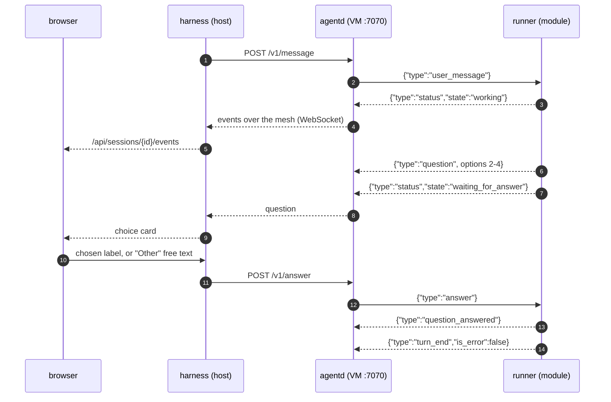

# Colonizer protocol v1

Three hops, one event vocabulary:

```
agent runner ──stdio JSONL──▶ colonizer-agentd ──WS (mesh)──▶ colonizer ──WS──▶ browser
```

All messages are single-line JSON objects with a `type` field. Unknown `type`s and unknown fields
must be ignored (forward compatibility).

---

## 1. Files inside the VM

| Path | Mode | Content |
| --- | --- | --- |
| `/colonizer/session.json` | ro | Session config (below) |
| `/colonizer/token` | ro | Bearer token for agentd (single line) |
| `/colonizer/boot.sh` | ro | Boot script (image command) |
| `/colonizer/mesh-authkey` | ro | Headscale pre-auth key (absent when mesh disabled) |
| `/opt/colonizer/bin/colonizer-agentd` | ro | Static agentd binary |
| `/opt/colonizer/tailscale/{tailscale,tailscaled}` | ro | Static tailscale binaries |
| `/opt/colonizer/agent/` | ro | Active agent module directory |
| `/opt/colonizer/plugins/<name>/` | ro | Claude Code plugin directories, one per entry in `COLONIZER_PLUGIN_DIRS`. Absent when none are configured |
| `/opt/claude/bin/claude` | ro | Claude Code binary (claude-code module only) |
| `/workspace` | rw | Git worktree |
| `/harness/out` | rw | Files the agent hands to the host (e.g. `pr.md`) |
| `/var/lib/colonizer/events.jsonl` | VM-local | agentd event log (replay source) |

`session.json`:

```json
{
  "session_id": "ab12cd34",
  "workspace": "/workspace",
  "listen": "0.0.0.0:7070",
  "agent": {
    "module": "claude-code",
    "command": ["node", "/opt/colonizer/agent/runner.mjs"],
    "env": { "COLONIZER_MODEL": "" }
  },
  "initial_prompt": "You are resolving GitHub issue #12 ..."
}
```

---

## 2. Agent runner contract (module ⇄ agentd, stdio JSON Lines)

agentd spawns `agent.command` with `cwd = workspace`, the VM environment plus `agent.env`, stdin/stdout
piped, stderr captured as `log` events (level `warn`). Right after spawning, if `initial_prompt` is
non-empty, agentd writes a `user_message` command with `id: "initial"`.

A question travels browser ⇄ harness ⇄ agentd ⇄ runner, and the same four hops carry the answer
back:



### Commands (agentd → runner stdin)

```jsonc
{"type":"user_message","id":"u-1","text":"Also update the docs"}
{"type":"answer","question_id":"toolu_01…","answers":{"Which database?":"Postgres","Features?":["Auth","Billing"]},"response":null}
{"type":"interrupt"}
{"type":"shutdown"}          // finish gracefully and exit(0) within 10 s
```

`answers` maps each question's exact `question` text to the chosen option label, an array of labels
(multi-select), or free text ("Other"). `response` (optional) is a free-form reply that dismisses the
whole question card instead.

### Events (runner stdout → agentd)

```jsonc
{"type":"status","state":"idle|working|waiting_for_answer|error|exited","detail":"optional"}
{"type":"user_message","id":"u-1","text":"…"}                      // echo when a message is accepted
{"type":"assistant_text_delta","message_id":"msg_…","block_index":0,"delta":"Hel"}   // optional streaming
{"type":"assistant_text","message_id":"msg_…","block_index":0,"text":"Hello"}        // final block text; supersedes deltas
{"type":"thinking","message_id":"msg_…","block_index":1,"text":"summary"}            // optional
{"type":"tool_call","message_id":"msg_…","tool_call_id":"toolu_…","name":"Bash","input":{"command":"ls"}}
{"type":"tool_result","tool_call_id":"toolu_…","output":"…","is_error":false}        // output ≤ 20 000 chars
{"type":"question","question_id":"toolu_…","message_id":"msg_…","questions":[
  {"question":"Which database?","header":"Database","multi_select":false,
   "options":[{"label":"Postgres","description":"…","preview":null},{"label":"SQLite","description":"…"}]}
]}
{"type":"question_answered","question_id":"toolu_…","answers":{…},"response":null}
{"type":"turn_end","is_error":false,"result":"final text or null","cost_usd":0.42,"duration_ms":81234,
 "model_usage":{"claude-opus-5":{"input_tokens":1200,"output_tokens":300,"cache_read_tokens":90000,"cache_write_tokens":8000}}}  // model_usage optional
{"type":"log","level":"info|warn|error","message":"…"}
```

Every event above, with its exact fields, is also machine-readable: `docs/agent-events.schema.json`
is the JSON Schema for the runner→agentd contract, `crates/colonizer/src/protocol.rs` deserialises
the events the harness acts on into an `AgentEvent` enum, and the runner's contract test asserts its
output matches the committed fixture (`modules/agents/claude-code/test/fixtures/events.jsonl`).

Rules:

- Any event a **subagent** produced carries `"agent": {"id":"toolu_…","name":"code-reviewer","description":"…"}`,
  where `id` is the `Task` tool call that started it. The orchestrator's own events omit the field
  entirely rather than sending null. `assistant_text(_delta)`, `thinking`, `tool_call` and
  `tool_result` can all carry it; `question`, `turn_end` and `status` are the colony's own and never
  do. A UI groups consecutive events by `agent.id` to show each subagent as its own speaker.
- `turn_end.cost_usd` and `model_usage` are cumulative for the colony. When `model_usage` is present, `cost_usd` sums
  only the Claude models in it (keys without a `/`): Claude Code prices a model it does not know, such as a routed
  `zai/glm-5.3-flash`, at the main model's rate, so its estimate for routed models is dropped and they are reported
  as tokens instead. Without `model_usage`, `cost_usd` is the SDK's total. What the provider gateway routed and
  priced is accounted separately, on the session's `routed_cost_usd` (§6.5), never in this field.
- A question is **never** also emitted as `tool_call`/`tool_result`; use `question` / `question_answered`.
- Agents must ask the user only through `question` events (the Claude Code runner appends a system
  prompt instruction and routes `AskUserQuestion` through `canUseTool`). Every question has 2–4
  options; UIs always add "Other".
- `status` must be emitted on every state change. `waiting_for_answer` while a question is open.
- On `shutdown` or stdin EOF: emit `status exited` and exit.

---

## 3. colonizer-agentd API (VM, port 7070)

Every request requires `Authorization: Bearer <contents of /colonizer/token>`; otherwise `401`.
Browsers never talk to agentd; only the harness does, over the mesh.

agentd assigns each runner event a monotonically increasing `seq` (starting at 1) and `ts` (RFC 3339
UTC), appends it to `/var/lib/colonizer/events.jsonl`, and broadcasts it. agentd's own diagnostics are
`log` events with the same numbering. If the runner exits, agentd emits
`{"type":"status","state":"exited","detail":"exit code N"}`.

### `GET /v1/health`

```json
{"ok": true, "version": "0.1.0", "agent": {"state": "working", "running": true, "last_seq": 42}}
```

### `GET /v1/events?since=<seq>` (WebSocket)

- Server → client text frames: every stored event with `seq > since`, then live events.
- Client → server text frames: runner commands (§2). agentd forwards `user_message`, `answer`,
  `interrupt` to the runner's stdin unchanged. Invalid frames are ignored.
- Multiple concurrent clients are allowed.

### `GET /v1/pty?cols=<n>&rows=<n>` (WebSocket)

Starts `/bin/bash -l` (fallback `/bin/sh`) in `/workspace` with `TERM=xterm-256color` in a new PTY.

- Client → server **binary** frames: raw input bytes.
- Client → server **text** frames: `{"type":"resize","cols":120,"rows":40}`.
- Server → client **binary** frames: raw output bytes.
- On shell exit: text frame `{"type":"exit","code":0}`, then close. Closing the socket kills the shell.

### `POST /v1/shutdown`

Sends `shutdown` to the runner, waits up to 10 s, then kills it. Response `{"ok": true}`.

---

## 4. Harness API (browser)

REST (JSON, errors as `{"error": "…"}` with a 4xx/5xx status):

| Method & path | Purpose |
| --- | --- |
| `GET /api/status` | Connections (GitHub, Claude), sandbox, mesh summary, storage health: `storage` is `{ok: true}` or `{ok: false, message, ts, failures}`, sticky, set by the first failed write and cleared only by a restart |
| `GET /api/modules` | `[{kind, provider, providers:[{id,name,description}], enabled, settings, schema}]` |
| `PUT /api/modules/{kind}` | `{provider, enabled, settings}` → saves config |
| `GET /api/repos` · `GET /api/repos/{owner}/{repo}/issues` | Source module |
| `POST /api/sessions` | `{repo, issue?, title?, instructions?, autopilot?}` → `Session` (omit `issue` for an open session: the agent asks what to work on; omit `autopilot` to use the `publish` module's `autopilot` setting, on by default). Past the parallel limit the colony comes back `queued` rather than being refused, and starts when a slot frees |
| `GET /api/sessions` · `GET /api/sessions/{id}` | `Session` list / one |
| `POST /api/sessions/{id}/publish` | Publish the colony's own `colonizer/…` branch (never the base or default branch). A live colony is stopped and its microVM removed first; a `stopped`, `failed` or `no_changes` colony that kept its worktree publishes directly, with no new microVM. Each step runs only if it is still needed: commit only what is uncommitted (co-authored by Colonizer), push only when origin is behind, reuse an open PR instead of opening a second one, so a publish that failed part-way can just be retried |
| `POST /api/sessions/{id}/stop` | Stop and remove the VM, keep the worktree |
| `POST /api/sessions/{id}/resume` | Boot a fresh microVM on the kept worktree and brief the agent to continue (`stopped`/`failed` colonies that still have their worktree). Past the parallel limit the colony comes back `queued` (worktree kept) and boots when a slot frees |
| `POST /api/sessions/{id}/cleanup` | Remove worktree + local branch (VM must be stopped) |
| Settings / Claude login endpoints | Unchanged from v0 (`/api/settings/*`, `/api/claude-login*`) |
| `GET /api/telemetry` · `PUT /api/telemetry` | The live map: its status and the exact next heartbeat; `{enabled}` switches it (see below) |

Module `schema` is a JSON Schema subset (also used for `settings` in agent `module.json` manifests):

```json
{
  "type": "object",
  "properties": {
    "image":  { "type": "string",  "title": "Image", "description": "glibc-based OCI image, pinned by digest", "default": "node:24-bookworm@sha256:6dac556d…" },
    "cpus":   { "type": "integer", "title": "vCPUs", "minimum": 1, "maximum": 64, "default": 4 },
    "model":  { "type": "string",  "title": "Model", "enum": ["", "opus", "sonnet", "haiku"], "default": "" },
    "draft":  { "type": "boolean", "title": "Open PRs as drafts", "default": false }
  }
}
```

Digests in these examples are cut short on purpose: the exact hex a release boots lives in
`crates/colonizer/images.lock`, and quoting a full one here would only rot the next time a pin bumps.

Supported property keys: `type` (`string` | `integer` | `number` | `boolean`), `title`, `description`,
`default`, `enum` (renders a select), `minimum`, `maximum`. `settings` holds the current values;
missing values mean the `default`.

`Session`:

```json
{
  "id": "ab12cd34", "repo": "owner/repo", "issue": 12, "issue_title": "…",
  "status": "queued|starting|running|waiting_for_answer|idle|publishing|pr_opened|merged|closed|no_changes|stopped|failed",
  "branch": "colonizer/issue-12-ab12cd34", "base": "main", "worktree": "/…",
  "sandbox": "colonizer-ab12cd34", "mesh": {"name": "colonizer-ab12cd34", "ip": "100.64.0.3"},
  "agent": "claude-code", "autopilot": false,
  "pr_url": null, "publish_stage": "committed|pushed|pr_opened", "error": null,
  "cost_usd": 0.42, "routed_cost_usd": null, "host_disk_bytes": null, "cleaned_up": false,
  "boot_timing": {"total_ms": 12345, "phases": [{"name": "issue", "ms": 240}, {"name": "git", "ms": 810}]},
  "created_at": "…", "updated_at": "…"
}
```

`publish_stage` records how far the last publish got (committed, pushed or pr_opened) so a retry
finishes from where it stopped and browsers can show the progress. It is left out until a publish
commits something, kept in place when a publish fails part-way, and cleared when a publish finds no
changes; the publish re-derives the truth from git and origin, so the field is the record, not the
authority.

`boot_timing` is where the last launch's time went, filled in when the colony finishes booting and
replaced on resume. The phases are consecutive spans in boot order and partition the launch, so they
sum to at most `total_ms`:

| Phase | Covers |
| :--- | :--- |
| `issue` | Fetching the issue and resolving the base branch |
| `git` | Syncing the bare clone and laying down the worktree |
| `providers` | Health probes for the model providers this colony will use |
| `mesh-start` | Starting the mesh and minting the colony's pre-auth key |
| `image-pull` | Downloading the colony image, when it was not in the local cache. Near zero once it is |
| `vm-boot` | `msb run`. The pull is its own phase above, unless it failed and `msb run` had to do it |
| `mesh-join` | Waiting for the node to come up in headscale |
| `agentd` | Waiting for the agent daemon to answer `/v1/health` |

The same breakdown is written to the colony's log as one line
(`boot 12345 ms: issue 240, git 810, …`), so it survives in the event stream whether or not anyone
reads the API.

`routed_cost_usd` is what the provider gateway has recorded for responses it routed (§6.5), on top of
`cost_usd`, which is only what Claude itself reports, when a turn ends. `host_disk_bytes` is what the
colony leaves on the host (its worktree plus its session directory) as last measured; the walk runs
only when a host-disk quota applies, so `null` until the first measurement, which without a quota never
comes. Both are estimates. A colony's budget answers to `cost_usd + routed_cost_usd` and its
host-disk quota to `host_disk_bytes`; past either, the mothership stops the colony: `status` `stopped`,
the reason in `error`, and the worktree kept, so raising the limit (or, for the quota, cleaning up) and
pressing Resume continues it.

### Plugin directories

`COLONIZER_PLUGIN_DIRS` names directories the mothership resolves in two places, in order: what the
operator put in `<data>/plugins/<name>`, then what shipped with the app in `<COLONIZER_HOME>/plugins/<name>`.
A local copy therefore overrides a vendored one of the same name. Each is a plain name, never a path,
and each is mounted read-only at `/opt/colonizer/plugins/<name>`.

`scripts/fetch-vendor.sh` stages vendored plugins at `dist/plugins/<name>`, which `install.sh` copies to
`<COLONIZER_HOME>/plugins/<name>`, and `install.sh` fails if a `plugin` entry in `vendor/vendor.lock` didn't
land there. It stages three vendored plugins today:

| Plugin | Source | Staged |
| :--- | :--- | :--- |
| `ecc` | [affaan-m/ECC](https://github.com/affaan-m/ECC) v2.2.1, MIT, pinned by sha256 in `vendor/vendor.lock` | `.claude-plugin/`, `skills/` (286), `agents/` (68), `commands/` (94), `scripts/`, `LICENSE`. 8.2 MB of the 58 MB source |
| `superpowers` | [obra/superpowers](https://github.com/obra/superpowers) v6.3.0, MIT, pinned by sha256 in `vendor/vendor.lock` | `.claude-plugin/`, `skills/` (12 of 14), `LICENSE`. 468 KB of the 2.1 MB source |
| `google-skills` | [google/skills](https://github.com/google/skills) at a commit (no upstream tags), Apache-2.0, pinned by sha256 in `vendor/vendor.lock` | `skills/finding-google-skills/` (Colonizer's copy), `catalog/` (142 skills), `index.json`, a generated `.claude-plugin/plugin.json`, `LICENSE`. 6.5 MB |

**ECC's hooks are not staged.** Its plugin manifest sets `userConfig.hooks_enabled` to `true` by
default and Claude Code discovers `hooks/hooks.json` by convention, so "skills and agents only" cannot
be expressed as a setting: every ECC hook is a `node -e` bootstrap that spawns first and reads
`ECC_HOOKS_ENABLED` second. The staging step removes the directory, and `fetch-vendor.sh` fails if it
survives. `ECC_HOOKS_ENABLED=false` is also set in any colony that loads a plugin, as a second line.

**superpowers' hook becomes system-prompt text.** Its one hook, `SessionStart` on
`startup|clear|compact`, injects `skills/using-superpowers/SKILL.md`, and that is what makes the agent
reach for the other skills. `hooks/` is removed as for ECC. Instead, for every loaded plugin directory
that contains `skills/using-superpowers/SKILL.md`, the claude-code runner appends that text to the system
prompt inside the hook's own `<EXTREMELY_IMPORTANT>` wrapper. The system prompt survives compaction,
which is what the hook's `compact` matcher was for.

**Two superpowers skills are not staged.** `using-git-worktrees` creates another worktree and
`finishing-a-development-branch` merges, pushes or opens a pull request, from inside the colony, around
the worktree, branch and publish step Colonizer already owns. Other skills name them, so the appended
text says they are missing on purpose and to stop at those steps. `fetch-vendor.sh` fails if either, or
`hooks/`, survives staging.

**Google's skills load on demand.** Claude Code discovers exactly one skill in `google-skills`:
`finding-google-skills`. The other 142 sit in `catalog/`, outside `skills/`, with upstream's directory
shape, so their relative links still resolve. `index.json` is upstream's catalog with each `entrypoint`
rewritten from a `raw.githubusercontent.com` URL to a path relative to the plugin root
(`catalog/cloud/gke-basics/SKILL.md`). The finder is Colonizer's copy of upstream's
(`vendor/google-skills/finding-google-skills/SKILL.md`, Apache-2.0, changes noted in the file): it finds
the plugin root two directories above the base directory Claude Code gives a skill when it loads, filters
the local catalog and reads only the matching `SKILL.md`. It has no network steps, and it doesn't copy
anything into the working directory, where the copy would land in the pull request. Its description is
kept short: Claude Code drops long skill descriptions from the list it shows the model, which left
upstream's 604-character one as a bare name. Not staged: upstream's `plugins/` (MCP servers, and git
submodules a codeload archive doesn't include). `fetch-vendor.sh` fails on any catalog entry it can't map
to a staged file, on a hook or MCP configuration anywhere in the plugin, on a `raw.githubusercontent.com`
URL left in the catalog or the finder, and on any second skill under `skills/`.

**Keeping vendored plugins current.** `scripts/update-vendored-plugins.mjs` checks every `plugin` entry in
`vendor/vendor.lock` against its upstream (the latest GitHub release for a `refs/tags/` pin, the default
branch for a commit pin) and reports skills added, removed and changed between the pinned archive and the
new one. `--write` rewrites the lock, comments included. `.github/workflows/vendored-plugin-updates.yml`
runs it daily, stages the result with `VENDOR_KINDS=plugin scripts/fetch-vendor.sh` so a failing check
stops the proposal, pushes `vendor/plugin-updates`, and opens a pull request, or, while the repository
doesn't let GitHub Actions open pull requests, keeps an issue open with the same description and a link to
open it. It never merges.

**Keeping the runtime pins current.** The same model covers the two runtime locks:
`crates/colonizer/images.lock`, which pins each preset's colony image by multi-arch OCI index digest:
one pin serves both linux/amd64 and linux/arm64 colonies, and the lock is compiled into the mothership,
and `vendor/claude-code.lock`, which pins the Linux Claude Code build colonies run by version and sha256.
`scripts/update-runtime-pins.mjs` checks both upstreams, the registry's manifest API for the images and
Anthropic's `stable` channel for Claude Code, and stages the newly pinned Claude Code build through
`scripts/fetch-agent-binary.sh`, so an update that fails the checksum check a real install does never
becomes a proposal. `.github/workflows/runtime-pin-updates.yml` runs it daily, pushes `runtime/pin-updates`,
and opens a pull request, or keeps an issue open with a link, the way the vendored plugins do. It never
merges: a pin bump changes what every release runs.

**Skillsets are switches, all off by default.** Settings shows the `claude-code` module's `plugins`
setting (schema `"format": "plugin-dirs"`) as one switch per plugin directory from `GET /api/plugins`,
and writes the same comma-separated list of names. A saved name that no longer resolves is shown as
missing, since a colony loading it fails to boot. Empty, the default, loads nothing. An org workspace
can switch single skillsets on or off over that list with `agent.skillsets` (see Org workspaces).

### Token savings

Three `claude-code` module settings cut what a colony spends on tokens. All are off by default, and each
works only when the install has what it needs; otherwise the colony boots without it and its log says why.

| Setting | What it does | Needs |
| :--- | :--- | :--- |
| `caveman` (`COLONIZER_CAVEMAN`), `caveman_level` (`lite`, `full`, `ultra`; default `full`) | The agent replies in [caveman](https://github.com/juliusbrussee/caveman)'s compressed style: output tokens | `<COLONIZER_HOME>/vendor/caveman/`, mounted at `/opt/colonizer/caveman` |
| `headroom` (`COLONIZER_HEADROOM`) | Model requests pass through [Headroom](https://github.com/headroomlabs-ai/headroom), which compacts large tool results before the model reads them: input tokens | The Headroom bundle for the machine's architecture, downloaded to `<data>/headroom/<release>` when Headroom is switched on and mounted at `/opt/colonizer/headroom` |
| `rtk` (`COLONIZER_RTK`) | Shell commands go through [rtk](https://github.com/rtk-ai/rtk), which shortens their output before the agent reads it: input tokens | `<COLONIZER_HOME>/bin/rtk`, mounted at `/opt/colonizer/bin/rtk` |

**caveman.** caveman switches itself on with `SessionStart` and `UserPromptSubmit` hooks that inject its
ruleset and track a per-session level. In a colony the level is the setting, and the runner puts the
ruleset (`skills/caveman/SKILL.md` without its frontmatter) into the system prompt, followed by the one
Colonizer exception: the pull request description, AskUserQuestion questions and options, memory
proposals and code comments stay in plain sentences. Only that file and `LICENSE` are staged, and both are
MIT. caveman's compression engine, proxy and MCP server are BSL-1.1 and are neither staged nor used.

**Headroom.** The runner starts Headroom's proxy on loopback inside the colony and points Claude Code's
`ANTHROPIC_BASE_URL` at it. Headroom forwards to the model router when the colony has provider routes and
to Anthropic when it doesn't, so routing, the Claude fallback and microsandbox's credential swap stay where
they were. What it changes is the size of large tool results: in the bundle's smoke test, a Bash result of
400 JSON log rows reaches upstream 75% smaller, with every error row still in it. How it runs is fixed in
`modules/agents/claude-code/headroom.mjs`:

- `--no-cache`. Headroom's semantic cache answers a similar-enough request without calling the model,
  which an agent must never get.
- `--stateless`. Nothing it would write is worth keeping in a disposable colony.
- No network of its own. Telemetry, update checks, subscription tracking, model downloads and LiteLLM's
  price-map fetch are switched off through its environment.
- No ML compression. Kompress needs a 261 MB model that the bundle doesn't carry, and it is disabled.
- No credential. From the runner's environment it gets `PATH`, `LANG` and the certificate-bundle
  variables (`SSL_CERT_FILE`, `SSL_CERT_DIR`, `REQUESTS_CA_BUNDLE`, `CURL_CA_BUNDLE`), and nothing else. The
  requests it forwards carry the colony's placeholder, which microsandbox swaps for the real credential at
  its TLS edge as before. Those variables are what make Headroom's Python trust that edge; without them,
  requests with no router in front fail with a 502.

It takes 2.5 to 7 seconds to start and 300 to 370 MB of the colony's memory (measured on arm64). If it
exits, or isn't healthy within 90 seconds, the colony runs without it and its log says why.

Headroom is Python (Apache-2.0), and colonies run whatever stack image the sandbox module chose, so it
can't live in the image. Each architecture gets one bundle instead: a standalone CPython 3.13 from
python-build-standalone with `headroom-ai[proxy]` and its dependencies, installed from
`vendor/headroom/requirements.txt` with every hash checked. `.github/workflows/headroom-bundle.yml` builds
it inside Debian bookworm, whose glibc 2.36 matches the colony image, runs `scripts/headroom-bundle/smoke.py`
against it, and publishes a release. `crates/colonizer/headroom.lock` pins each archive by sha256. The pins
are compiled into the mothership, and nothing is downloaded at install.

Saving the agent module in Settings with Headroom switched on starts the download
(`POST /api/headroom/download`). The mothership fetches the bundle for its own architecture (a Mac on Apple
Silicon takes `linux-aarch64`), checks it against the sha256 pin compiled into the mothership, and unpacks
it to `<data>/headroom/<release>`. The archives are 221 MB for aarch64 and 243 MB for x86_64. A colony that
starts before the download has finished runs without Headroom. A new pin is a new download, and earlier
releases stay on disk.

**rtk.** The runner registers an in-process `PreToolUse` hook on `Bash` that runs `rtk rewrite <command>`.
Exit 0 or 3 with output replaces the command (3 is a rewrite rtk's ask rules flag; the colony's own
permission handling still applies), and anything else (1 for no rtk equivalent, 2 for a deny rule, rtk
missing, or no answer within 2 seconds) runs the command unchanged. The hook returns only
`updatedInput`, never a permission decision, so it can't allow what `delegate = enforce` denies. Rewritten
commands call `rtk`, so `/opt/colonizer/bin` is put first on the agent's `PATH`. Read, Grep and Glob
don't go through the shell and aren't rewritten.

`scripts/build-rtk.sh` builds rtk from the source pinned in `vendor/vendor.lock` as a static musl binary
inside a `rust:1-alpine` microVM, like `colonizer-agentd`, and skips the build when that source is already
built for the machine. Upstream's aarch64 Linux release is linked against glibc 2.39, newer than the
colony image's 2.36, so it would not start in a colony on Apple Silicon. rtk's telemetry is opt-in and
never switched on in a colony.

### Pre-flight scan

With `COLONIZER_SCAN` set to `warn` or `block` and `COLONIZER_SCAN_COMMAND` naming a scanner, the
runner scans `/workspace` before the agent sees it. Findings arrive as `log` events. In `block` mode a
non-zero exit ends the colony with `status error` before the first prompt; the microVM is still up, so
the terminal remains reachable.

**This is advisory, not a security boundary.** A repository's own `.claude/settings.json` hooks and
`.mcp.json` servers already run inside colonies by design. The boundary is the microVM, the publish
step's sanitizing, and a human reading the pull request. What a scan protects is the task outcome:
prompt injection steering the agent into work nobody asked for.

It runs inside the colony and never on the mothership: repository content is attacker-controlled, and
the mothership holds every credential. A scanner that cannot start, or that runs past its timeout, is
reported and treated as no findings: a broken scanner must not be able to halt every colony.

### `GET /api/version`

What this mothership was built from, stamped in at build time by `crates/colonizer/build.rs`:

```json
{"version":"v0.1.4","commit":"1367191…","dirty":false,"built_at":"2026-09-17T17:21:32Z","release":"v0.1.4"}
```

`version` is `git describe --tags --always --dirty`, so a build after a tag reads `v0.1.4-12-gabc1234`.
`release` is the last release tag the build contains, which is what an update is compared against. A
build from a source package with no git history reports the crate version and no commit. `built_at`
honours `SOURCE_DATE_EPOCH`, so a release can still be built reproducibly.

### `GET /api/update` and `PUT /api/update`

Whether a newer release exists. **On by default**; `PUT {"enabled": false}` turns it off, and
`COLONIZER_UPDATE_CHECK=0` keeps it off from the environment (reported as `blocked_by`).

The check asks GitHub for the latest release of `Colonizer-dev/harness` a minute after start and every
six hours after that, and only while it is on: switched off, the mothership makes no request for it,
and forgets the last answer so no banner lingers. Drafts and prereleases are ignored. The request
carries a user agent and nothing about the install: the live map is separate, and off until switched
on (`telemetry.md`). `COLONIZER_RELEASES_URL` points the check elsewhere, for a fork or a test.

```json
{"enabled":true,"blocked_by":null,"installed":{…},"latest":{"version":"v0.1.5","url":"…","notes":"…","published_at":"…"},
 "available":true,"last_checked":"…","error":null}
```

`available` is true only when `latest` parses as a release newer than `installed.release`. A build
whose version cannot be placed is never told it is behind.

`apply` reports an update being installed: `phase` is `idle`, `installing`, `restarting` or `failed`,
with the installer's output and a line per live colony. `can_apply` says whether this install can update
itself at all: a source checkout cannot, and says so.

### `POST /api/update/apply`

Installs the latest release and restarts into it. Answers as soon as the work starts.

It runs `scripts/install-release.sh` from inside the app (the same installer a person would run) so the
download, its checksum and the symlink swap are not reimplemented. A failure leaves the running version
untouched, because the installer unpacks beside it and moves the symlink last.

Refused with `409` when a colony is `publishing`: its microVM is already gone and the host is committing
and pushing, and interrupting that leaves the colony failed with its pull request unopened. A colony that
is merely working does not hold an update: it is detached, and `sessions::recover` reconnects it.

The installer is run with `COLONIZER_KEEP_PREVIOUS=1`, because colonies mount vendored plugins out of the
app directory this mothership started from (`resolve_assets` canonicalises the symlink away), and taking
it out from under them would take their plugins too. Each session records that directory as `app_slot`;
at the next start, once recovery has settled, a kept directory is removed if no live colony still names
it.

### `POST /api/sandbox/pull` and `GET /api/sandbox/pull`

Downloads the configured colony image (after the stack preset) into microsandbox's cache, so a launch
boots instead of waiting on a registry. Settings calls `POST` when the sandbox module is saved, which
is the moment a stack is chosen. The image is the preset's reference pinned by digest in
`crates/colonizer/images.lock` and compiled into the mothership, so the cache ends up with the exact
bytes the release was tested with. An image set by hand with no lock row boots as written.

`POST` returns at once (a cold pull of `node:24-bookworm` measured 108 s, too long to hold a request
open) and the download runs in the background. Calling it again while the same image is pulling
returns the running pull rather than starting a second. `GET` returns the most recent status:

```json
{"image": "python:3.13-bookworm@sha256:933b46a0…", "state": "pulling", "started_at": "…", "finished_at": null, "error": null}
```

`state` is `idle`, `cached` (already local, nothing done), `pulling`, `done` or `failed`.

**There is no progress percentage.** `msb pull` draws its progress bar only on a terminal; piped, it
prints one line when it has finished, and `--info` adds only migration logs. Scraping the bar through a
pty would mean parsing an undocumented format that can change with any msb release, so the API reports
what is actually known: the image, when it started, and how it ended.

A launch still pulls a cold image itself if nothing got to it first, announcing it in the log and
recording it as the `image-pull` phase.

### `POST /api/headroom/download` and `GET /api/headroom`

Downloads the Headroom bundle pinned for this machine (see Token savings). Settings calls `POST` when the
agent module is saved with `headroom` switched on, and offers it as "Download now" while the switch is on
and nothing is downloaded.

`POST` returns at once and the download runs in the background. While the bundle is installed,
downloading or unpacking, `POST` returns that status without starting another download, and it returns
`409` when no bundle is pinned for this architecture. `GET` returns the status:

```json
{"release": "0.37.0-1", "state": "downloading", "bytes": 104857600, "total": 231330241, "started_at": "…", "finished_at": null, "error": null}
```

`state` is `idle` (not downloaded), `installed`, `downloading`, `unpacking`, `failed` (with `error`), or
`unavailable` (no bundle for this architecture, and `release` is null). Unlike the image pull, this reports
progress: `bytes` of `total`, updated about every megabyte.

Nothing appears at `<data>/headroom/<release>` until the archive's sha256 has matched and it has unpacked
completely. A mismatch or an interrupted download ends `failed` and leaves no partial files behind.

### `GET /api/telemetry` and `PUT /api/telemetry`

The live map on colonizer.dev (`docs/telemetry.md`). It is off until the user switches it on, and
the web UI asks once while `enabled` is `null`. `GET` returns:

```json
{
  "enabled": true, "blocked_by": null,
  "endpoint": "https://telemetry.colonizer.dev", "map_url": "https://colonizer.dev/live",
  "last_sent_at": "…", "last_error": null,
  "heartbeat": {"install_id": "0b0c9a8e-…", "version": "0.1.3", "platform": "darwin-arm64", "colonies": 2}
}
```

`heartbeat` is exactly what the next heartbeat will send; `install_id` is `null` until the map is first
switched on. `blocked_by` names `DO_NOT_TRACK` or `COLONIZER_TELEMETRY` when the environment keeps it
off, and `enabled` is then `false`.

`PUT` with `{"enabled": true|false}` saves the answer to `<config>/telemetry.json` and returns the same
status. Switching on creates a random `install_id` and sends a heartbeat within a second or two.
Switching off sends `{"install_id", "online": false}` and forgets the id. `PUT` returns `409` while the
environment keeps it off.

### `GET /api/sessions/{id}/events?since=<seq>` (WebSocket)

Server → client:

- On connect: `{"type":"session","session":Session}`, then the last ≤200 harness logs as
  `{"type":"harness_log","level":"info|error","message":"…","ts":"…"}`, then agent events with
  `seq > since` (same objects as §3, including `seq`/`ts`), then live.
- Whenever the session changes: `{"type":"session","session":Session}`.

Client → server:

```jsonc
{"type":"user_message","text":"…"}                        // harness assigns the id
{"type":"answer","question_id":"…","answers":{…},"response":null}
{"type":"interrupt"}
```

### `GET /api/sessions/{id}/terminal?cols=<n>&rows=<n>` (WebSocket)

Byte-for-byte proxy of agentd `/v1/pty` (same binary/text frame rules).

---

## 5. Web UI contract

- Stack: Vite + React + TypeScript + Tailwind v4 + assistant-ui (`useExternalStoreRuntime`) + xterm.js.
  Built to `web/dist`; dev server proxies `/api` (incl. WebSockets) to `http://127.0.0.1:7878`.
- Layout: sidebar (repositories → issues, sessions list) · session view (header with status, branch,
  mesh name, cost, host disk, actions: Create PR, Stop, Clean up) · chat panel and terminal panel side by side
  (tabs below 900 px). Settings dialog: Connections (GitHub, Claude subscription login) and Modules.
- Events → assistant-ui messages: `user_message` → user message; `assistant_text(_delta)`, `thinking`,
  `tool_call` + `tool_result` → parts of the current assistant message; `question` → a tool-call part
  with `toolName: "ask_user"` rendered by a registered tool UI.
- Consecutive assistant messages group into one bubble, and a change of `agent` breaks the group, so a
  subagent's turn is never folded into the orchestrator's. A subagent's bubble is shown as its own
  speaker: ant avatar, the subagent's name, indented under the `Task` call that started it.
- Choice card (`ask_user`): one section per question with its header chip; options as large selectable
  cards (radio, or checkboxes when `multi_select`) showing label + description; `preview` rendered as
  monospace text (markdown) or a sandboxed `iframe srcdoc` (HTML); an always-present "Other…" option
  with a text field; a single Submit button that sends `answer`. Once `question_answered` arrives the
  card collapses to a summary of the chosen answers.
- The composer sends `user_message`; a Stop button sends `interrupt` while the agent is working.
- Light and dark themes via `prefers-color-scheme`; usable at 400 px width.

---

## 6. v1.1 additions: model routing, org workspaces, shared memory, watchdog

### 6.1 Model routing (runner)

Model strings are `<provider>/<model-id>` for non-Anthropic providers (e.g. `deepseek/deepseek-flash`,
`local/deepseek-flash`). Anything without a known provider prefix (`opus`, `claude-opus-5`, …) goes to
Anthropic unchanged.

Runner environment set by the mothership:

| Variable | Meaning |
| --- | --- |
| `COLONIZER_MODEL` | Orchestrator (main thread) model; nearly all of a colony's model traffic |
| `COLONIZER_SUBAGENT_MODEL` | Model for subagents; only used when the agent delegates to one, which colonies rarely do (maps to `CLAUDE_CODE_SUBAGENT_MODEL`, with `CLAUDE_CODE_SUBAGENT_MODEL_FORCE=1` so agents that name their own model (Claude Code's built-in Explore is `inherit`) use it too) |
| `COLONIZER_IMAGE` | The container image the colony booted; the runner tells the agent what it can and cannot run |
| `COLONIZER_BACKGROUND_MODEL` | Model for small auxiliary background work (maps to `ANTHROPIC_DEFAULT_HAIKU_MODEL`) |
| `COLONIZER_MODEL_ROUTES` | JSON array of routes (below); empty or absent means Anthropic only |
| `COLONIZER_SCAN` | `off` (default), `warn` or `block`. Pre-flight scan of the workspace before the agent starts |
| `COLONIZER_SCAN_COMMAND` | The scanner to run, resolved **inside the colony**. Split on whitespace and run without a shell. Empty means no scan runs |
| `COLONIZER_PLUGIN_DIRS` | Comma-separated **in-VM** plugin directories. The mothership resolves the configured names under its own plugins folder, mounts each read-only, and rewrites this to the guest paths; the runner turns them into the SDK's `plugins: [{type:'local', path}]`. Empty or absent loads none |

```json
[{"provider": "deepseek", "prefix": "deepseek/", "base_url": "https://api.deepseek.com/anthropic",
  "auth": "x-api-key", "key_env": "COLONIZER_PROVIDER_KEY_DEEPSEEK"}]
```

`auth` is `x-api-key`, `bearer` or `none`. `key_env` names an env var holding the key. Since v1.2 the
mothership points every route at its provider gateway with `auth: none` and a colony token instead, so
no key enters the colony (§6.5); `key_env` remains for routes set by hand. When any route or non-default
model is configured, the runner starts
a local router on `127.0.0.1` and points Claude Code's `ANTHROPIC_BASE_URL` at it:

- Requests whose JSON `model` matches a route prefix: strip the prefix, send to `base_url` + the request
  path (`/v1/messages`, `/v1/messages/count_tokens`), replace `authorization`/`x-api-key` with the route's
  credential, drop Anthropic OAuth betas from `anthropic-beta`, stream the response back unchanged.
  If the upstream has no `count_tokens`, answer `{"input_tokens": ceil(chars / 4)}`.
- Everything else: forward to `https://api.anthropic.com` with headers unchanged.

### 6.2 Shared memory (runner ⇄ mothership)

Approved notes are mounted read-only in every colony:

```
/colonizer/memory/global/  MEMORY.md  notes/<id>.md
/colonizer/memory/org/     MEMORY.md  notes/<id>.md     (the colony's GitHub org)
/colonizer/memory/repo/    MEMORY.md  notes/<id>.md     (the colony's repository)
```

`MEMORY.md` is an index (`- [Title](notes/<id>.md) — first line`). `COLONIZER_MEMORY_DIR=/colonizer/memory`
tells the runner memory is enabled. The runner exposes two tools to the agent: `memory_search`
(search the mounted notes) and `memory_propose` (scope `repo` | `org` | `global`, `title`, `content`).
Proposing emits a runner event; nothing is written inside the colony:

```jsonc
{"type":"memory_proposal","scope":"repo","title":"Run tests with --locked","content":"markdown…","tags":["tests"]}
```

The mothership records it as a pending proposal and broadcasts `{"type":"memory_proposed","proposal":{…}}`
(no `seq`) on the colony's event stream. Approved proposals become notes and appear in every colony's
mount immediately.

**Where approved notes live** is the memory module's provider. `files` keeps them on the mothership and
mounts each scope directory. `mem0` keeps them in a [mem0](https://mem0.ai) project through its Platform
API (v3), and the runner side is identical:

- Proposals queue on the mothership either way. mem0 only receives a note once it is approved (or stored
  with review off), written with `infer: false` and `immutable: true` so mem0's extraction model never
  rewrites or later consolidates text a human reviewed.
- Each scope is a mem0 `user_id` (`colonizer:global`, `colonizer:org:<org>`, `colonizer:repo:<owner>/<repo>`)
  and every memory carries `app_id: "colonizer"`. Colonizer's own fields (`colonizer_id`, `scope`, `key`,
  `title`, `tags`, `source`, `created_at`) ride in `metadata`. Listing and deleting are filtered on both, so a
  mem0 project shared with other tools is safe to point at.
- At boot the mothership lists the colony's three scopes from mem0 and writes them into the colony's session
  directory in the layout above. The colony never talks to mem0 and never sees the key, and a resume
  rewrites the layout rather than keeping deleted notes. `MEMORY.md` is ordered by mem0's relevance to the
  task (the issue title, the instructions, then the issue body, not the full prompt).
- If mem0 cannot be reached at boot, the colony still starts, with an empty layout and a `warn` in its log.
  An approval that cannot reach mem0 fails with `502` and the proposal stays in the queue; with review off, a
  note that cannot be stored is queued for review instead of dropped.

### 6.2b Autonomous mode (Mothership)

The `autonomy` module decides who answers a colony's questions. `off` (the default) means they wait
for a person. `judge` means a model answers one the person has not.

| Setting | Default | |
| --- | --- | --- |
| `model` | none | A plain id (`fable`, `opus`) goes to Anthropic with the saved Claude credential; `provider/model` goes to a configured model provider. Any model may be chosen; a frontier model judges best |
| `after_minutes` | 10 | How long a question waits for a person first; `0` answers as soon as it is seen |
| `max_answers` | 5 | Judged answers per colony, after which it is left for the person |
| `free_text` | false | Whether a question with no options may be answered |

Every thirty seconds the Mothership looks for colonies in `waiting_for_answer` whose question has
waited long enough. It sends the model the task and the question with its options, and expects
`{"answers": {"<question>": "<label>"}, "reason": "<sentence>"}` back.

The judge chooses **only among the labels the agent offered**, and the reply is checked against them
before anything is sent. A label that was not offered, a question left out, a reply that is not that
JSON, or free text while `free_text` is off: each leaves the question for the person rather than
guessing, and stops this colony being judged again. This is the boundary that keeps a colony's own
output (which can carry repository content, which can carry instructions) from becoming an
instruction to the Mothership.

An accepted answer travels the ordinary path (§6.2's `answer` command), so the colony cannot tell it
apart from a person's, except that its `response` says so in words, and the session log records the
model and its reason. A pull request that came out of autonomous mode reads as one afterwards.

### 6.3 Mothership API additions

**Skillsets** (plugin directories a colony can load; see "Plugin directories"):

| Method & path | Purpose |
| --- | --- |
| `GET /api/plugins` | `{local_root, plugins: [{name, description, version, source: "vendored"\|"local", shadows_vendored, skills, agents, commands}]}`, one entry per name resolved the way a colony's boot resolves it. `local_root` is where an operator adds their own; the counts are what Claude Code discovers: `skills/<name>/SKILL.md`, `agents/*.md`, `commands/*.md` |

**Model providers** (credentials stay on the mothership, keys stored 0600):

| Method & path | Purpose |
| --- | --- |
| `GET /api/providers` | `[{id, name, base_url, auth, wire: "anthropic"\|"openai", has_key, models: [string], preset: "deepseek"\|"openai"\|"local"\|"custom"}]` |
| `PUT /api/providers/{id}` | `{name, base_url, auth, wire?, models, api_key?}`: `wire` omitted is `anthropic`; `api_key` omitted keeps the saved key, `""` removes it |
| `DELETE /api/providers/{id}` | Remove a provider |
| `GET /api/models` | `[{id, label, provider}]` for model pickers: Anthropic aliases plus `<provider>/<model>` for every provider model |

Presets: `deepseek` = `https://api.deepseek.com/anthropic`, `x-api-key`, models `deepseek-flash`,
`deepseek-v4-pro`. `openai` = `https://api.openai.com`, `bearer`, wire `openai`, models `gpt-5.6`, `gpt-5.5`,
`context_tokens` 272000. `local` = `http://127.0.0.1:8080`, `none`, no models. Loopback base URLs are rewritten
to `host.microsandbox.internal` inside colonies.

The agent module schema gains `subagent_model` and `background_model` next to `model` (all free-text
strings; UIs offer `GET /api/models` as suggestions).

**Org workspaces.** `Session` gains `"org": "<repo owner>"`.

| Method & path | Purpose |
| --- | --- |
| `GET /api/orgs` | `[{org, colonies: {live, total}, pending_memory, settings}]` for every org seen in repositories, colonies or saved settings |
| `PUT /api/orgs/{org}` | `{settings}`; merged into the saved settings instead of replacing them: a field the body names always wins (`null` = inherit the global module setting), one it omits keeps its saved value |

The PUT is a merge, not a replace. A field of `settings` the body does not name keeps its saved value; a
field it names always wins, `null` included: an explicit `null` is how a client inherits the global
module setting. The merge reaches one level deeper for two nested fields: an `agent` object without
`skillsets` keeps the saved skillset overrides, and a `watchdog` object without `waiting_minutes` keeps
its saved value (the web form never sends `waiting_minutes`, and a save from a client that predates a
field must not quietly clear it). So a body naming only `max_parallel` changes just that, where a plain
replace would have cleared everything it left out.

`agent.skillsets` is a map of plugin directory name to `true` or `false`: those skillsets are switched on
or off for the org's colonies, on top of the global `plugins` setting; any it doesn't name follow the
global switch. Names are plain directory names, at most 64. An empty map is stored as `null`.

`max_parallel` overrides the sandbox module's parallel limit for the org's colonies. So do the two
per-colony limits: `budget_usd` is the org's own spend budget per colony in dollars, `host_disk` its own
host-disk quota per colony, a size like `16G`. `null` inherits the sandbox module's setting (`budget_usd`,
`host_disk`); `0` (or `"0"`) means unlimited, which is how an org opts out of a global limit. The same
validation applies as at the module setting: a budget is `0` or more dollars, a quota must parse as a size.
Past either limit the mothership stops the colony with its worktree kept (§6.5 covers the budget's
gateway half).

```json
{"settings": {
  "agent": {"model": "opus", "subagent_model": "deepseek/deepseek-flash", "background_model": null,
            "skillsets": {"ecc": false, "google-skills": true}},
  "max_parallel": 2,
  "budget_usd": 20,
  "host_disk": "32G",
  "memory": {"enabled": true},
  "watchdog": {"enabled": true, "stall_minutes": 15, "max_nudges": 3}
}}
```

**Shared memory.** `scope` is `global`, `org` (key = org) or `repo` (key = `owner/repo`).

| Method & path | Purpose |
| --- | --- |
| `GET /api/memory?scope=&key=` | `{scope, key, provider, notes: [Note], proposals: [Proposal]}`; `provider` is `files` or `mem0` |
| `GET /api/memory/proposals` | Every pending proposal, newest first |
| `POST /api/memory/proposals/{id}/approve` | Optional `{title, content}` edits; creates the note |
| `POST /api/memory/proposals/{id}/reject` | Discard |
| `POST /api/memory/notes` | `{scope, key, title, content}`: a note written by you |
| `DELETE /api/memory/notes/{id}?scope=&key=` | Remove a note. With mem0, only one Colonizer wrote into that scope |
| `GET /api/memory/mem0` | `{has_key, source, active}`: whether a key is set (`saved` or `MEM0_API_KEY`) and mem0 is the provider. Never the key |
| `PUT /api/memory/mem0` | `{api_key}`: save the key on the mothership (`config/memory-keys/mem0`, mode 0600); an empty string removes it |
| `POST /api/memory/mem0/check` | `{ok, error?}`: try the key against the configured base URL |

`Note` = `{id, scope, key, title, content, tags, created_at, source}`; `Proposal` adds `status`
(`pending`). `source` = `{session_id, repo}` or `{user: true}`.

**Watchdog.** New module kind `watchdog` (provider `default`; settings `enabled` = true,
`stall_minutes` = 15, `max_nudges` = 3, `waiting_minutes` = 30) and kind `memory` (provider `files`;
settings `enabled` = true, `require_review` = true). `Session` gains `last_activity_at` and
`attention`:

```json
{"attention": {"reason": "stalled|waiting_for_answer|nudges_exhausted|autopilot_held", "since": "…", "nudges": 2}}
```

Every minute the mothership checks live colonies. A colony that is `running` with no agent event for
`stall_minutes` is nudged with a `user_message` whose id starts with `watchdog-` (UIs render it as a
notice, not a user bubble), at most `max_nudges` times per stall; then `attention.reason` becomes
`nudges_exhausted`. A question open longer than `waiting_minutes` sets `waiting_for_answer`. An
autopilot colony whose turn ends with an error (not an interrupt) is not published and gets
`autopilot_held`. Any new agent event clears `attention`; a disabled watchdog clears only the reasons
it sets itself.

**Notify.** New module kind `notify` (provider `default`, issue #119; settings `on_question` = true,
`on_attention` = true, `on_failed` = true, `on_pull_request` = true, `desktop` = false,
`webhook_url` = ""). Like `autonomy`, it is absent from `modules.json` until first configured: it
announces colonies to the outside world, so it is off until asked for. Every thirty seconds the
mothership diffs the session list against what it last saw, seeding new colonies without firing so a
restart does not replay a backlog, and announces the edges once each: `status` became
`waiting_for_answer` (question), `failed`, or `pr_opened` (pull request), or `attention.reason`
became the watchdog's `stalled` or `nudges_exhausted` — `waiting_for_answer` belongs to the question
event and `autopilot_held` is not the watchdog's, so neither announces here. The text is one short
line naming the repository and issue (`acme/webshop #42 needs an answer`, `… has stalled`, `… is out
of nudges`, `… failed`, `… opened a pull request`); colonies with no issue are just the repository.

The desktop channel runs `osascript -e 'display notification …'` on macOS or `notify-send` on Linux
under a graphical session, with the text passed as an argument and escaped for AppleScript. Over SSH
or headless it does nothing, logging the reason once rather than a line a tick. A non-empty
`webhook_url` POSTs one JSON note per event:

```json
{"event": "question|attention|failed|pull_request", "at": "2026-09-18T00:00:00+00:00",
 "text": "acme/webshop #42 needs an answer",
 "colony": {"id": "…", "repo": "acme/webshop", "org": "acme", "issue": 42, "status": "waiting_for_answer"},
 "pr_url": null}
```

The note carries no repository content — no issue title, no question text, no branch, no error — and
`pr_url` is the colony's pull request address only on the `pull_request` event, `null` otherwise.
Every request carries `X-Colonizer-Timestamp` (unix seconds); when a signing secret is set
(`config/notify-secret`, mode 0600, or `COLONIZER_NOTIFY_SECRET`) it also carries
`X-Colonizer-Signature: sha256=<hex>` — HMAC-SHA256 over the exact bytes `"{timestamp}.{body}"` —
and without one it is sent unsigned. Transport errors and non-2xx answers are logged, never
retried.

| Method & path | Purpose |
| --- | --- |
| `GET /api/notify/secret` | `{has_secret, source}`: whether a webhook signing secret is set (`file` or `env` for `COLONIZER_NOTIFY_SECRET`). Never the secret |
| `PUT /api/notify/secret` | `{secret}`: save it on the mothership; `{secret: null}` removes it |

**Autopilot.** When a turn ends, an autopilot colony is published only if the turn ended without an
error or open question and the agent wrote or updated `/harness/out/pr.md` since the previous turn
ended. An unchanged `pr.md` from an earlier turn doesn't publish a colony the maintainer is still
talking to.

### 6.4 UI additions

- Sidebar org switcher (All orgs, then each org) filtering repositories and colonies; org chip on
  colonies; per-org settings dialog with an "inherit" state for every field.
- Settings → Connections → Model providers: add from preset (DeepSeek, Local) or custom, base URL, auth,
  key (write-only), model list. Agent module model fields get suggestions from `GET /api/models`.
- Memory view with pending proposals (approve, edit then approve, reject), notes per scope (global, org,
  repo), and a pending count badge in the sidebar.
- Watchdog: amber attention badge on colonies, the reason in the colony header, and `watchdog-` messages
  rendered as notices.

### 6.5 Provider gateway (v1.2, issue #5)

Routed (non-Anthropic) model traffic goes through a gateway on the mothership instead of straight from
the colony. The mothership is on the operator's networks (tailnet, LAN), holds the provider keys, and
sees every colony, so it can enforce per-provider concurrency, long timeouts, health, fallback and the
per-colony spend budget.

The gateway listens on `127.0.0.1:41750` (`COLONIZER_GATEWAY_BIND`). Colonies reach it as
`http://host.microsandbox.internal:41750`; a colony with any route gets the `host` network profile.
Provider keys never enter colonies.

**Routes.** `COLONIZER_MODEL_ROUTES` entries gain fields:

```json
[{"provider": "strix", "prefix": "strix/",
  "base_url": "http://host.microsandbox.internal:41750/providers/strix", "auth": "none",
  "headers": {"x-colonizer-colony": "<per-colony token>"},
  "timeout_secs": 900, "context_tokens": 131072, "fallback_model": "claude-sonnet-5"}]
```

**Runner.**

- Adds a route's `headers` to every request routed through it.
- For routes referenced by `COLONIZER_MODEL`, `COLONIZER_SUBAGENT_MODEL` or `COLONIZER_BACKGROUND_MODEL`
  (the "used" routes), sets in Claude Code's environment:
  - when the largest `timeout_secs` is above 300: `CLAUDE_STREAM_IDLE_TIMEOUT_MS` = min(t·1000, 1800000),
    `API_TIMEOUT_MS` = t·1000 + 60000, `API_FORCE_IDLE_TIMEOUT` = `0`,
    `CLAUDE_ASYNC_AGENT_STALL_TIMEOUT_MS` = t·1000;
  - when any used route has `context_tokens`: `CLAUDE_CODE_MAX_CONTEXT_TOKENS` = the smallest of them.
- **Fallback.** When a routed request returns 502, 503 or 504 with an `x-colonizer-fallback` header and
  the route has `fallback_model`, resend the same request to Anthropic (as for unrouted models, with the
  headers Claude Code sent) with `model` set to `fallback_model`, and emit
  `{"type":"log","level":"warn","message":"provider strix unavailable (queue_timeout); used claude-sonnet-5"}`. A gateway that can't be reached at all also falls back (reason `gateway unreachable`). `thinking: {type: "enabled"}` is rewritten to `{type: "adaptive"}`, which current Claude models require.
  Without `fallback_model`, return the gateway's response unchanged.

**Gateway endpoint** `ANY /providers/{id}/{path}`:

- Requires `x-colonizer-colony` to match a live colony's token; otherwise `401`.
- A colony past its spend budget is refused `403` `permission_error` before it waits for a slot, with no
  `x-colonizer-fallback`: there is nothing to fall back to. The same check stops the colony on the host,
  worktree kept, so raising the budget and resuming continues it.
- `wire: anthropic` (the default): forwards to the provider's `base_url` + `/{path}` + query, with `content-type`, `accept`,
  `anthropic-version` and `anthropic-beta` (minus `oauth-*` betas) plus the provider credential. It never
  forwards the client's `authorization` or `x-api-key`.
- `max_concurrent`: waits up to `queue_timeout_secs` for a slot, then answers `503`
  `{"type":"error","error":{"type":"overloaded_error","message":"…"}}` with `x-colonizer-fallback: queue_timeout`.
- Connection failure: `502` `api_error` with `x-colonizer-fallback: unreachable`. No response headers within
  `timeout_secs`: `504` with `x-colonizer-fallback: timeout`. A response body silent for `timeout_secs`
  is ended.
- For a `text/event-stream` response, a silence of 15 s between events gets a `: keep-alive\n\n`
  comment (ignored by any SSE parser) instead of ending the body; this covers a long, silent GGUF
  prefill. Pings are only sent at an event boundary, never inside a partly forwarded event. They don't
  reset the `timeout_secs` deadline, so a provider that never sends a real byte still times out. Non-SSE
  bodies are never pinged.
- Errors use the Anthropic error shape so Claude Code reports them normally.
- A colony with a request in flight through the gateway counts as making progress for the watchdog.

**`openai` wire.** A provider with `wire: "openai"` speaks OpenAI's Chat Completions API, and the gateway
translates in both directions (`crates/colonizer/src/openai.rs`). The runner's fallback resends its own,
untranslated request, so it is unaffected.

- Only `POST /v1/messages` is translated, to `{base_url}/v1/chat/completions`, sent with `content-type` and
  the provider credential only. Any other path, including `/v1/messages/count_tokens`, answers `404`, and
  the runner estimates the token count itself.
- The request is rebuilt from an allowlist. `system`, and system messages inside `messages`, become
  `system` messages; text, images (base64 or URL) and PDF documents become content parts; `tool_use` becomes
  `tool_calls`, and `tool_result` becomes `tool` messages directly after them (images in a tool result move
  to a user message after the tool messages); tools with an `input_schema` become functions (server tools
  are dropped); `tool_choice` and `disable_parallel_tool_use` map across; `max_tokens` becomes
  `max_completion_tokens`; `stream` adds `stream_options.include_usage`. Everything else is dropped:
  `thinking`, `context_management`, `output_config`, `metadata`, `cache_control`, thinking blocks, and
  `temperature`, `top_p` and `stop_sequences`, which OpenAI's reasoning models refuse unless left at their
  defaults.
- A stream becomes the Anthropic event sequence, one content block at a time; each parallel tool call gets
  its own `tool_use` block. Usage arrives in `message_delta`, with cached prompt tokens reported as
  `cache_read_input_tokens`. `finish_reason` maps `stop` → `end_turn`, `length` → `max_tokens`,
  `tool_calls` → `tool_use`, `content_filter` → `refusal`.
- Once the stream has started there is no fallback. An error inside the stream, a stream that ends without
  a finish reason, or a provider that interleaves the arguments of parallel tool calls ends with an
  `event: error`, never a silently truncated message. Keep-alive pings and the silence deadline work as
  above; upstream chunks that translate to nothing still count as activity.
- Error responses keep their status and map to Anthropic error types. `context_length_exceeded` becomes
  `400` "prompt is too long: …", so Claude Code compacts; `insufficient_quota` becomes `403`
  `permission_error`, so it isn't retried. Of the upstream headers only `retry-after` is kept. None of
  these errors carries `x-colonizer-fallback`.

**Spend accounting.** Every response the gateway serves is counted, priced with the provider's `pricing`,
and added to the colony's `routed_cost_usd`. The budget is re-checked after each addition and before a
request is served; Claude's own `cost_usd` landing at a turn end re-checks it too. The two wires are
counted differently but on one scale, Anthropic's token names:

- `wire: anthropic`: the body is tapped while it forwards; the bytes the colony receives are never
  changed. An SSE stream is read event by event (`message_start` fixes the input side, `message_delta`
  carries the running output total); a non-streaming JSON body is buffered only to count, up to 4 MiB,
  past which the response forwards unpriced. Anything the tap cannot parse counts as zero, so an
  estimate can only undercount.
- `wire: openai`: the usage the translation already extracted is reused; the body is never read twice.

`pricing` is four rates in dollars per million tokens: `input_per_mtok`, `output_per_mtok`,
`cache_read_per_mtok` and `cache_write_per_mtok`, each `0` or more. A provider without it (or with all
four at `0`) still counts its tokens, which reach `model_usage` as usual, but contributes nothing to
`routed_cost_usd`. `PUT /api/providers/{id}` with `pricing` omitted keeps the saved rates, like the key;
an all-`0` object clears them in effect. Claude traffic does not pass through the gateway at all:
microsandbox injects the credential straight to `api.anthropic.com`, so Claude's spend is only seen when
a turn ends, as the runner's `cost_usd`. A colony's budget answers to the two added together, and both
are estimates.

**Provider fields** (all optional): `timeout_secs` (30-3600, default 600), `max_concurrent` (1-64, absent =
unlimited), `queue_timeout_secs` (1-3600, default `timeout_secs`), `context_tokens` (1024-2000000),
`fallback_model` (a Claude model; the aliases `opus`, `sonnet`, `haiku` and `fable` are resolved to model IDs in routes, because a fallback request goes to the API as is). `GET /api/providers` also returns `pricing`, `in_flight`,
`queued`, `usage` and `used_by`.

**Usage.** `usage` is the provider's cumulative counters: what says a request has ever actually gone to it,
which the momentary `in_flight`/`queued` gauges cannot:

```json
{"requests": 12, "failures": 2, "fallbacks": 1, "duration_ms": 48021, "last_request_at": "…"}
```

`requests` counts every request the gateway accepted for the provider, from the moment everything that can
refuse a request locally has passed (colony auth, provider lookup, path and body translation), queueing,
the upstream call and the streamed body are included, a request the gateway itself refuses is not, and an
attempt that queued past `queue_timeout_secs` without ever reaching the provider still counts. `failures`
is the subset that produced no usable upstream response: one of the gateway's three fallback answers (queue
timeout, unreachable, timeout), an upstream status ≥ 400, or an openai-wire response whose body failed or
never finished. `fallbacks` is the subset of `failures` the
gateway predicts will fall back to Claude: it answered with `x-colonizer-fallback` and the provider has a
`fallback_model`, which is exactly when the colony's router retries on Claude; the retry never comes back
through the gateway, so this is a prediction, not an observation. `duration_ms` is the cumulative
wall-clock of dispatched requests, streamed body included, timed from when a request's slot was acquired,
so time spent queued is not. `last_request_at` is RFC 3339, `null` before
the first request. The counters live in `provider-usage.json` in the mothership's data directory, written
by a background task every 5 s when they changed and once more at shutdown, so a crash loses at most 5 s
of the tally and a restart carries on where it left off; `DELETE /api/providers/{id}` also removes the
provider's tally.

`used_by` names the model settings (`model`, `subagent_model`, `background_model`) whose resolved value
(schema default, global setting or org override) routes to this provider as `<provider>/<model>`, across
the global agent env and every org override, e.g. `["subagent_model"]`. Empty means the provider is
configured but no model setting points at it: wired only to `subagent_model`, say, on a harness whose
colonies never spawn subagents: unused so far, not broken. A bare alias or a partial id prefix is
another provider's model and doesn't match, same rule as the "used" routes above.

**Health.** `GET /api/providers/{id}/health` probes `GET {base_url}/v1/models` with a 5 s timeout:

```json
{"reachable": true, "status": 200, "latency_ms": 42, "models": ["deepseek-v4-flash"], "error": null, "checked_at": "…"}
```

At colony start the mothership probes every used provider and logs a warning for each unreachable one
(the colony still starts; fallback covers it when configured).

### 6.6 Findings

A colony that notices a real problem outside its task (a bug, a security gap, documentation promising
what the code does not do) files it as a GitHub issue instead of fixing it in the pull request.

Runner side. When the mothership sets `COLONIZER_FINDINGS=true`, the Claude Code runner adds an
in-process MCP server `colonizer_findings` with one tool, `finding_file { title, body, evidence }`,
and a system prompt instruction: confirm a finding with a fresh subagent before filing it, and put
how it was confirmed in `evidence`. Only the orchestrator may call it: a `PreToolUse` hook refuses a
call that carries `agent_id`, whatever the delegation mode, and tells the subagent to report the
finding instead. A call emits:

```jsonc
{"type":"finding","title":"llms.txt promises career pages the scanner cannot fetch","body":"markdown…","evidence":"A subagent read model.rs:9-14 and providers/mod.rs:4-19…"}
```

Mothership side. The GitHub token never enters a colony, so filing happens on the host:

- Setting: `publish.settings.file_findings`, default `true`. When it is off the variable is not set, and
  a `finding` event that arrives anyway is ignored.
- Validation: `title` (one line, ≤ 200 chars), `body` (≤ 20 000) and `evidence` (≤ 5 000) are all
  required. A finding without evidence is not filed.
- Cap: at most 5 per colony, counted from `sessions/<id>/findings.jsonl`. A GitHub error does not use
  one up.
- Duplicates: open issues are searched by title words (normalised, so no search qualifiers can be
  injected), and one whose normalised title matches exactly means nothing is created.
- Filing: `gh issue create` on the colony's own repository, labelled `colonizer-finding` (created if
  missing, and dropped if the token cannot apply it). The body carries the finding, a "How it was
  confirmed" section and a footer naming the colony and the issue it was working on.
- Every outcome (filed, duplicate, over the cap, rejected, failed) is a line in the colony log. The
  agent is told only that the finding was handed over.

