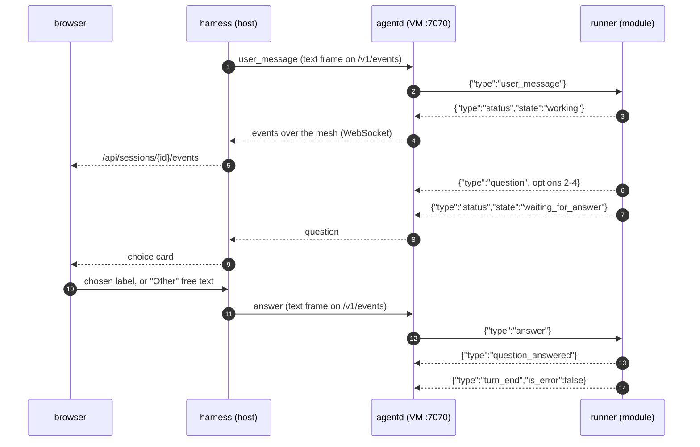

# 2. Agent runner contract (module ⇄ agentd, stdio JSON Lines)

Part of the [Colonizer protocol](../protocol.md).

agentd spawns `agent.command` with `cwd = workspace`, the VM environment plus `agent.env`, stdin/stdout
piped, stderr captured as `log` events (level `warn`). Right after spawning, if `initial_prompt` is
non-empty, agentd writes a `user_message` command with `id: "initial"`.

A question travels browser ⇄ harness ⇄ agentd ⇄ runner, and the same four hops carry the answer
back. agentd has no command endpoints of its own: the harness sends every command as a text frame
on the `/v1/events` WebSocket it already holds (§3).



## Commands (agentd → runner stdin)

```jsonc
{"type":"user_message","id":"u-1","text":"Also update the docs"}
{"type":"answer","question_id":"toolu_01…","answers":{"Which database?":"Postgres","Features?":["Auth","Billing"]},"response":null}
{"type":"interrupt"}
{"type":"set_model","model":"claude-sonnet-5"}   // switch the orchestrator model, same session (§6.1b)
{"type":"shutdown"}          // finish gracefully and exit(0) within 10 s
```

`answers` maps each question's exact `question` text to the chosen option label, an array of labels
(multi-select), or free text ("Other"). `response` (optional) is a free-form reply that dismisses the
whole question card instead. `set_model` takes the forms a model setting does (§6.1); the runner
answers with `model_changed`, or with a `warn` log if the SDK refuses the model.

## Events (runner stdout → agentd)

```jsonc
{"type":"status","state":"idle|working|waiting_for_answer|error|exited","detail":"optional"}
{"type":"user_message","id":"u-1","text":"…"}                      // echo when a message is accepted
{"type":"assistant_text_delta","message_id":"msg_…","block_index":0,"delta":"Hel"}   // optional streaming
{"type":"assistant_text","message_id":"msg_…","block_index":0,"text":"Hello"}        // final block text; supersedes deltas
{"type":"thinking","message_id":"msg_…","block_index":1,"text":"summary"}            // optional
{"type":"tool_call","message_id":"msg_…","tool_call_id":"toolu_…","name":"Bash","input":{"command":"ls"}}
{"type":"tool_result","tool_call_id":"toolu_…","output":"…","is_error":false}        // output ≤ 20 000 chars; optional `denial` (below) marks a refusal
{"type":"tool_result","tool_call_id":"toolu_…","is_error":true,"denial":{"class":"egress|read_only|tool_disabled|policy","hint":"…"}}  // denial is guidance the runner attaches when a result reads as a colony refusal — it never changes `is_error` and never grants anything; the runner also feeds the hint to the agent itself, at most once per class per session
{"type":"question","question_id":"toolu_…","message_id":"msg_…","risk":"workspace_write","questions":[
  {"question":"Which database?","header":"Database","multi_select":false,
   "options":[{"label":"Postgres","description":"…","preview":null},{"label":"SQLite","description":"…"}]}
]}
{"type":"question_answered","question_id":"toolu_…","answers":{…},"response":null}
{"type":"agent_session","session_id":"…"}                       // the runner's own conversation id, announced once
{"type":"turn_end","is_error":false,"result":"final text or null","cost_usd":0.42,"duration_ms":81234,
 "model_usage":{"claude-opus-5":{"input_tokens":1200,"output_tokens":300,"cache_read_tokens":90000,"cache_write_tokens":8000}}}  // model_usage optional
{"type":"log","level":"info|warn|error","message":"…"}
{"type":"model_changed","model":"claude-sonnet-5","previous":"claude-opus-5-5"}
{"type":"jev_ladder","applied":true,"pre_tokens":12000,"post_tokens":8000,"trigger":"auto","decisions":[
  {"tool_call_id":"toolu_…","tool":"Bash","action":"keep|drop_result|drop_call","keep_call":0.98,"keep_result":0.87}]}  // Jev compaction's per-chunk decisions, shadow telemetry the harness grades into `jev_ladder.jsonl` (below); `applied:false` marks a fallback pass, which is not measured
{"type":"loop_next","delay_minutes":120,"reason":"CI reruns at 11"}   // a self-paced loop's colony names its next run (Loops, below)
{"type":"loop_stop","reason":"all flakes fixed"}                      // a loop's colony ends its loop
{"type":"path_policy","access":"read","policy":"masked","path":".env","tool":"Read"}  // the agent reached for a masked or write-protected path (docs/path-policy.md); reporting only — the mount enforced before this ran, and the harness logs it once per distinct (access, path)
{"type":"boundary","kind":"egress_denied","control":"egress","detail":"Could not resolve host: x.example","target":"x.example","at":"2026-01-01T00:00:00.000Z"}  // a control refused something (issue #609, docs/boundaries.md "Watchdog signatures"): kind is one of exec_policy_deny, exec_policy_ask_bypass_attempt, path_policy_denied, path_policy_unbound, egress_denied, publish_rewrite_refused, sandbox_denied; detail is one redacted line ≤ 300 chars; target only when named; reporting only — the watchdog reads it for its control-defeat signature
```

`memory_proposal` (§6.2) and `finding` (§6.6) are runner events too; they are described with the
features they belong to.

Every event above, with its exact fields, is also machine-readable: `docs/agent-events.schema.json`
is the JSON Schema for the runner→agentd contract, `crates/colonizer/src/protocol.rs` deserialises
the events the harness acts on into an `AgentEvent` enum, and the runner's contract test asserts its
output matches the committed fixture (`modules/agents/claude-code/test/fixtures/events.jsonl`). The
fixture covers one ordinary turn, so it has no `jev_ladder`, `loop_next` or `loop_stop` line.

Rules:

- Any event a **subagent** produced carries `"agent": {"id":"toolu_…","name":"code-reviewer","description":"…"}`,
  where `id` is the `Task` tool call that started it. The orchestrator's own events omit the field
  entirely rather than sending null. `assistant_text(_delta)`, `thinking`, `tool_call` and
  `tool_result` can all carry it; `question`, `turn_end` and `status` are the colony's own and never
  do. A UI groups consecutive events by `agent.id` to show each subagent as its own speaker.
- `turn_end.cost_usd` and `model_usage` are cumulative for the colony. When `model_usage` is present, `cost_usd` sums
  only the Claude models in it (keys without a `/`): Claude Code prices a model it does not know, such as a routed
  `zai/glm-5.3-flash`, at the main model's rate, so its estimate for routed models is dropped and they are reported
  as tokens instead. Without `model_usage`, `cost_usd` is the SDK's total. What the provider gateway routed and
  priced is accounted separately, on the session's `routed_cost_usd` (§6.5), never in this field.
- A question is **never** also emitted as `tool_call`/`tool_result`; use `question` / `question_answered`.
- Agents must ask the user only through `question` events (the Claude Code runner appends a system
  prompt instruction and routes `AskUserQuestion` through `canUseTool`). Every question has 2–4
  options; UIs always add "Other".
- Every question carries a **risk class** in `risk` (optional), a closed vocabulary ordered lowest
  to highest: `read_only`, `workspace_write`, `publish_affecting`, `credential_adjacent`. The
  runner assigns the class; the Mothership's autonomy judge enforces it against its ceiling
  (§6.2b). A question with no `risk` — an older runner's — counts as `workspace_write`; a value
  outside the vocabulary counts as above every ceiling and is never answered automatically.
- A question whose answer a tool call is blocked on, in flight inside a live agent, carries
  `blocking: true`: a subagent's `AskUserQuestion`, an ACP permission request, an exec-policy ask
  (which also carries `kind: "exec_policy"`). A resumed transcript cannot finish that call, so the
  Mothership does not suspend such a colony while it waits, up to a two-hour cap
  ([#759](https://github.com/Colonizer-dev/harness/issues/759); docs/colonies.md). The lead agent's
  own question omits the field: its turn resumes with the answer as the next message.
- `status` must be emitted on every state change. `waiting_for_answer` while a question is open.
- `agent_session` names the runner's own conversation id, so the harness can have it continued later
  (§1's `COLONIZER_RESUME_SESSION`). Emit it as soon as the runner knows its conversation id, the
  same once-only rule `model_changed` follows for the model; re-reporting the known id emits
  nothing. A runner that cannot resume a session never emits it.
- `model_changed` names the orchestrator model. The runner emits it when Claude Code's init first
  names the model (`previous: null`), so a client always knows it, and after each `set_model` the
  SDK accepted. An init that names the model already announced emits nothing.
- On `shutdown` or stdin EOF: emit `status exited` and exit.

---
