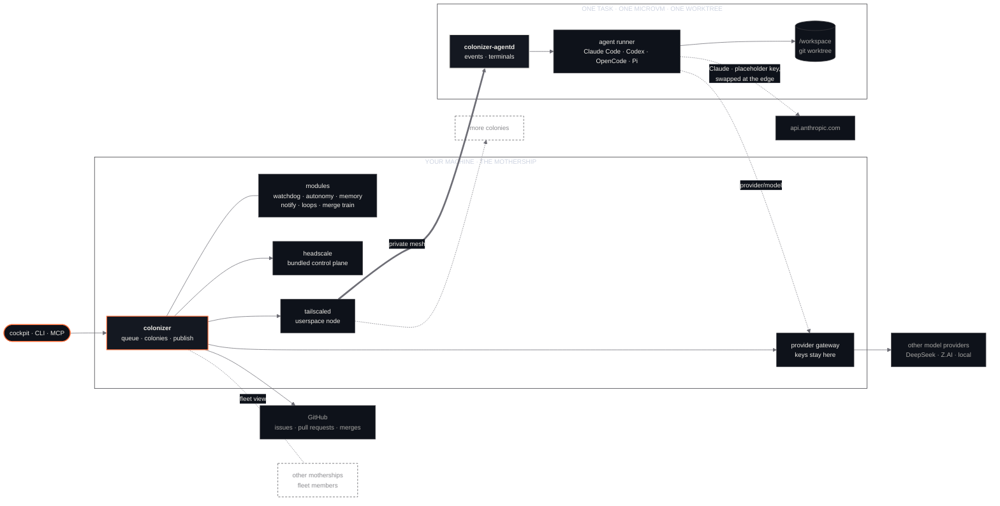

# Colonizer

**Colonize your backlog.**

Colonizer sends coding agents out to settle your issues. Each one lands in its own colony, a real
microVM with a fresh worktree, stays linked to home over a private mesh, and returns with a pull
request you can trust. You stay in command: agents bring you decisions as choices, not walls of text.

## Why

Coding agents are good enough to work unsupervised for long stretches, but most setups make you
choose between **safety** (sandboxed, slow, one at a time, constant approvals) and **speed** (an agent
with your credentials loose on your laptop). Colonizer removes that trade-off:

- every task gets a disposable, hardware-isolated machine, so the agent can do anything *inside* it;
- credentials never enter it;
- you can run many at once and steer them with one click each.

## Vocabulary

| Term | Meaning |
| --- | --- |
| **Mothership** | The Colonizer app on your machine. Holds credentials, git, the mesh control plane, and publishes results. |
| **Colony** | One session: a microVM + git worktree + agent, landed on one task. Disposable. |
| **Settler** | An agent working in a colony. The agent module (Claude Code by default) is a colony's first settler; the subagents it sends out for parts of the task are settlers too, each named for its role: Scout, Builder, Inspector, Tester and so on. |
| **Frontier** | Your backlog: issues and repositories waiting to be settled. |
| **Mesh** | The private network linking every colony to the mothership, separate from any network you already use. |
| **Return** | Bringing a colony's work home as a pull request. |

Use the metaphor lightly in the product; plain words win whenever clarity is at stake.

## Principles

1. **Real isolation by default.** Colonies are KVM microVMs, not shared-kernel containers. Secrets are
   injected at the network edge and never exist inside a colony.
2. **Decisions, not prose.** When an agent needs a human, it asks with concrete choices (plus
   "Other"). A good question takes one click to answer.
3. **Everything is a module.** Sources, sandboxes, meshes, settlers, interfaces and publishers are
   swappable providers behind small contracts.
4. **Local-first and self-contained.** Runs on your hardware and ships its own dependencies, with no
   cloud account required. After install, the downloads are the colony images colonies run, the
   optional bundles you switch on (such as Headroom), the pinned OpenCode binary when a colony runs
   that agent module, and a release check every six hours, which you can switch off.
5. **Scale out, stay close.** Many colonies run in parallel; the mesh keeps each one a hop away for
   chat, terminals and previews.
6. **Trust, then verify.** Colony output is untrusted data until the mothership has sanitized and
   published it, and a human has reviewed the pull request.

These are the design. Where the code does not yet meet the security and trust claims, [audit.md](audit.md)
says so; where something this page describes or the website illustrates has not been built yet,
[gaps.md](gaps.md) says so, with its tracking issue where one is filed.

## Horizon, and where it stands

Checked against the code on `main`. **Built** means merged and usable; **partly** says which part;
**not built** means nothing runs yet.

| Horizon | Where it stands |
| --- | --- |
| **More settlers:** other coding agents behind the same runner protocol. | **Partly.** Claude Code, OpenCode and Pi run on the stock colony images. Codex, Grok Build and an Agent Client Protocol runner (verified against Gemini CLI) are in the repository and fetch their pinned CLI on first boot; Hermes is in the repository too, but its CLI is not staged into a colony image, so it needs an image you build with it on the `PATH`. An org picks its agent module in its settings. |
| **More frontiers:** GitLab, Linear and Jira as sources; review comments as follow-up tasks. | **Not built.** GitHub is the only source and the only publisher. |
| **Remote outposts:** other machines (a GPU box, a home server) join the mesh and host colonies. | **Not built.** The control/execution seam is drawn in the code and only the local side exists ([outposts.md](outposts.md)). |
| **Fleet view:** a live board of every colony, what it's waiting on, and what it costs. | **Partly.** On one machine, the cockpit's Overview, Nest, Inbox and org dashboards show every colony, what it waits on and what it has spent. Across machines, motherships pair into a [fleet](fleet.md) (or are named read-only in `COLONIZER_FLEET_PEERS`), and the Fleet panel lists each one's slots, queue and disk. A fleet owner also sees its members' finished colonies once each member turns history sync on; running colonies on other machines are not listed. |
| **Guardrails:** network policies and approval rules as modules. | **Partly.** An egress policy (open, or an allowlist, with allow and block lists per install and per org), a path policy that masks or write-protects worktree paths ([path-policy.md](path-policy.md)), prompt screening at publish ([prompt-screening.md](prompt-screening.md)), and a risk ceiling on which questions the autonomy judge may answer. They are sandbox, screen and autonomy settings, not a policy module of their own. An exec policy layers deny, ask and allow rules over the commands an agent runs (install → org → repository), with an `ask` becoming an Allow/Deny question; it is guidance in front of the model, not a boundary ([#471](https://github.com/Colonizer-dev/harness/issues/471)). |
| **Previews:** dev servers inside colonies reachable from the mothership over the mesh. | **Not built.** Chat and a terminal are what the mesh carries today. |
| **Your cockpit from anywhere:** an opt-in link to your own cockpit, with no port forwarding and no tailnet. | **Partly.** The Settings switch, the mothership's tunnel client and the relay are in the repository, but the relay is not deployed and the two halves do not work end to end yet ([remote-tunnel.md](remote-tunnel.md), [#531](https://github.com/Colonizer-dev/harness/issues/531)). |

## Two things, and which is which

| | What it is | Status |
| :--- | :--- | :--- |
| **Harness** | This repository: the mothership, the in-VM daemon, the agent modules, the web UI, the bundled mesh. Runnable today on your own machine. | `SHIPPING` |
| **Colonizer** | Anything beyond one machine that the harness does not do yet: remote outposts that host colonies, a hosted offering. Motherships can already pair into a [fleet](fleet.md) with a shared view. | `PLANNED` |

Two labels are used everywhere below, and they set the tense of the sentence around them:

- `SHIPPING`: merged, in this repository, and exercised on a real machine.
- `PLANNED`: named, not specified, not started.

---

## Shape



---

## The argument, in five points

**1. A colony is a machine, not a container.** Each task runs in a KVM microVM
([microsandbox](https://microsandbox.dev), libkrun) with its own kernel. The agent runs without
permission prompts because there is nothing on the other side of the wall worth protecting.

**2. Secrets stay home.** Git objects are mounted read-only, so the agent can read history but not
rewrite it. The mothership commits, pushes and opens the pull request after the microVM is gone, and it
treats everything the colony left behind as untrusted: `.git` is rewritten, nested repositories are
removed, and git runs with hooks and fsmonitor disabled.

**3. Every colony is one hop away.** The mothership runs its own Headscale and a userspace `tailscaled`,
both bundled. Every colony joins with a single-use key. The network is separate from any tailnet the
machine is already on. The mothership can reach colonies, and colonies can't reach each other. One narrow
UDP rule per colony keeps WireGuard direct (about 1 ms) instead of relayed.

**4. Decisions, not prose.** Agents bring you choices. Your job is to pick one, not to parse a paragraph
that ends in a question mark.

**5. Everything is a module.** Source, sandbox, mesh, agent, interfaces and publish are providers behind
small contracts, selected in the UI and saved in `modules.json`. The agent contract is a JSON Lines
protocol on stdio, so an agent module can be written in anything.

The agent modules so far. An org can pick which installed agent module its colonies launch on (Org
settings → Agent module; without a pick, the mothership's agent choice applies):

| Agent | What it is | Status |
| :--- | :--- | :--- |
| [`claude-code`](../modules/agents/claude-code) | Anthropic's Claude Code via the Claude Agent SDK, with questions to the user as choice cards | `SHIPPING` |
| [`codex`](../modules/agents/codex) | OpenAI's Codex CLI, headless: one `codex exec` process per turn, resumed into a single thread; the runner fetches the pinned CLI on first boot | `SHIPPING` |
| [`grok-build`](../modules/agents/grok-build) | xAI's Grok Build CLI, headless: one grok process per turn, resumed into a single session; the runner fetches the pinned CLI on first boot | `PLANNED` |
| [`acp`](../modules/agents/acp) | Any Agent Client Protocol agent over stdio, one long-lived process per colony; verified against Google's Gemini CLI (`gemini --experimental-acp`), whose pinned bundle the runner fetches on first boot | `PLANNED` |

---

## A question, from inside a colony

Real, from a colony working on this repository. Unedited apart from line breaks.

```json
{"type": "question", "seq": 14,
 "question_id": "toolu_01Kz2S34mniQ6KJ476Twd2X3",
 "questions": [{
   "header": "README tweak", "multi_select": false,
   "question": "Which small README improvement do you prefer?",
   "options": [
     {"label": "Add a table of contents",
      "description": "Insert a short linked ToC near the top (Requirements, Install, Trust model, Configuration, Development, Run as a service) so readers can jump to a section in this fairly long README."},
     {"label": "Add a Quick Start block",
      "description": "Add a 3-line 'Quick Start' snippet right under the intro paragraph (clone, install.sh --install, open the URL) so skimmers get running before reading Requirements/Trust model/Configuration."}
   ]}]}
```

The web UI renders that as a card with both options and an **Other…** answer. One click sends
`question_answered` back through the mothership, over the mesh, to the agent that is waiting for it.

Agents never ask in plain text. The Claude Code module routes `AskUserQuestion` into this event, and if a
turn still ends on a plain-text question, the runner holds the turn open and has the agent ask again as
a card. Autopilot can't publish in the middle of a question.

---

## Roadmap, in public

| Capability | Status |
| :--- | :--- |
| Colonies, private mesh, choice cards, terminal, Claude Code module, GitHub source and publish | `SHIPPING` |
| Orchestrator and subagents on different providers ([#1](https://github.com/Colonizer-dev/harness/issues/1)) | `SHIPPING` |
| Org workspaces ([#2](https://github.com/Colonizer-dev/harness/issues/2)) | `SHIPPING` |
| Shared memory with review ([#3](https://github.com/Colonizer-dev/harness/issues/3)) | `SHIPPING` |
| Watchdog for stalled colonies ([#4](https://github.com/Colonizer-dev/harness/issues/4)) | `SHIPPING` |
| Provider gateway: private-network models, queues, long timeouts, health, Claude fallback ([#5](https://github.com/Colonizer-dev/harness/issues/5)) | `SHIPPING` |
| CI running the Rust, runner and UI test suites | `SHIPPING` |
| Local Claude Code plugins mounted read-only into colonies, with ECC's skills and agents vendored ([#6](https://github.com/Colonizer-dev/harness/issues/6)) | `SHIPPING` |
| Skillsets switched on and off in Settings, globally and per org ([#46](https://github.com/Colonizer-dev/harness/issues/46)) | `SHIPPING` |
| superpowers vendored, with its bootstrap in the system prompt instead of a hook ([#44](https://github.com/Colonizer-dev/harness/issues/44)) | `SHIPPING` |
| Google's skills vendored and loaded on demand from a pinned local catalog ([#43](https://github.com/Colonizer-dev/harness/issues/43)) | `SHIPPING` |
| Daily proposals for vendored plugin updates, described in skills added, removed and changed ([#43](https://github.com/Colonizer-dev/harness/issues/43)) | `SHIPPING` |
| Docs & README loop: off until enabled per repository or org; finds docs drift on the mothership's clone without a model, then dispatches one docs-only colony per repository ([docs/loops.md](loops.md#docs--readme)) | `SHIPPING` |
| Token savings: terse replies (caveman) and compact command output (rtk), each a switch | `SHIPPING` |
| Token savings: Headroom compacting tool results, its bundle downloaded when switched on ([#53](https://github.com/Colonizer-dev/harness/issues/53)) | `SHIPPING` |
| Live map of motherships, off until you switch it on: the heartbeat and its receiver | `SHIPPING` |
| Release provenance: every release artifact attested, colony images and the guest agent pinned, SBOMs and dependency audits, pins proposed by pull request ([#89](https://github.com/Colonizer-dev/harness/issues/89)) | `SHIPPING` |
| More agent modules behind the runner protocol | `PLANNED` |
| GitLab, Linear and Jira sources; review comments as follow-up tasks | `PLANNED` |
| Remote outposts: other machines joining the mesh to host colonies | `PLANNED` |
| Per-colony budgets and host-disk quotas ([#86](https://github.com/Colonizer-dev/harness/issues/86)) | `SHIPPING` |
| Red-team raids: hunters with distinct briefs raiding one repo while the nest is empty ([docs/red-team.md](red-team.md), [#212](https://github.com/Colonizer-dev/harness/issues/212)) | `SHIPPING` |
| Burn-down mode: weekly token plan spent to a reserve by paced bug-hunt colonies ([docs/burn-down.md](burn-down.md), [#210](https://github.com/Colonizer-dev/harness/issues/210)) | `SHIPPING` |
| Fleets: motherships that pair with an invite and a confirmation code, share one fleet view, and sync finished-colony history to the owner once each member opts in ([docs/fleet.md](fleet.md), [#686](https://github.com/Colonizer-dev/harness/issues/686), [#762](https://github.com/Colonizer-dev/harness/issues/762)) | `SHIPPING` |
| Merge train, off by default: green, clean colony pull requests squash-merged one at a time and rebased when behind, with an opt-in loop that drives it ([docs/architecture.md](architecture.md#merge-train), [docs/loops.md](loops.md#merge-train), [#671](https://github.com/Colonizer-dev/harness/issues/671), [#754](https://github.com/Colonizer-dev/harness/issues/754)) | `SHIPPING` |
| Network policies as a module of their own | `PLANNED` |
| Dev-server previews over the mesh | `PLANNED` |

The roadmap is the issue tracker. There is no private version of it. On top of it, the v0.1.3 audit
sets four release checkpoints ([docs/audit.md](audit.md)).

## Brand

- **Name:** Colonizer, at colonizer.dev.
- **Voice:** calm, technical, confident; a touch of frontier and space flavor, used sparingly.
- **Look:** deep-space neutrals with one beacon-orange accent; a simple hexagon outpost mark.
